# 1.Git概述

### 1.1 Git历史

Git 诞生于一个极富纷争大举创新的年代。Linux 内核开源项目有着为数众多的参与者（Git的产生和Linux内核有很大关系，Git和Linux作者是同一人）。 绝大多数的 Linux 内核维护工作都花在了提交补丁和保存归档的繁琐事务上（1991－2002年间）。 到 2002 年，整个项目组开始启用一个<u>**专有的分布式版本控制系统 BitKeeper**</u> 来管理和维护代码。

到了 2005 年，开发 BitKeeper 的商业公司同 Linux 内核开源社区的合作关系结束，他们收回了 Linux 内核社区免费使用 BitKeeper 的权力。 这就迫使 Linux 开源社区（特别是 Linux 的缔造者 Linus Torvalds）基于使用 BitKeeper 时的经验教训，开发出自己的版本系统。 


他们对新的系统制订了若干目标：

* 速度

* 简单的设计（设计和用户使用要足够简单）

* 对非线性开发模式的强力支持（允许成千上万个并行开发的分支）

* **完全分布式**（与SVN的最大区别）

* 有能力高效管理类似 Linux 内核一样的超大规模项目（速度和数据量）

### 1.2 Git与SVN对比

SVN是==集中式的版本控制系统==，版本库是集中放在中央服务器的（C/S结构软件），而开发人员工作时，用的都是自己的电脑，所有首先要从中央服务器下载最新的代码，然后开发，开发完后，需要把自己开发的代码提交到中央服务器。

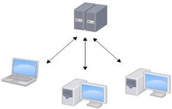

集中式版本控制工具的缺点

* 服务器单点故障
* 容错性差（与第一个有关系，正是由于单点故障，所以一旦服务器出问题，整个工作环境就不可用了）


Git是==布式版本控制系统==（Distributed Version Control System，简称 ==DVCS==） ，分为两种类型的仓库：==本地仓库==和==远程仓库==。


* 本地仓库：是在开发人员自己电脑上的Git仓库

* 远程仓库：是在远程服务器上的Git仓库

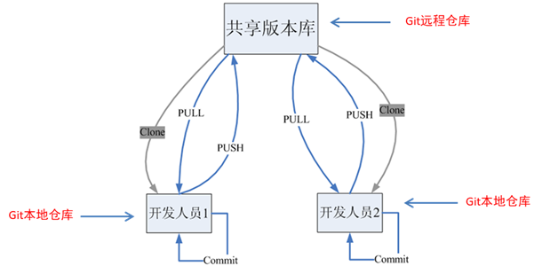

图的解释;

* Commit命令：将代码提交到本地仓库，此时其他开发人员是看不到的
* PUSH命令：将本地仓库的代码==推送==（上传）到远程仓库
* PULL命令：从远程仓库==拉取==（下载）代码到本地

* Clone命令：将远程仓库==克隆==（复制）到本地


本地：可以进行版本管理（提交，查看日志，恢复数据）


### 1.3 Git工作流程


工作区：目前可以先认为是自己电脑上的文件夹

暂存区：


工作流程如下：

1. 从远程仓库中克隆代码到本地仓库
2. 从本地仓库中checkout（检出）代码然后进行修改（检出到工作区，目前可以先认为是自己电脑上的文件夹）
3. 在提交前需要先将代码提交到暂存区
4. 提交到本地仓库。本地仓库中保存修改的各个历史版本
5. 修改完成后，需要和团队成员共享代码时，将代码push到远程仓库、
6. CLONE操作只需要一次，之后如果想要从远程仓库下载代码，拉取(PULL)代码到工作区即可


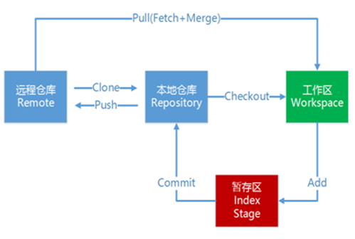


### 1.4 Git安装与下载

* Git GUI：Git提供的图形界面工具
* Git Bash：Git提供的命令行工具


# 2. Git代码托管服务

### 2.1 常用的Git代码托管服务

前面我们已经知道了Git中存在两种类型的仓库，即本地仓库（自己电脑上的Git仓库）和远程仓库（远程服务器上的Git仓库）。那么我们如何搭建Git远程仓库呢？我们可以借助互联网上提供的一些==代码托管服务==来实现，其中比较常用的有GitHub、码云、GitLab等。


* **GitHub**：（ 地址：https://github.com/ ）是一个**面向开源及私有软件项目**的托管平台，因为**只支持Git** 作为唯一的版本库格式进行托管，故名GitHub
* **码云**：（地址： https://gitee.com/ ）是国内的一个代码托管平台，由于服务器在国内，所以相比于GitHub，码云速度会更快
* **GitLab**：（地址： https://about.gitlab.com/ ）是一个用于==仓库管理系统==的开源项目，使用Git作为代码管理工具，并在此基础上搭建起来的web服务

### 2.2 注册

### 登录并创建Git远程仓库

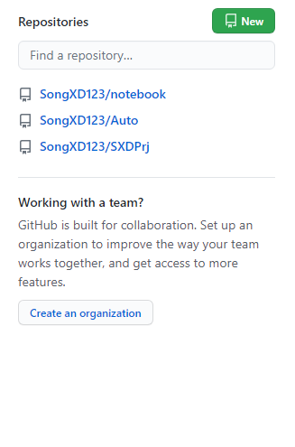

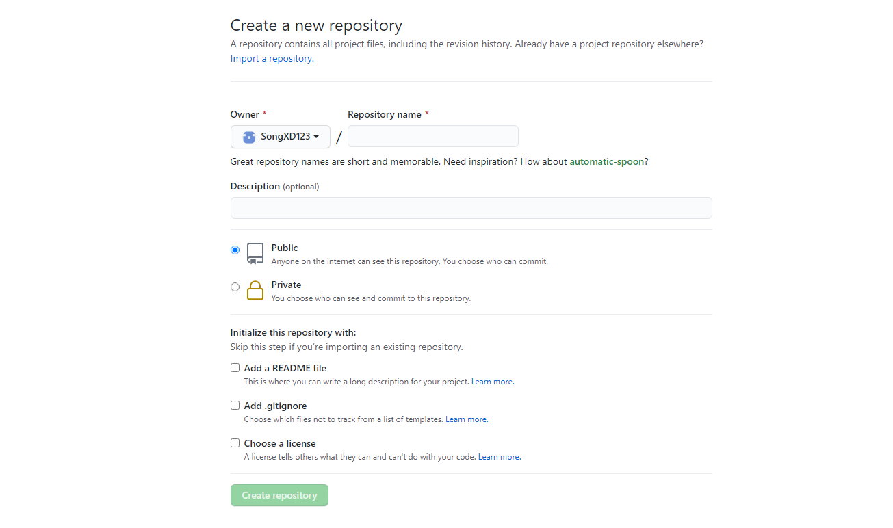

初始化仓库：

* 使用README文件初始化仓库
* 

创建完成

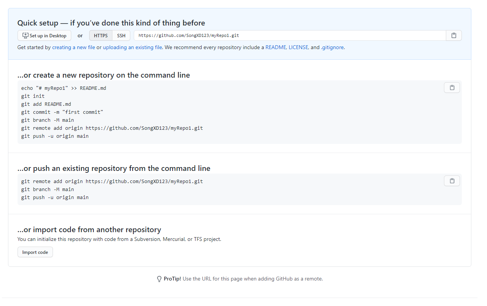

每个Git远程仓库都会对应一个网络地址：https://github.com/SongXD123/myRepo1.git

当前仓库为空

# 3.Git常用命令

本节有如下命令和概念

* 环境配置：通过Git相关命令

* 获取Git仓库

* 工作目录、暂存区以及版本库概念：

* Git工作目录下文件的两种状态：未跟踪状态、已跟踪状态

* 本地仓库操作

* 远程仓库的使用

* 分支

* 标签

### 3.1 环境配置

当安装Git后，首先要做的事情就是==设置用户名称和Email地址==（当前是谁）。这是非常重要的，因为每次Git提交都会使用该用户信息

注意：这里的用户名称和Email地址与远程仓库（码云、GitHub）是没有关系的，之前GitHub注册的用户名和地址是为了操作远程仓库，推送和克隆都需要GitHub账号；而这里只是设置个人信息，该个人信息不是用作认证的，只是标识你是谁，因此可以任意设置


* 设置用户信息
  * git config --global user.name "itcast"
    * global表示全局
  * git config --global user.email "hello@itcast.cn"
    * Email地址也会不进行校验，因此是可以任意写的
* 查看配置信息
  * git config --list
  * git config user.name
* 通过上面的命令设置的信息会保存在==~/.gitconfig==文件中
* 编辑Git配置文件：
  * git config -e    # 针对当前仓库 
  * git config -e --global   # 针对系统上所有仓库

### 3.2 获取Git仓库

要使用Git对我们的代码进行版本控制，首先要获得Git仓库

获取Git仓库通常有两种方式

* 在本地初始化一个Git仓库
* 从远程仓库中克隆

#### 3.2.1 在本地初始化一个Git仓库

步骤如下：

* 在电脑的任意位置创建一个空目录（例如repo1）作为我们的本地Git仓库

*  进入这个目录中，点击右键打开Git bash窗口

* 执行命令git init

* 如果在当前目录中看到.git文件夹，说明创建成功

  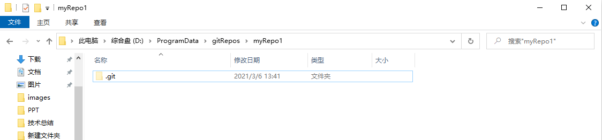

或者可以**指定目录作为Git仓库**：==**git init dir**==

#### 3.2.2 从远程仓库克隆

可以通过Git提供的命令从远程仓库进行克隆，将远程仓库克隆到本地

命令形式为：git clone 远程Git仓库地址 

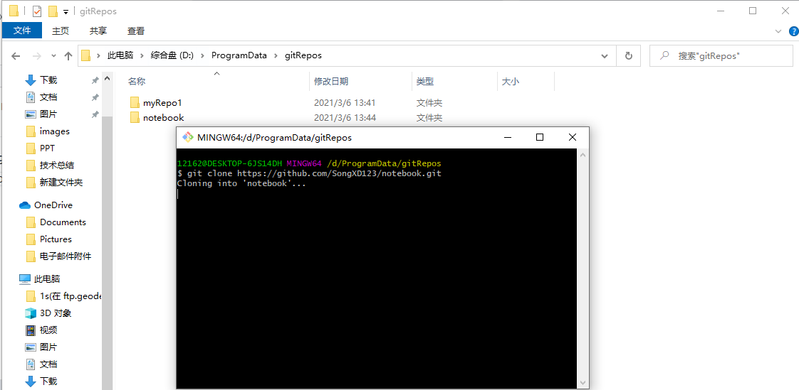

**克隆到指定目录**：**==git clone \<repo> \<directory>==**

### 3.3 工作目录、暂存区以及版本库概念

**版本库**：前面看到的.git隐藏文件夹就是版本库，版本库中存储了很多==配置信息、日志文件和文件版本信息==

**工作目录（工作区）**：==包含,git文件夹的目录==就是工作目录，主要用于存放开发的代码

**暂存区**：.git文件夹中有很多文件，其中有一个==index文件（二进制文件）==就是暂存区，也可以叫做stage。暂存区是一个临时保存修改文件的地方，如要提交修改后的文件，前提是将修改的文件的改变存放到暂存区，只有从暂存区里面才能提交到版本库，让git进行版本管理

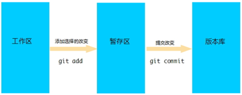

* git add：将改变的内容提交到暂存区
* git commit：将修改的内容提交到版本库

### 3.4 Git工作目录下文件的两种状态

Git工作目录下的文件存在两种状态：

* untracked未跟踪（未被纳入版本控制，没有被Git进行版本管理）
* tracked已跟踪（被纳入版本控制，被Git进行版本管理）
  * Unmodified：未修改状态
  * Modified：已修改状态
  * Staged：已暂存状态，修改完成后，只有通过git add将修改的文件添加到暂存区，才成为已修改状态
* 这些文件的状态会随着我们执行Git的命令发生改变

### 3.5 本地仓库操作

#### **3.5.1 git status查看文件状态**

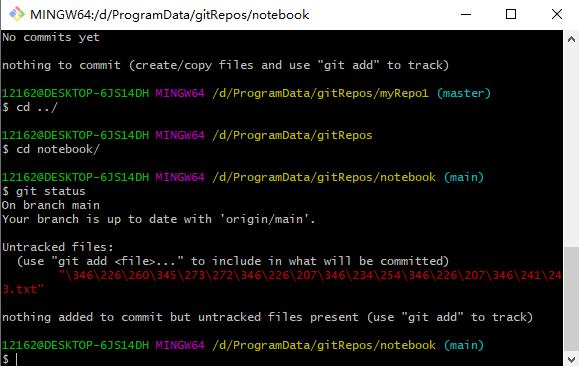

* 当前处于main分支
* 已被跟踪但还未被修改的不会提示

也可以通过==git status -s==使输出更加简洁

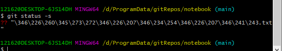


#### 3.5.2 git add将未跟踪的文件加入暂存区

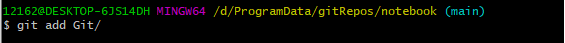

将新创建的文件加入暂存区后查看文件状态

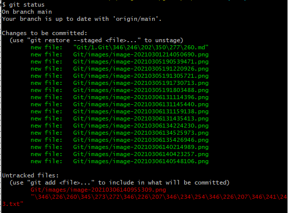

* **添加一个或多个文件到暂存区**：git add [file1] [file2] ...
* **添加指定目录到暂存区，包括子目录**：git add [dir]
* **添加所有文件**：git add .


#### 3.5.3 **git reset 将暂存区的文件取消暂存**

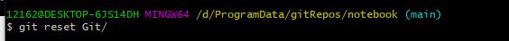

新建的文件此时回到未跟踪

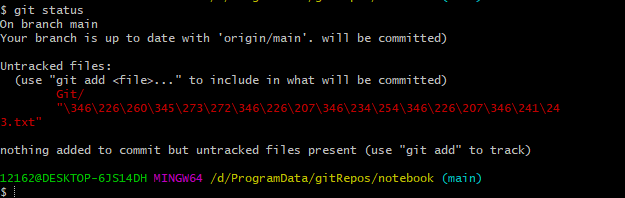

格式：**==git reset [--soft | --mixed | --hard] [HEAD]==**

* **--mixed** 为默认，可以不用带该参数，用于重置**暂存区**的文件与上一次的提交(commit)保持一致，工作区文件内容保持不变。
* git reset  [HEAD] :
  * git reset HEAD^            # 回退所有内容到上一个版本  
  * git reset HEAD^ hello.php  # 回退 hello.php 文件的版本到上一个版本  
  * git  reset  052e           # 回退到指定版本
* **--soft** 参数用于回退到某个版本：git reset --soft HEAD
  * git reset --soft HEAD~3 # 回退上上上一个版本
* **--hard** 参数**撤销工作区中所有未提交的修改内容**，将**暂存区与工作区都回到上一次版本**，并删除之前的所有信息提交：git reset --hard HEAD
* **git reset HEAD** 命令用于取消已缓存的内容。


#### 3.5.4 git commit将暂存区的文件修改提交到本地仓库

git commit -m message

* 必须有**-m**参数，表示提交时需要提交日志信息，其实是一个字符串
  * 如果不加-m参数，会默认打开编辑器，要求我们将日志信息写到vim编辑器中
* 会将暂存区中所有文件提交，==必须先提交到暂存区==
* message是一个字符串
* 提交后变为**==已跟踪后的未修改状态==**
* 设置参数-a后不需要git add命令：git commit -a

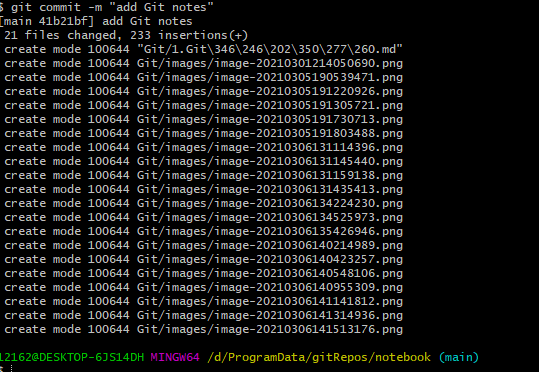


#### 3.5.5 git diff命令比较文件的不同，即比较文件在暂存区和工作区的差异

git diff 命令显示**==已写入暂存区==**和**==已经被修改但尚未写入暂存区文件==**对区别。

git diff 有两个主要的应用场景。

- 尚未缓存的改动：**git diff**

  ```
  显示暂存区和工作区的差异:
  $git diff [file]
  ```

- 查看已缓存的改动： **git diff --cached**

  ```
  显示暂存区和上一次提交(commit)的差异:
  $ git diff --cached [file]
  或
  $ git diff --staged [file]
  ```

- 查看已缓存的与未缓存的所有改动：**git diff HEAD**

- 显示摘要而非整个 diff：**git diff --stat**

#### 3.5.6 git rm删除文件

git rm filename

只是将工作区中文件删除，而并没有提交，因此本地仓库中还是有该文件的

* 这个命令必须在**提交到版本库以后才能执行的**，否则
  * 如果文件没有提交到版本库，Git是不会发现的，并报错：fatal: pathspec ==filename== did not match any files
  * 如果提交到暂存区，是无法删除的，并报错：error: the following file has changes staged in the index:    ==filename==
  * 如果文件与版本库中不一致，就删除不了，**除非强制删除**：

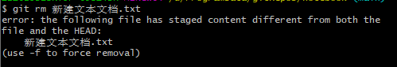

* rm操作==默认添加到暂存区==，可以直接用**commit**提交
* 选中文件删除：**没有提交到暂存区的意思**，所以还需用git add将删除的文件加到暂存区
* ==**not staged for commit**==：没有提交到暂存区的意思


#### 3.5.7 将文件添加至忽略列表

一般我们总会有些文件**无需纳入Git 的管理（如日志文件，.class文件）**，希望管理的是源代码等，**也不希望它们总出现在未跟踪文件列表**。 通常都是些自动生成的文件，比如日志文件，或者编译过程中创建的临时文件等。 在这种情况下，我们可以在工作目录中创建一个名为 .gitignore 的文件（文件名称固定），列出要忽略的文件模式（**#号为注释**；**!**表示取反，表示除外；。下面是一个示例：

> \# no .a files
>
> *.a
>
> \# but do track lib.a, even though you're ignoring .a files above
>
> !lib.a
>
> \# only ignore the TODO file in the current directory, not subdir/TODO
>
> /TODO
>
> \# ignore all files in the build/ directory
>
> build/
>
> \# ignore doc/notes.txt, but not doc/server/arch.txt
>
> doc/*.txt
>
> \# ignore all .pdf files in the doc/ directory
>
> doc/**/*.pdf

**touch .gitignore**


#### 3.5.8 git log查看日志记录

 进入vim编辑器，回车下一行，q退出

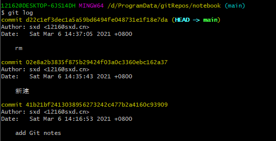


### 3.6 远程仓库操作

前面执行的命令操作都是针对的本地仓库，本章节我们会学习关于远程仓库的一些操作，具体包括：

* 查看远程仓库

* 添加远程仓库
* 从远程仓库克隆
* 移除无效的远程仓库
* 从远程仓库中抓取与拉取
* 推送到远程仓库


#### 3.6.1 查看远程仓库

如果想查看**已经配置的远程仓库服务器**，可以运行**git remote**命令。它会列出指定的每一个远程服务器的简写。

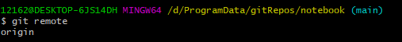

如果已经克隆了远程仓库，那么至少应该能看到origin，这是Git克隆的服务器的默认名字

* origin表示本地仓库和哪个远程仓库建立了关联


如果想要看得更详细些，可以通过**git remove -v**：

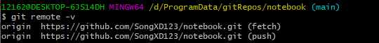

* fetch表示可以从这个地址抓取
* push表示本地开发得代码可以推送到远程仓库。
* fetch==push表示本地仓库和远程仓库建立了关联关系，既可以从远程仓库抓取代码，也可以将本地代码推送到远程仓库。而该仓库名字为origin
* 因此当前本地仓库是克隆来的，所以默认配置远程仓库名origin
* **如果当前本地仓库没有和任何远程仓库建立关联关系，则git remote命令不会显示任何东西**
* 查看更详细的信息：**git remote show origin**
  * 当前分支：master（HEAD branch）
  * 远程分支：master tracked，表示当前master分支和远程master分支有追踪关系（关联关系）
* 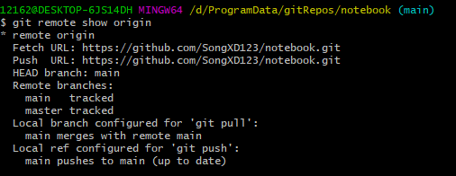

 


#### 3.6.2 添加远程仓库

对于非克隆而来的本地仓库，可以运行**git remote add \<shortname> \<url>**添加一个新的远程Git仓库，同时可以指定一个可以引用的简写（

* 一般建议远程仓库和本地仓库名称保持一致

* 一般shortname建议**origin**

  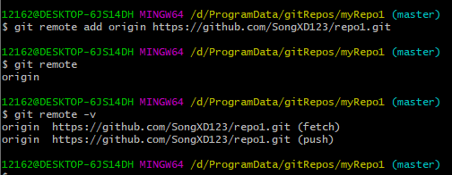

  * 顺序
    * git remote add \<shortname> \<url>
    * git remove查看

* 一个本地仓库**可以添加多个远程仓库**，指定不同的\<shortname>


#### 3.6.3 从远程仓库克隆

如果你想获得一份已经存在了的 Git 仓库的拷贝，这时就要用到 git clone 命令。 Git 克隆的是==**该 Git 仓库服务器上的几乎所有数据（包括日志信息、历史记录等），而不仅仅是复制工作所需要的文件**==。 当你执行 git clone 命令的时候，默认配置下远程 Git 仓库中的<u>**每一个文件的每一个版本都将被拉取下来**</u>。

克隆仓库的命令格式是 **git clone [url]**


#### 3.6.4 移除无效的远程仓库

如果因为一些原因想要移除一个远程仓库，可以使用==**git remote rm \<name>**== 

注意：此命令只是**从本地移除远程仓库的记录（关联关系）**，如之前的origin，并**不会真正影响到远程仓库**


#### 3.6.5 从远程仓库抓取与拉取

* ==**git fetch**==是从远程仓库中获取最新版本到本地仓库，**不会自动merge**

  * git fetch \<shortname> \<branch>

  * 默认：git fetch = git fetch origin master

  * 抓取完成后，会将文件抓取到本地仓库（**.git/objects/**），是以二进制形式存放，但是没有合并到工作区来，所以工作区中并没有这些文件

  * 所以还需要手动合并：**==git merge origin/master==**(shortname/branch)

    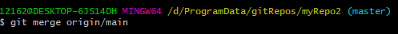

  * 

* **==git pull==**是从远程仓库获取最新版本并**merge到本地仓库**

  * 拉取的只是有区别的文件，相同的文件拉取不到

* 可能的报错

  * 如果当前本地仓库不是从远程仓库，而是本地创建的仓库，并且仓库中存在文件，此时再从远程仓库中拉取文件的时候会报错（fatal:refusing to merge unrelated hostories)，解决此问题可以在git pull命令后面加上参数**==--allow-unrelated-histories==**，也就是不能合并的错误
  
* 修改并上传单个文件

  * 首先提交到本地仓库：
    * git add filename
    * git commit
    * 或 git commit -a -m message，先提交到暂存区，再提交
  * git push origin master

### 3.7 Git分支

几乎所有的版本控制系统都以某种形式支持分支。 使用分支意味着你可以==**把你的工作从开发主线上分离开来**==，以免影响开发主线。Git 的master分支并不是一个特殊分支。 它跟其它分支没有区别。 之所以几乎每一个仓库都有 master 分支，是因为git init 命令默认创建它，并且大多数人都懒得去改动它。

在本章节我们会学习到关于分支的相关命令，具体如下：

* 查看分支

* 创建分支

* 切换分支

* 推送至远程仓库分支

* 合并分支

* 删除分支

#### 3.7.1 查看分支

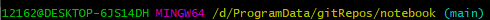


* 列出所有本地分支

  * 命令行结尾括号中表示本地main分支

  * **==git branch==**

* 列出所有远程分支

  * **==git branch -r==**

* 列出所有本地分支和远程分支

  * ==**git branch -a**==

    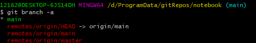

#### 3.7.2 创建分支

**==git branch \<branchname>==**

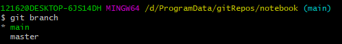

*号表示当前处于哪个分支

新建的分支都是在当前分支基础上创建的

#### 3.7.3 切换分支

**==git checkout branchname==**


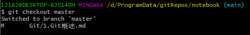

工作空间只会显示当前分支下的。切换分支后，==**工作空间不显示不属于该分支的文件**==

#### 3.7.4 推送至远程仓库分支

**==git push \<shortname> \<branchname>==**

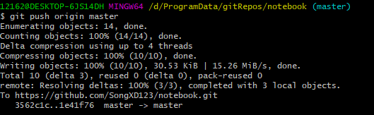

将**本地的master**分支推送到**远程仓库的master分支**，==此时所作的修改与提交都是在当前分支下的==，本地分支和远程分支存在==追踪关系==

不同的分支随着开发代码会不一样，以上

#### 3.7.5 分支合并

如，在master分支下：

* git merge \<branch1> ，将branch1合并到master分支

  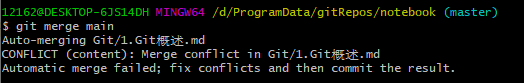

有时候合并操作不会如此顺利。 如果你在两个不同的分支中，**对同一个文件的同一个部分进行了不同的修改**，Git 就没办法合并它们，同时会提示文件冲突。**此时需要我们==打开冲突的文件并修复冲突内容（会有一些冲突字符）==，最后执行git add命令来标识冲突已解决**

* 其实有合并，只是合并冲突

* 冲突如下：

  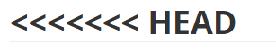

#### 3.7.6 删除分支

删除的是本地分支：**git branch -d \<branchname>**

如果要删除的分支中进行了一些开发动作，此时执行上面的删除命令并不会删除分支，如果坚持要删除此分支，**==可以将命令中的-d参数改为-D==**

* 如，在master分支下创建b1分支，且在b1分支中进行了一些开发，但还未推送或合并到某个分支，此时不能删除该分支

**==无法在当前分支中删除当前分支==**


**如果要删除远程分支：**

* git push origin -d branchName

#### 3.7.7 综合应用

工作场景如下：

开发某个网站。

为实现某个新的需求，创建一个分支（dev）。

在这个分支上开展工作。

正在此时，你突然接到一个电话说有个很严重的问题需要紧急修补。 你将按照如下方式来处理：

切换到你的线上分支（master）。

为这个紧急任务新建一个分支（fix），并在其中修复它。

在测试通过之后，切换回线上分支（master），然后合并这个修补分支（fix），最后将改动推送到线上分支（master）。

切换回你最初工作的分支上（dev），继续工作。

* git branch dev
* git checkout dev
* dev下开发工作，并提交（git add、git commit）
* git checkout master
* git branch fix
* 处理问题
* git commit -a -m msg
* git checkout master
* git merge fix
* git push origin master

### 3.8 Git标签

像其他版本控制系统（VCS）一样，Git 可以给历史中的某一个提交打上标签，以示重要。 比较有代表性的是人们会使用这个功能来标记发布结点（v1.0 、v1.2等）。==**标签指的是某个分支某个特定时间点的状态**==。通过标签，可以很**==方便的切换到标记时的状态==**。

* 分支是动态的，不断推进迭代
* 标签一旦创建，就记录了当时的状态，通过标签就可以回到某个时间点状态


在本节中，我们将学习：

* 列出已有的标签

* 创建新标签

* 将标签推送至远程仓库

* 检出标签

* 删除标签

#### 3.8.1 列出已有标签

* 创建标签

  * git tag tagName：以下两个标签状态一样

    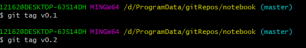

* 列出已有标签
  
  * git tag
* 查看tag信息
  * git show [tag]
  * git show 0.1

#### 3.8.2 将标签推送至远程仓库

* 提交指定tag
  * git push [remote] [tag]
  * remote：远程仓库名
  * git push origin v0.1

#### 3.8.3 检出标签

* 新建一个分支，指向某个tag

  * git checkout -b \[branch][tag]

    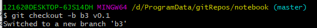

  * 创建并转为了b3分支，b3的状态就是创建v0.1时的状态，

  * 后续在b3中进行修改，提交到本地仓库

  * 创建标签：git tag v2.0

  * git push origin v2.0

#### 3.8.4 删除标签

* 删除本地tag
  * git tag -d [tag]
* 删除远程标签
  * git push origin :refs/tags/[tag]

# 4.TortoiseGit图形界面（不看）

# 5.IDEA中使用Git

### 5.1 在IDEA中配置Git

安装好IntelliJ IDEA后，如果Git安装在默认路径下，那么idea会自动找到git的位置，如果更改了Git的安装位置则需要手动配置下Git的路径（似乎不用）。

选择File→Settings打开设置窗口，找到Version Control下的git选项：

 

上述界面中，可以点击Test按钮测试是否正确配置。

### 5.2 在IDEA中使用Git

本章节我们会学习在IDEA中使用Git进行版本管理，具体包括：

* 在IDEA中创建工程并将工程添加至Git

* 将文件添加到暂存区

* 提交文件

* 将代码推送到远程仓库

* 从远程仓库克隆工程到本地

* 从远程拉取代码

* 版本对比

* 创建分支

* 切换分支

* 分支合并

#### 5.2.1 在IDEA中创建工程并将工程添加至Git

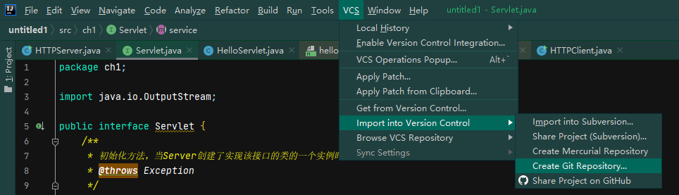

将项目添加至Git管理后，可以从IDEA的工具栏上看到Git操作的按钮

#### 5.2.2 将文件添加到暂存区

工程下标红的是还未提交到本地仓库

**注意：并非所有文件都需要进行版本管理，有些文件交给Git管理反而会造成一些问题，如**

* **.idea文件夹（本该是idea维护，交给Git管理反而会经常造成冲突）**
* **gittest.iml(项目名）文件，也是idea产生的文件**
* **target目录**
* 通过忽略列表进行管理，添加后需要Synchronize "gittest"(**新版不需要刷新**)
* 然后在**.gitignore**中进行编辑

操作：

* 工程名右键菜单中，**Git—>Add添加到暂存区**

  

#### 5.2.3 提交文件到本地仓库

* 点击✔提交提交到本地仓库

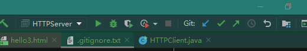

* 或可以提交的同时推送：Commit and Push

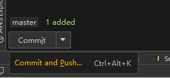

#### 5.2.4 将代码推送到远程仓库

GIt——repository——push

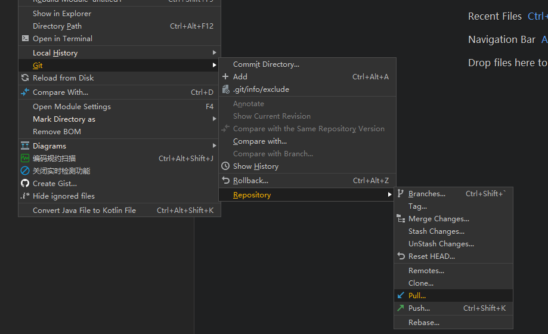

#### 5.2.5 从远程仓库克隆到本地

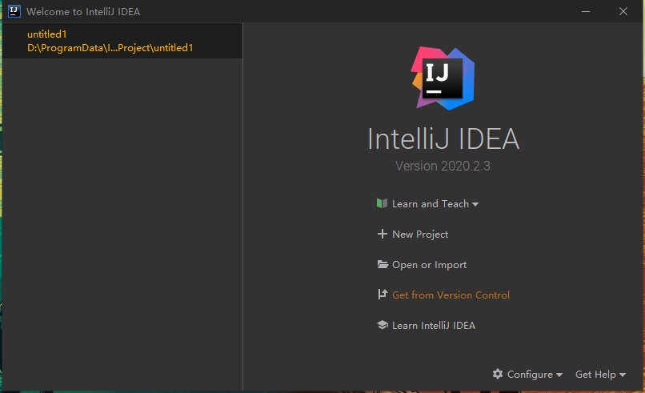

#### 5.2.6 从远程拉取代码

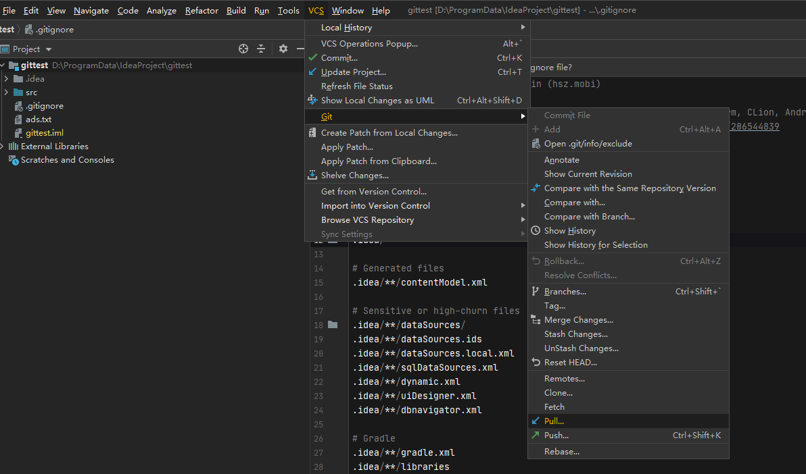

通过更新项目**Update Project**也可以从远程仓库更新代码

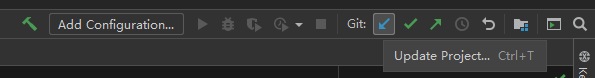

#### 5.2.7 版本对比

Compare with

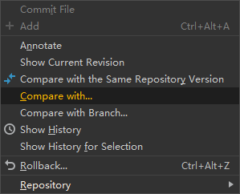

选中最早的一次

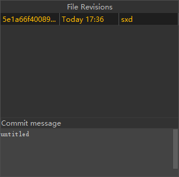

右侧表示当前最新的，左侧为上一步选中版本

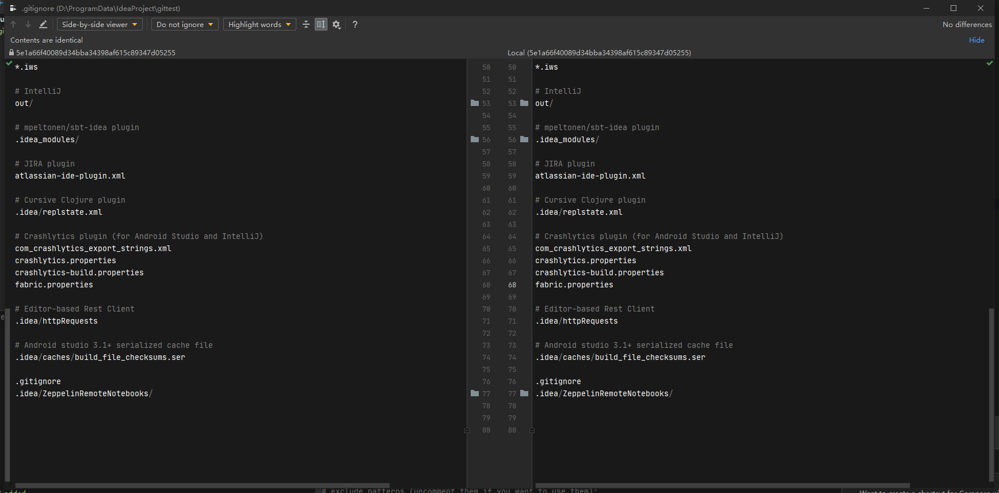

在对比历史版本代码时非常有用

#### 5.2.8 创建分支

Git/Branches/New Branch

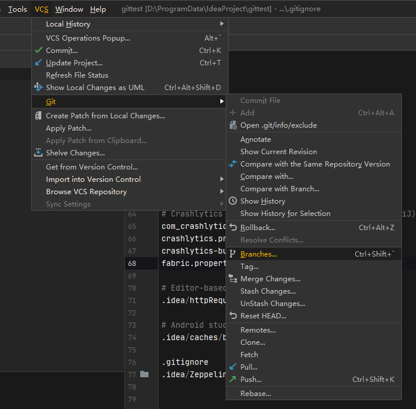

勾选checkout branch会**切换到该分支**

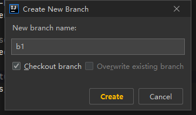

切换回master：Branches/master/checkout

#### 5.2.9 合并分支

Git——Repository——Merge Changes

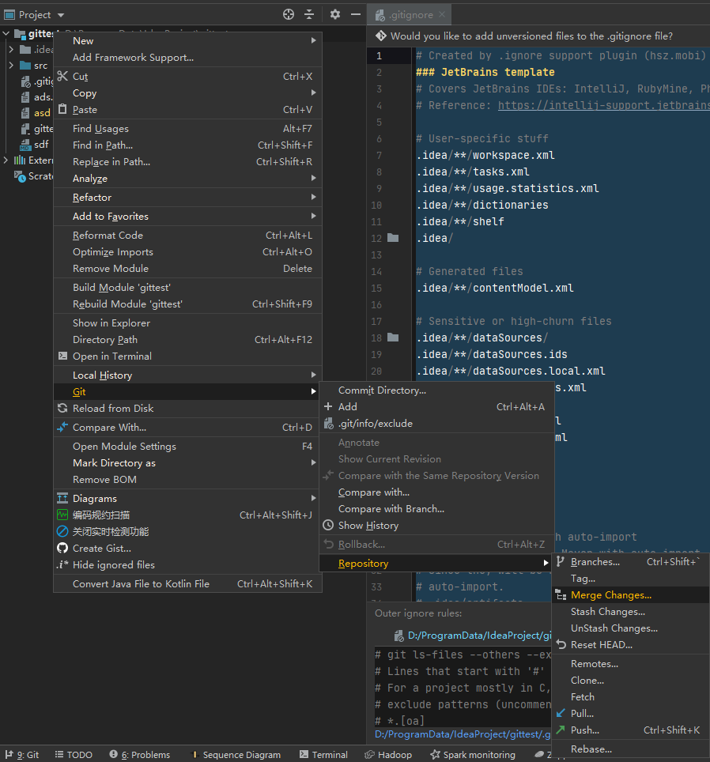

# 6.使用SSH协议传输数据

### 6.1 Git支持的传输协议

由于Git的远程仓库并不在我们本地，当我们在使用远程仓库的时候（例如克隆、拉取、推送）就会涉及到数据的网络传输，Git支持多种数据传输协议

* 本地协议（Local）

* HTTPS 协议

* SSH（Secure Shell）协议

* Git 协议

我们前面的操作都是基于HTTPS协议进行的，本章节我们会学习如何使用SSH协议

### 6.2 什么是SSH协议

* SSH为**Secure Shell（安全外壳协议）**的缩写，由IEEE的网络小组（Network Working Group）所制定。SSH是目前较为可靠，专为远程登录会话或其他网路服务提供安全性的协议。利用SSH协议可以有效防止远程管理过程中信息泄露问题。（本身是一个安全的协议）

* 由于本地Git仓库和远程仓库之间的传输是通过SSH加密的，所以必须要让远程仓库服务器认证你的SSH key，在此之前，必须要生成SSH key。

* 使用SSH协议通信时，**推荐使用基于密钥的验证方式**。你必须为自己创建一对密钥（公钥和私钥），并把公钥放在要访问的服务器上。
  * HTTPS：通过用户名和密码验证，只用输入一次
  * SSH：会自动进行公钥和私钥的匹配

### 6.3 配置SSH协议

在没有配置公钥和私钥之前，不能通过SSH地址进行克隆等操作

可以使用Git提供的命令行工具Git Bash生成公钥和私钥，具体操作过程如下：

* 使用命令**ssh-keygen –t rsa**生成公钥和私钥，执行完成后在window本地用户.ssh目录**C:\Users\用户名\.ssh**下面生成如下名称的公钥和私钥

  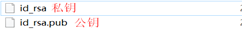

* 复制公钥文件至服务器


# 注意

1. git status下中文文件名显示Unicode码

   **git config --global core.quotepath false**

2. 解决git 错误error: failed to push some refs to......

   * **办法1：**先拉下来，会自动合并的（不用操心）

     命令：**git pull origin master**

   * **办法2：**可以通过如下命令进行代码合并

     命令：**git pull --rebase origin master**  (我的成功解决是方法2)

   * **最后：**再执行语句 git push 即可完成代码上传到github

     命令：**git push -u origin master**

3. 修改远程关联仓库

   git remote set-url origin http://192.168.100.235:9797/john/git_test.git

4. commits

   我们平常用的一些操作git clone ,git commit 都会产生commits，通俗的讲这个就是版本号，但是git reset并不会产生commits（不是不会产生，而是会产生 但是都是一样的），通过**git reflog**查看

   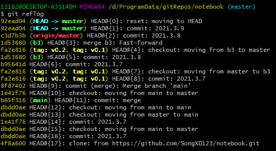

5. 

