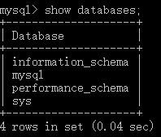

# 1.SQL 概述

### 1.1 使用数据库

* 实现数据持久化
* 使用完整的管理系统统一管理，易于查询

### 1.2 数据库相关概念

* **==DB==**：数据库（database）：存储数据的**“仓库”**。它保存了一系列有组织的数据。 
* **==DBMS==**： 数据库管理系统（Database Management System），**简称数据软件或数据库产品**，如MySQL。数据库是通过DBMS创建和操作的容器。  
  * 安装DBMS后，就可以操作和管理DB中的数据
* **==SQL==**：结构化查询语言（Structure Query Language）：专门用来与数据库通信的语言。  

### 1.3 SQL优点：

* 不是某个特定数据库供应商专有的语言，几乎所有DBMS都支持SQL
* 简单易学
* 虽然简单，但实际上是一种强有力的语言，灵活使用其语言元素，可以进行非常复杂和高级的数据库操作。 

### 1.4 数据库存储数据特点

* 将数据放到表中，表再放到库中
* 一个数据库中有多张表，每个表有一个名字，用来标识自己。表名具有唯一性
* 表具有一些特性，这些特性定义了数据在表中如何存储，类似“类”的设计
* 表由字段组成，类似“属性”
* 数据按行存储，类似“对象”

### 1.5 MySQL

MySQL数据库隶属于MySQLAB公司，总部位于瑞典，后被Oracle收购

优先：

* 成本低：开源代码
* 性能高：执行很快
* 简单：容易安装和使用


#### 1.5.1 安装

* DBMS分为两类
  * 基于共享文件系统的DBMS(**Access**)
  * 基于C/S架构的DBMS：MySQL、Oracle等
    * 使用时需要安装客户端和服务端，**一般来说安装数据库指安装数据库服务端**

* MySQL版本
  * 社区版
  * 企业版
* 安装
  * Developer Default（安装所有开发产品）、Server only、Client only、Full、Custom
  * Multifunctional Database（多功能存储引擎）、Transactional Database only（事务型存储引擎）、Non-Transactional Database only（非事务型存储引擎）
    * **存储引擎分为事务型存储引擎和非事务型存储引擎**
  * Developer Machine（开发机）、Server Machine（服务机）、Delicated MySQL Server Machine（专用服务器），**所占内存越来越大**
  * MySQL中字符集为**utf8**而非**utf-8**
* 过程与配置
  * 8.0以后没有MySQLInstanceConfig.exe来修改配置，似乎可以通过**Installer**来配置
* 配置文件
  * 位置：**C:\ProgramData\MySQL\MySQL Server 8.0\my.ini**
  * 服务端配置项：
  * 端口号：port=3306
  * **安装目录**：# basedir="C:/Program Files/MySQL/MySQL Server 8.0/"
  * **文件目录**：datadir=C:/ProgramData/MySQL/MySQL Server 8.0\Data，**即数据存储路径**
  * **字符集**：# character-set-server=
  * **存储引擎**：default-storage-engine=INNODB，**存储引擎用以执行SQL语句**
  * **语法模式**：sql-mode="STRICT_TRANS_TABLES,NO_ENGINE_SUBSTITUTION"
  * **最大连接数**：max_connections=100
  * **改完重启数据库服务**

#### 1.5.2 启动与停止

启动：

* 计算机管理中的服务中找到MySQL服务（如MySQL80），将其启动或停止，可以在其属性中修改启动类型为自动或手动
* 命令行方式：管理员方式打开命令行窗口（CTRL+SHIFT+ENTER），
  * 停止：**net stop mysql80**
  * 启动：**net start mysql80**

#### 1.5.3 登录与退出

前提：**保证服务是启动的**

* 通过MySQL自带客户端（**Command Line Client**），并输入root密码
  * 退出：**exit**或**CTRL+C**
  * **只适用于root用户**，==不推荐==
* 管理员权限客户端， **mysql -h hostname -P port -u username -p password**
  * 可以在-p后打回车，并输入密码
  * 退出：**exit**或**CTRL+C**
  * **如果连接到本机3306，-h和-P都可以省略**
  * **需要配置环境变量**

#### 1.5.4 常见命令

* 推荐每句结尾用**分号或\g**

* **查看所有数据库**：==show databases==

  

  * information_schema：保存元数据信息
  * mysql：保存用户信息
  * performance_schema：保存性能信息、性能参数
  * test：测试数据库，是空的，可以在其中建表，删除库或修改库，**前三个不能动**，**==但似乎可能没有，需要手动建立==**

* **进入数据库**：==use dbname==

* **查看表**：

  * 进入某个数据库，然后==show tables==
  * ==show table from dbname==，**但不会进入该数据库**

* **查看当前所在库**：==select database()==

* **创建表**：

  ```sql
  create table stuinfo(
  	id int,
  	name varchar(20)
  );
  ```

  

* **查看表的信息**：==desc tablename==

* **查询**：==select==

* **插入**：==insert==（重启后依然生效）

* **更新**：==update==

* **查看版本**：

  * ==select version()==
  * 退出客户端，dos命令：==mysql --version==

#### 1.5.5 SQL语法规范

* 不区分大小写，但建议关键字大小写，表名、列名小写
* 每条命令最好用分号结尾
* 每条命令根据需要，可以进行缩进、分行，关键字单独占一行
* 注释：
  * 单行注释：#注释文字
  * 单行注释：-- 注释文字（**--后必须有括号**）
  * 多行注释：/* 注释文字 */

#### 1.5.6 SQL文件

一个询问代表一个SQL文件

# 2.SQL语言

### 2.1 SQL语言分类

* DQL(Data Query Language)
* DML(Data Manipulation Language)
* DDL(Data Define Language)
* TCL(Transaction Control Language，事务控制语言)

### 2.2 基础查询

语法：**select 查询列表 from 表名**

特点

* 查询列表可以是：表中的字段、常量、表达式、函数
* 查询结果是一个虚拟表格


注意：

* 建议在查询语句最开始加上**USE 库名**，来启动相应的库
* **==字符串必须用单引号==**
* 字段名左右可加可不加**`**
* 自动调整格式：**CTRL+b**
* 执行脚本：**CTRL+SHIFT+ENTER**

#### 2.2.1 查询字段

```sql
select last_name from employees
# 查询多个字段
select last_name,salary,email from employees;
# 查询所有字段
select * from employees
```

#### 2.2.2 查询常量值

```sql
select 100
select 'join'
```

#### 2.2.3 查询表达式

```sql
select 100*98
```

#### 2.2.4 查询函数

```sql
select version()
```

#### 2.2.5 别名

* 方便理解；
* 如果要查询的字段有重名的情况下，使用别名可以区分开来
* 如果别名包含空格等特殊符号，建议加双引号**"别名"**


* 方式一：使用as

```sql
select 100%98 as result;
select 'last_name' AS 姓, first_name AS 名
```

* 方式二：使用空格

```sql
select last_name 姓, first_name 名
```

#### 2.2.6 +号作用

* MySQL中**+**仅有运算符功能
  * 两个操作数都会数值型，则做加法运算
  * 其中一个操作数为字符型，则试图将字符数值转换成数值型
    * 转换成功，执行计算
    * 转换失败，将字符型数值转为0
  * 只要其中一个操作数为null，只要其中一方为null，结果一定为null 

```sql
select last_name+first_name AS 姓名
```

#### 2.2.7 拼接

使用concat函数

* 一个参数为null，则结果为null

```sql
select concat('a','b','c')#可变参数
```

* 为避免null的情况，使用ifnull函数
  * ifnull(字段名，默认值)

```sql
select
	concat('first_name',',','last_name',',',ifnull(job_id,0)) as output
from 
	employees
```

### 2.3 条件查询

语法：

```sql
select 
	查询列表
from
	表名
where
	筛选条件;
```

分类：

* 按条件表达式筛选：
  * 关系符：> < = != <> >= <=
* 按逻辑表达式筛选：
  * 逻辑运算符：&& || |或 and or not
* 模糊查询
  * like
  * between and
  * in
  * is null

#### 2.3.1 按条件表达式筛选

```sql
select
	*
from 	
	employees 
where
	salary > 12000
```

#### 2.3.2 按逻辑表达式筛选

* &&  and
* ||   or
* !  not

#### 2.3.3 模糊查询

* like
  * 一般和通配符一起使用：
    * %：任意多个字符，包含0个字符
    * _：任意单个字符
    * \：转移字符
      * 或自定义转移字符：like \'_\_\$\_%'  escape '\$'  将$定义为转移字符
* between min and max
  * 不能调换临界值
  * 临界值可以包含
*  in
  * 字段名/表达式 in ('a', 'b', 'c')
  * in列表的值类型必须统一或兼容
  * 不能用通配符
* is null
  * 不能用=表示
  * **is not null**表示不为null
  * **is 只能用于null**
* 安全等于 <=>
  * 可以用安全等于表示等于null：**<=>null**
  * 也可以用于判断其他值