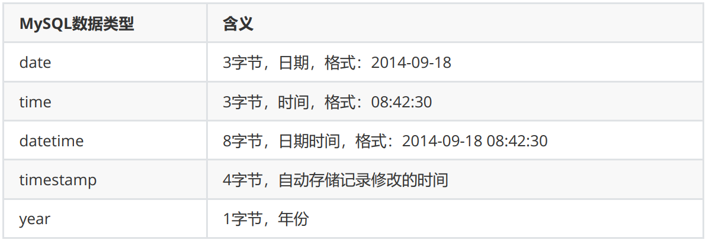
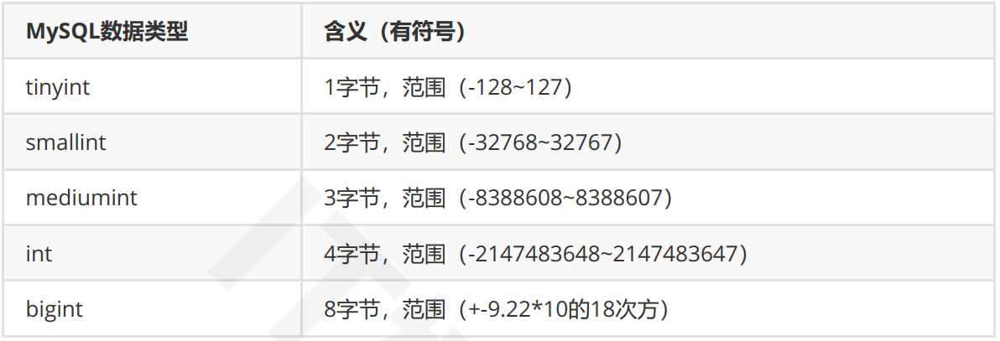
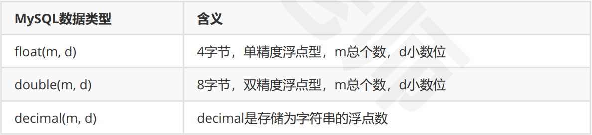
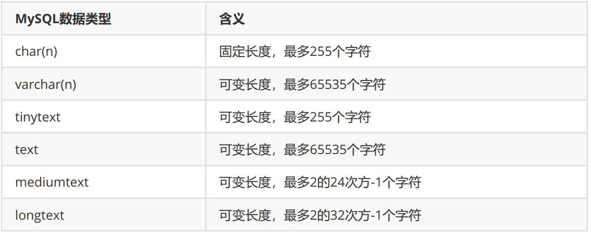

# 第一章

## 一、入门简介

### 1.介绍

* MySQL是一种开放源代码的**关系型（表和表有关系）**数据库管理系统（RDBMS），使用最常用的数据库管理语言--
  **结构化查询语言**（SQL）进行数据库管理。
  * 前端：采集和展示
  * 后端：数据处理和存储，因此有性能问题
  * 非结构化的存储介质：**Hadoop**、**fastdfs（主要存图片）**
  * **DFS**：分布式文件存储系统
  * 也有基于键值对的内存数据库：**redis**
  * 列式数据库：**hbase**
  * 文档数据库：**mongodb**
  * 时序数据库
* MySQL是开放源代码的，因此任何人都可以在General Public License的许可下下载并根据个性化
  的需要对其进行修改。
* MySQL因为其速度、可靠性和适应性而备受关注。MySQL是管理内容最好的选择。
* 安装Server即可

### 2.socket介绍

* 客户端和服务端是使用socket链接的。  
* socket中文翻译是插座，但是学术叫套接字。其实就是计算机和计算机链接的方式 。
* 一个计算机使用ip+端口使用某种协议就能和另外一台机子的ip+端口链接通信。（TCP / UDP）  
  * 数据库连接是用TCP
* mysql使用的默认端口是3306，一个客户端随便使用一个端口，就能连接上服务。  
* **服务器的ip+端口是固定的**,客户端往往是随机的 。
  * 数据库服务器一个就足够，客户端可以有多个

### 3.基本

* 清屏：
  * windows下无法通过命令行清空
  * Linux下：system clear   system reset   !clear   commond+I

#### 

# 二、SQL

## 1.SQL语句分类

* DDL(Data Definition Language):数据定义语言，用来定义数据库对象：库、表、列等。功能：
  创建、删除、修改库和表结构。
* DML(Data Manipulation Language):数据操作语言，用来定义数据库记录:增、删、改表记录。
* DCL(Data Control Language):数据控制语言，用来定义访问权限和安全级别。
* DQL(Data Query Language):数据查询语言，用来查询记录。也是本章学习的重点。  

##  2.DCL（数据控制语言）

该语言用来定义访问权限，以后用得不多。

需要记住得是，一个项目创建一个用户，一个项目对应的数据库只有一个。这个用户只能对这个数据库有权限，其他数据库该用户就操作不了。

### 2.1 创建用户

* 用户只能在指定ip地址上登录mysql：create user 用户名@IP地址 identified by '密码‘;
* 用可以在任意ip地址上登录：create user 用户名@'%' identified by ’密码':

```sql
create user zn@'%' identified by 'zn123';
```

### 2.2 给用户授权

语法: 

```
grant 权限1，…，权限n on 数据库.* to 用户名@用户地址 identified by '连接口令'
```

 其中权限1、2、n可以直接用**all关键字**代替。

权限例如:create，alter，drop，insert，update，delete，select。  

* *代表所有的表
* \*.*代表所有数据库的所有表
* 用户地址可以是localhost、IP地址、机器名、域名，可用'%'表示从任何地址连接
* 刷新权限：flush privileges
* **==MySQL8分配权限不能带密码，即不需要identified==**

```sql
# 将test下所有表的所有权限给zn用户
grant all on test.* to zn
```

### 2.3 撤销用户

语法：

```sql
revoke 权限1，…，权限n on 数据库.* from 用户名@ip地址；
```

撤销指定用户在指定数据库上的指定权限。撤销例如：

```sql
revoke create,delete on mydb1.* form user@localhost;
```

表示的是撤销user用户在数据库mydb1上的create和alter权限

```sql
revoke all on test.* from zn;
```

### 2.4 查看权限

查看指定用户的权限：

```sql
show grants for 用户名@ip地址;
```

### 2.5 删除用户

```sql
drop user 用户名@ip地址
```

## 3.DDL（数据定义语言）

该语言用来对数据库和表结构进行操作

* use databse：进入数据库
* show tables：查看有哪些表
* 

### 3.1常用的数据类型

#### 日期和时间数据类型



#### 整型



上面定义的都是有符号的，也可以加上unsigned关键字，定义成无符号的类型，取值范围翻倍，例如**tinyint unsigned**的取值范围为0~255

#### 浮点型



decimal精度更高，如有一列为float(5, 3)  ：

* 插入123.45678，最后查询得到的结果为99.999；  
* 插入123.45678，最后查询得到的结果为99.999；  
* 插入123.45678，最后查询得到的结果为99.999；  

在使用浮点数时，需要注意

#### 字符串数据类型



* char(n)和varchar(n)中括号中的n代表字符的个数，并不代表字节个数，所以当使用了中文的时候(UTF8)意味着可以插入m个中文，但是实际会占用m*3个字节。  
* 同时，char和varchar最大的区别就在**于char不管实际value都会占用n个字符的空间**，而**varchar只会占
  用实际字符应该占用的空间+1**，并且实际空间+1<=n  
* 超过char和varchar的n设置后，字符串会被截断。  
* char的上限为255字节，varchar的上限65535字节，text的上限为65535  。
* char在存储的时候会截断尾部的空格，varchar和text不会  
* **varchar会使用1-3个字节来存储长度**，text不会  

#### 其他类型

* enum("member1","member2",...,"member65525")

  enum定义了一种枚举，最多包含65535个不同成员。当定义了一个enum的列时，该列的值限制为列定义中声明的值。如果列声明包含NULL属性，则**NULL将被认为是一个有效值，并且是默认值**，如果声明了**NOT NULL**，则列表**的第一个成员是默认值**

* set(“member”, “member2″, … “member64″)  

  set数据类型为指定一组预定义值中的零个或多个值提供了一种方法，这组值**最多包括64个成员**。值的选择限制为列定义中声明的值。

### 3.2 对数据库的操作（增删改查）

* 查看所有数据库：**show databases; **
* 使用数据库：**use 数据库名;**
* 创建数据库并指定编码，如不指定编码可能会导致乱码问题；**也可以在创建表的时候指定**

```sql
 create database test1 default character set utf8;
 # 或
  create database test1 charset utf8;
```

* 删除数据库：**drop database 数据库名**
* 切换数据库：**use 数据库名**

### 3.3 对表结构的操作

#### 创建表

```sql
create table 表名 (
	字段名1 类型 (宽度) 约束条件,
    ...
);

CREATE TABLE student (
	id INT(10) primary key,
	name VARCHAR (10),
	age INT (10) NOT NULL,
	gander varchar(2)
);
CREATE TABLE course (
	id INT (10) primary key,
	name VARCHAR (10) ,
	t_id INT (10)
);
CREATE TABLE `teacher` (
	id INT (10) primary key,
	name VARCHAR (10)
);
CREATE TABLE `scores` (
	s_id INT primary key,
	score INT (10),
	c_id INT (10)
);
```

#### 查看当前数据库中所有表

show tables

#### 查看表结构

desc 表名

#### 修改表

* 添加列：**alter table 表名 add(列名 列类型, ... , 列名 列类型);**

```sql
ALTER TABLE student add (address VARCHAR(20),hobby VARCHAR(20))
```

* 修改列类型：**alter table 表名 modify 列名 列的新类型;**

```sql
alter table student modify hobby int
```

* 列名称和类型一起修改：**alter table 表名 change 原列名 新列名 列类型;**

```sql
alter table student change hobby newhobby varchar(15);
```

* 删除表：**alter table 表名 drop 列名;**

```sql
alter table student drop newHobby
```

* 修改表名：**alter table 表名 rename to 新表名**

```sql
ALTER TABLE student add (address VARCHAR(20),hobby VARCHAR(20))
```

## 4.DML（数据操作语言）

用来对表记录操作（增删改）

### 4.1 插入数据（一次插入就是插入一行）

```sql
insert into 表名(列名1, 列名2, 列名3) values (列值1, 列值2, 列值3);
insert into stu (id,name,age,gander) values (2,'李华',19,'男');
```

说明：

* 在数据库中所有的**字符串类型，必须使用单引号**
* **(列名1，列名2，列名3)可省略**，表示按照表中的顺序插入。但不建议采取这种写法，因为降低了
  程序的可读性  

### 4.2 修改记录

#### 修改某列的全部值：

update 表名 set 列名1=列值1(, 列名2=列值2)；

```sql
UPDATE stu set age=22;
UPDATE stu set age=23,name='张楠';
```

这样会修改所有数据，所以往往加条件

```sql
update stu set age=23, name='sxd', where id=1
```

#### 修改（某行或多行记录的）列的指定值：

update 表名 set set 列名1=列值1 where 列名2=列值2 or 列名3=列值3


==**运算符**==：

> =、!=、<>、<、>、>=、<=、between...and、in(…)、is null、not、or、and   

* 其中in(...)的用法表示集合，如

```sql
# 不用in
update 表名 set 列名1=列值1 where 列名2=列值2 or 列名2=列值22
# 用in
update 表名 set 列名1=列值1 where 列名2 in (列值2, 列值3)
```

#### 删除数据（整行）

delete from 表名 (where 条件)

**不加where条件会删除表中所有记录，为防止这种失误操作，很多数据库往往都会备份**

# 三.登录别人的MySQL

修改IP：

* /etc/sysconfig/network-scripts/ifcfg-ens3，修改IPADDR
* 重启网卡：systemctl restart network

关闭防火墙：

* systemctl stop firewalld：关闭防火墙
* systemctl disabled firewalld：开机不启动

**==MySQL8步骤==**

* grant all on \*.* to root@'%'
  * 权限分配不能带有密码，即不需要identified
  * 为root用户分配权限
  * 如果出现错误：You are not allowed to create a user with GRANT，则
* 使用MySQL数据库：**use mysql**
* 特定用户的host修改：**update user set host='%' where user='root'**
* 指定用户权限：**grant all on \*.* to root@'%'**
* 刷新权限：flush privileges
* 在远程客户端，登录：**mysql -h ip/主机地址 -P port -u root -p**


说明：几种数据库：

* information_schema：保存元数据信息
* mysql：保存用户信息
* performance_schema：保存性能信息、性能参数

# 四.常见的建表约束

