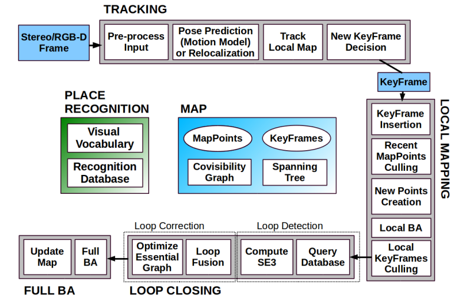
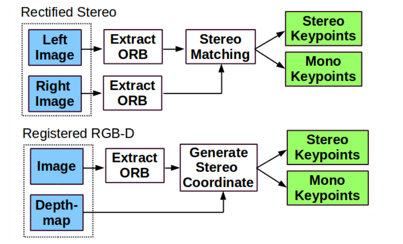
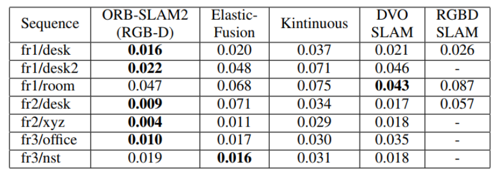
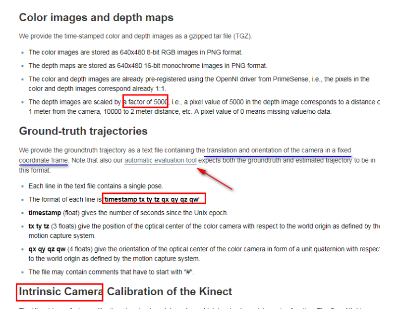

# 1.ORB_SLAM2 简介

### 1.1 ORB_SLAM2简介

* 首个（2017年发布时）支持单目，双目和RGB-D相机的完整的开源SLAM方案，具有回环检测和重
  新定位的功能。
* 能够在CPU上进行实时工作，可以用于移动终端如 移动机器人、手机、无人机、汽车。特征点法的巅峰之作，定位精度极高，可达厘米级。
* 能够实时计算出相机的位姿，并生成场景的稀疏三维重建地图。
* 代码非常工整，可读性强，包含很多实际应用中的技巧，非常实用。
* 支持**仅定位**模式，该模式适用于**轻量级以及在地图已知情况下**长期运行，此时**不使用局部建图和回环检测的线程**。
* 双目和RGB-D（与单目很多代码重用）相对单目相机的主要优势在于，可以直接获得深度信息，不需要像单目情况中那样做一个特定的SFM初始化。  

### 1.2 框架

#### **主体框架**



#### **数据输入的预处理：**

为了兼容不同相机（双目相机与RGBD相机），需要对输入数据进行预处理，使得交给后期处理的数据格式一致，具体流程如下：



#### 文件说明

* yaml：相机参数等配置文件

# 2.TUM数据集使用

编译完成后，在Examples下有各种可执行文件

### 2.1 ORB-SLAM2在TUM数据集上的表现



### 2.2 TUM RGB-D 数据集简介

注意：

* 深度的表达方式

* 数据的存储格式

  * 彩色图：$640\times 480$的8bit图
  * 深度图：16bit，像素值5000代表1米
  
* Ground-truth：

  * 相机在固定坐标系下的值，并非第一帧

  

### 2.3 运行RGBD模式时的预处理

关于associate.py：

* 官网下载
* 只能在Python2环境下运行
* 适用于RGBD模式，该模式下彩色图和深度图不是同时输出，存在时间差，所以需要进行关联，即哪一帧彩色图对应哪一帧深度图，但时间并非严格关联
* 运行

```python
python associate.py rgb.txt depth.txt > associate.txt
# 对ground-truth也进行对齐
python associate.py associate.txt groundtruth.txt > associate_with_groundtruth.txt
# 如果添加了中文注释，需要在开头加上
#encoding=utf-8
```

* 注意：
  * 直接associate后出问题，生成的结果**associate_with_groundtruth.txt**和**associate.txt**不一定一一对齐，也就是说，associate的不一定有groundtruth，**associate.txt**的行数可能多余**associate_with_groundtruth.txt**，所以要以**associate_with_groundtruth.txt**的关联结果为准

### 2.4 不同颜色地图点含义

* **红色**点表示局部地图点（用于当前的跟踪），黑色点表示 剩下的点（没有跟踪到）

```c++
void MapDrawer::DrawMapPoints()
{
    //取出所有的地图点
    const vector<MapPoint*> &vpMPs = mpMap->GetAllMapPoints();
    //取出mvpReferenceMapPoints，也即局部地图d点
    const vector<MapPoint*> &vpRefMPs = mpMap->GetReferenceMapPoints();

    //将vpRefMPs从vector容器类型转化为set容器类型，便于使用set::count快速统计 - 我觉得称之为"重新构造"可能更加合适一些
    //补充, set::count用于返回集合中为某个值的元素的个数
    set<MapPoint*> spRefMPs(vpRefMPs.begin(), vpRefMPs.end());

    if(vpMPs.empty())
        return;

    // for AllMapPoints
    //显示所有的地图点（不包括局部地图点），大小为2个像素，黑色
    glPointSize(mPointSize);
    glBegin(GL_POINTS);
    glColor3f(0.0,0.0,0.0);         //黑色

    for(size_t i=0, iend=vpMPs.size(); i<iend;i++)
    {
        // 不包括ReferenceMapPoints（局部地图点）
        if(vpMPs[i]->isBad() || spRefMPs.count(vpMPs[i]))
            continue;
        cv::Mat pos = vpMPs[i]->GetWorldPos();
        glVertex3f(pos.at<float>(0),pos.at<float>(1),pos.at<float>(2));
    }
    glEnd();

    // for ReferenceMapPoints
    //显示局部地图点，大小为2个像素，红色
    glPointSize(mPointSize);
    glBegin(GL_POINTS);
    glColor3f(1.0,0.0,0.0);

    for(set<MapPoint*>::iterator sit=spRefMPs.begin(), send=spRefMPs.end(); sit!=send; sit++)
    {
        if((*sit)->isBad())
            continue;
        cv::Mat pos = (*sit)->GetWorldPos();
        glVertex3f(pos.at<float>(0),pos.at<float>(1),pos.at<float>(2));

    }
    glEnd();
}

```

* **红色**点表示参考地图点，其实就是tracking里的local mappoints  
* **黑色**表示所有地图点，红色点属于黑色点的一部分

# 3.ORB特征


