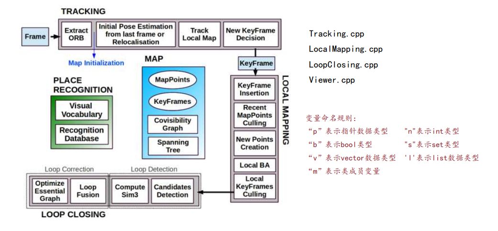

https://github.com/Tom-Hardy-3D-Vision-Workshop/Awesome-Autonomous-Driving

地址：raulmur/ORB-SLAM2

# 1.简介

作者：Raul Mur-Artal

特点：

* 首个支持单目，双目和RGB-D相机的完整的开源SLAM方案，能够实现地图重用，回环检测和重新定位的功能
* 能够在CPU上进行实时工作，比如手机、无人机和汽车
* 特征点法的巅峰之作，定位精度极高
* 能够实时计算出相机位姿，并生成场景的稀疏三维重建地图（稠密建图未公开）
* 代码非常整洁，模块化分割很好，包含很多实际应用中的技巧，非常实用
* 支持仅定位模式，该模式适用于轻量级以及在地图已知情况下长期运行，此时不使用局部建图和回环检测线程
* 双目和RGB-D相对单目相机的主要优势在于，可以直接获得深度信息，不需要像单目情况中那样做一个特定的SFM初始化（除此外，跟踪中，双目或RGB-D会补充一些临时地图点，增加鲁棒性）

# 2.ORBSLAM2代码框架

 

* 模块化、封装的很好，代码简洁，适合学习