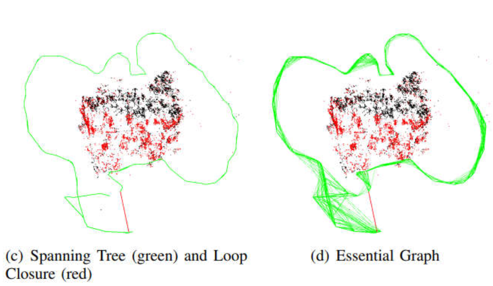
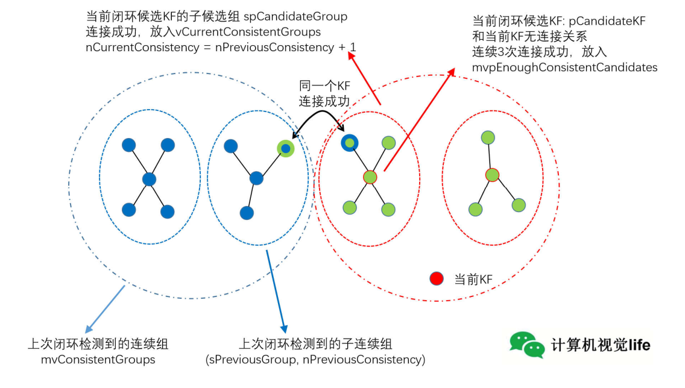

ORB-SLAM2：

ORB-SLAM2是视觉SLAM中特征点法的开源代表作，同时支持单目、双目、RGBD相机，涵盖视觉SLAM领域重要知识，如实时跟踪、局部地图、回环检测、BA优化，工程技巧。适合二次开发，视觉SLAM工作必备，为学习ORB-SLAM3打基础 。

框架：

**主体三个线程**：

* Tracking：跟踪
  * 预处理
  * 初步跟踪
    * Pose prediction：参考关键帧跟踪
    * Motion model：恒速模型
    * Relocalization：重定位跟踪
  * Track Local Map：用局部地图进行更精确跟踪
  * new keyframe decision：根据跟踪结果判断是否生成关键帧
* Local Mapping：局部建图（只对关键帧操作，不管普通帧）
  * KeyFrame Insertion：生成关键帧插入Local Mapping
  * Recent MapPoints Culling：地图点筛选（tracking时，选入了较多地图点，这里进行较为严格的筛选）
  * New Points Creation：由关键帧生成新的地图点
  * Local BA：对位姿和地图点进行多个帧的BA（tracking中只对位姿进行BA）
  * Local KeyFrames Culling：关键帧剔除
* Loop Closing：闭环检测
  * Loop Detection
    * Query Database：关键帧放入一个Database（即Recognittion Database)，每插入一个关键帧，都会去查询是否发生闭环
    * Compute SE3：确认闭环，计算SE3
  * Loop Correction:
    * Loop Fusion：闭环融合。当前关键帧和闭环关键帧用SE3作矫正，对地图点位姿进行融合
    * Optimizatoin Essential Graph：优化本质图
* 最后，FULL BA（全局BA），更新地图
* 其他：
  * MAP：地图点(MapPoints)、关键帧(KeyFrames)、共视图(Covisibility Graph)、扩展树(Spanning Tree)
  * Place Recognition（位置识别，通过词袋模型）

**ORB-SLAM2特点**

* 所有的任务（跟踪/局部地图/闭环/重定位）==**采用相同的特征**==，使得系统更高效、简单可靠  
* ORB特征具有==**旋转/光照不变性**==，无需GPU即可实时  
* **==共视图使得跟踪/建图控制在局部共视区域==**，与全局地图大小无关，可以在大场景下运行  
* 使用**==Essential Graph来优化位姿实现回环检测==**，耗时少精度高  
* 实时重定位使得在**==跟踪丢失后可以恢复位姿==**，增强地图重用性  
* **==单目初始化和应用场景解耦，不管是平面/非平面场景==**，都可以**==自动初始化==**，无需人工干预  
* 地图点和关键帧**==创建比较宽松==**，但后续会进行**==严格筛选==**，剔除冗余关键帧和误差大的地图点，增加建图过程的弹性，在大旋转、快速运动、纹理不足等恶劣情况下可以提高跟踪的鲁棒性  
* 相比于直接法（==**距离较远，时间较长时，灰度不变可能不成立，光度误差大，baseline较小**==），可以用于==**宽基线匹配**==（**视图不变性和光照不变性**），更适合于**对深度精度要求较高的三维重建** （**需要较大的baseline**） 
* 适用于手持设备、汽车、机器人  
* 集各种优秀的算法于一身，特征点法SLAM中最佳方案  

**ORB-SLAM2不足**

* 相比于直接法，**特侦提取比较耗时**，运行速度没有直接法高
* 相比于直接法，**在弱纹理/重复纹理/图像模糊**的场景下容易跟踪丢失  
* 产生的地图比较稀疏  

**共视图**

* 节点是关键帧，边是关键帧之间的共同观测地图点数目（至少15个）

  

  
  * 共视图有多个层级，可以扩展。一般用一级相邻关键帧比较多，在局部地图点中用一级+二级相邻。
  * 通过共视关系得到更多的信息进行优化
  * 共视关系体现关键帧之间的紧密程度
  * 共视图只是提供一种结构关系，可以用在很多地方，在跟踪时通过一级相邻和二级相邻的信息得到很多地图点，将所有地图点投影到当前关键帧上，得到更多约束，从而使得位姿优化更准确；也可以在用于重定位、候选关键帧等。

**本质图（Essential Graph）**

* 只针对关键帧，不考虑普通帧
* 共视图比较稠密，本质图比共视图更稀疏，这是因为本质图的作用是用在闭环矫正时，用相似变换来矫正尺度漂移，把闭环误差均摊在本质图中。本质图中节点也是所有关键帧，但是连接边更少，只保留了联系紧密的边来使得结果更精确  
* 包括
  * Spanning tree连接关系
  * 形成闭环的连接关系，闭环后地图点变动后新增的连接关系
  * 共视关系非常好（至少100个共视地图点）的连接关系
* 建立在扩展树基础上，加了**闭环关系**和**共视关系非常强的共视关系**

**闭环检测确认候选帧**

* 近远点判断

  