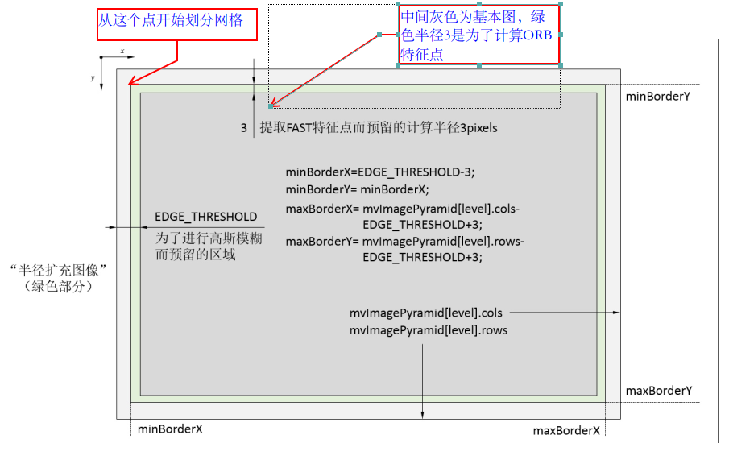
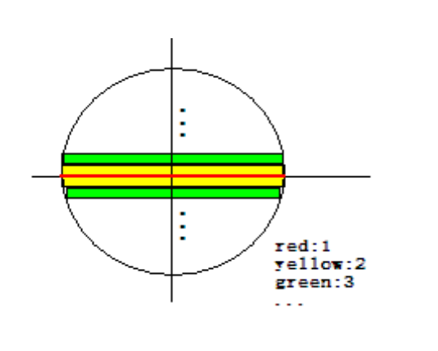
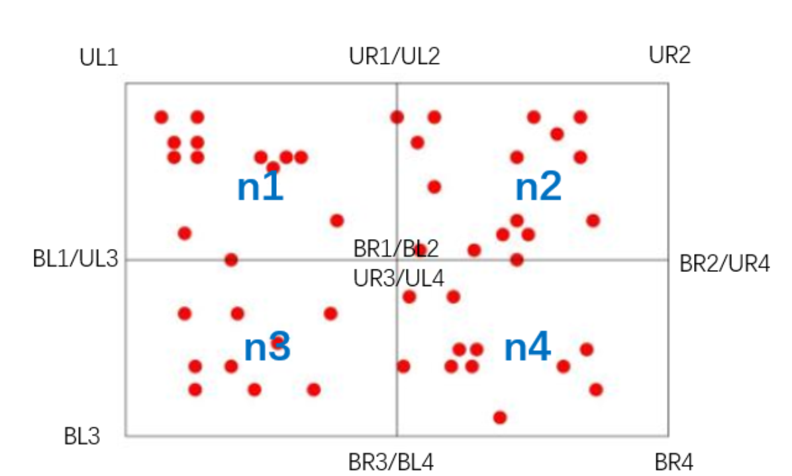
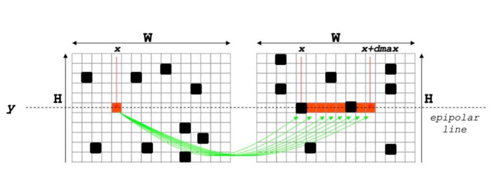
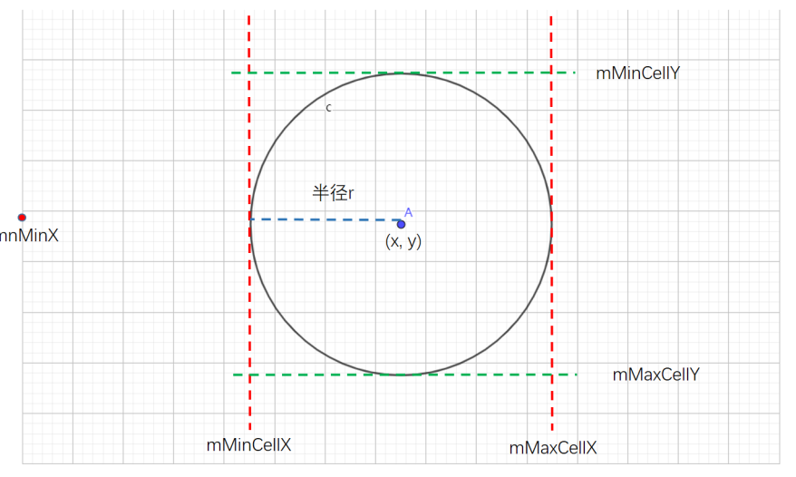

# **mono_tum**

* LoadImages：读取文件
  * strFile：rgb.txt等文件，记录时间戳和帧文件名
  * vTimestamps：返回值，记录时间戳
  * vstrImageFilenames：返回值，记录帧文件名
* <a href="#system">创建ORB_SLAM2::System系统，初始化所有线程并准备处理图像帧，传入</a>
  * strVocFile：字典文件
  * strSettingFile：yaml配置文件
  * sensor：传感器类型枚举
  * bUseViewer：是否可视化
* vTimesTrack：跟踪时间数据
* 循环读取图片
  * cv::imread读取图片
  * tframe：读取时间戳
  * <a href="#trackmonocular">将图像传给SLAM系统：SLAM.TrackMonocular(im, tframe)</a>

# <span id="system">System</span>

* 构造cv::FileStorage读取yaml配置文件，此处仅检查文件是否有效
* 构造ORBVocabulary字典，利用了DBoW2
  * loadFromTextFile(filename)：加载字典
* 构造KeyFrameDatabase，创建关键帧数据库
* 构造Map
* 构造FrameDrawer和MapDrawer构造帧绘制器和地图绘制器供可视化的Viewer使用
* <a href="#tracking">构造并初始化Tracking线程</a>myTracker
  * System *pSys：系统实例
  * ORBVocabulary *pVoc：BOW字典
  * FrameDrawer *pFrameDrawer：帧绘制器
  * MapDrawer *pMapDrawer：地图点绘制器
  * Map *pMap：地图句柄
  * KeyFrameDatabase *pKFDB：关键帧产生的词袋数据库
  * const string &strSettingPath：配置文件路径
  * const int sensor：传感器类型
* 初始化局部建图线程LocalMapping：mpLocalMapper
* 初始化闭环线程LoopClosing并运行：mpLoopCloser
* 初始化Viewer线程并运行
* 给mpTracker设置追踪器

### <span id="trackmonocular">System::TrackMonocular</span>

* 一些线程和模式的设置
* <a href="#grabimagestereo">获取相机位姿的估计结果：cv::Mat Tcw = mpTracker->GrabImageStereo(imLeft,imRight,timestamp)</a>
  * 输入左目或RGBA图像，输出世界坐标系到该相机标系的变换矩阵
  * step1：将彩色图像转为灰度图像
  * step2：构造Frame
  * step3：跟踪


# <span id="tracking">Tracking</span>

* 内参赋值：mK
* 矫正参数赋值：mDistCoef
* 双目摄像头baseline * fx：mbf
* 帧率：fps
* RGB还是BGR：mbRGB
* 加载ORB特征点有关参数：
  * nFeatures：每一帧提取的特征点数
  * fScaleFactor：图像建立时金字塔时的变化尺度：1.2
  * nLevels：尺度金字塔的层数：8
  * fInitThFAST：提取fast特征点的默认阈值
  * fMinThFAST：如果默认阈值提取不出足够fast特征点，则使用最小阈值8
* <a href="#extractor">构建ORBextractor类变量**mpORBextractorLeft**来提取左图特征点</a>：
  * _nfeatures：要提取的特征点数目
  * _scaleFactor：图像金字塔的缩放系数
  * _nlevels：图像金字塔的层数
  * _iniThFAST：指定初始的FAST特征点提取参数（阈值），可以提取出最明显的角点
  * _minThFAST：如果因为图像纹理不丰富，提取出的特征点不多，为了达到想要的特征点数目，就使用该参数提取不是那么明显的特征点
* 如果是双目，还需要计算mpORBextractorRight
* 单目初始化时，构建ORBextractor类变量**mpIniORBextractor**来提取两倍特征点
* 计算3D远/近点阈值mThDepth
* 链接深度值和具体深度值的参数：mDepthMapFactor

### <span id="track">track</span>

track包括3部分：**初始化、跟踪、记录位姿信息并用于轨迹复现**

* <a href="#mstate">判断mState是否为NO_IMAGES_YET，如果是，赋值为NO_INITIALIZED</a>
  * 如果图像复位过，或者第一次运行，则为NO_IMAGES_YET
* **mLastProcessedState**：存储了Tracking的最新状态，用于FrameDrawer中的绘制，**mLastProcessedState=mState**
* 地图更新时加锁
* step1：初始化：mState为NO_INITIALIZED时
  * RGBD/双目，使用<a href="#stereoinitialization">StereoInitialization</a>
  * 单目，使用<a href="#monocularinitialization">MonocularInitialization</a>

### <span id="grabimagestereo">GrabImageMonocular(im, timestamp)</span>

* mImGray=im：当前帧的灰度图像，在双目和RGBD输入时，为左侧图像的灰度图
* step1：将图像转为灰度图，若图片是3、4通道的，转为灰度图
* step2：构造Frame
  * <span id="mstate">判断mState状态是否是初始化</span>
    * SYSTEM_NOT_READY：系统没有准备好的状态，一般就是在启动后加载配置文件和词典文件时候的状态
    * NO_IMAGES_YET：当前无图像，没有成功初始化前的状态，传入Tracking构造函数
    * NO_INITIALIZED：有图像但是没有完成初始化
    * OK：正常时候的工作状态
    * LOST：系统已经跟踪丢了的状态
  * <a href="#frame">如果mState为NO_IMAGES_YET或NO_INITIALIZED，使用**mpIniORBextractor**作为特征点提取器初始化Frame，否则，用**mpORBextractorLeft**作为特征点提取器来初始化Frame，即**mCurrentFrame**</a>
* step3：跟踪<a href="#track">Track()</a>
* 返回当前帧的位姿：**mCurrentFrame.mTcw().clone()**

### <span id="monocularinitialization">MonocularInitialization</span>

* step1：如果单目初始化器（Initializer* mpInitializer）还没有被创建，则创建。**第一帧时初始化器就是未创建的状态，之后如果重新初始化也会重新创建**
  * 当前帧的特征点个数必须大于100
  * 初始化需要两帧：mLastFrame，mInitialFrame
    * **mLastFrame**=Frame(mCurrentFrame)
    * **mInitialFrame**=Frame(mCurrentFrame)
  * **mvbPrevMatched**：在初始化过程中，保存参考帧中的特征点

  ```c++
  for(size_t i=0;i<mCurrentFrame.mvKeysUn.size();i++){
  	mvbPreMatched[i]=mCurrentFrame.mvKeysUn[i].pt;
  }
  ```

  

  * <a href="#initializer">创建初始化器，ReferenceFrame=mCurrentFrame，sigma=1.0，iteration=200</a>

  * **mvIniMatches**：在初始化阶段中，当前帧中的特征点和参考帧中的特征点之间的匹配关系，用于跟踪初始化时两帧间的匹配关系，初始化为-1
    * **index保存的是F1中对应特征点的索引，值保存的是匹配好的F2特征点的索引**

* step2：如果单目初始化器已经被创建（第二帧开始）
  
  * 如果当前帧特征点数太少（少于100），则重新构造初始化器，删除上一帧的初始化器，保证连续两帧的特征点个数大于100，才能继续进行初始化
  
* step3：创建<a href="#orbmatcher">ORBmatcher</a>
  * 对**mInitialFrame**和**mCurrentFrame**进行特征点匹配
    * **mvbPrevMatched**为参考帧的特征点坐标，==初始化存储的时**mInitialFrame**中的特征点坐标，匹配后存储的时匹配好的当前帧的特征点坐标==
    * **mvIniMatches**保存==参考帧F1中特征点是否匹配上，index保存是F1对应特征点索引，值保存的是匹配好的F2特征点索引==
    * 调用<a href="#searchforinitialization">SearchForInitialization</a>在单目初始化中用于参考帧和当前帧的特征点匹配：

```c++
int nmatches = matcher.SearchForInitialization(//只有在单目初始化时使用
	mInitialFrame, mCurrentFrame,              //初始化时的参考帧和当前帧
	mvbPrevMatched,                            //在初始化参考帧中提取到的特征点
	mvInitMatched,                             //保存匹配关系
	100                                        //搜索窗口的大小
)
```

* step4：验证匹配结果，如果初始化的两帧之间的匹配点太少，重新初始化，需要删除mpInitializer，置为null
* Rcw：世界坐标系到当前相机系的旋转；tcw：世界坐标系到当前相机系的平移
* vbTriangulated：三角关系，记录当前特征点是否成功被三角化
* step5：通过H模型或F模型进行单目初始化，得到两帧间相对运动：<a href="#initialize">mpInitializer->Initialize</a>

```c++
mpInitializer->Initialize(
	mCurrentFrame,
	mvInMatches,
	Rcw,tcw,
	mvIniP3D,     //进行三角化得到的空间点集合
	vbTriangulated//对于mvInMatches来说，哪些点被三角化了
)
```

* step6：初始化成功后，删除那些无法进行三角化的匹配点

```c++
for(size_t i=0,iend=mvIniMatches.size();i<end;i++){
	if(mvIniMatches[i]>=0 && !vbTriangulated[i]){
		mvIniMatches[i]=-1;
		nmatches--;
	}
}

```

* step7：将初始化的第一帧作为世界坐标系，因此第一帧变换矩阵为单位矩阵

```c++
mInitialFrame.SetPose(cv::Mat::eye(4,4,CV_32F));
```

* 由Rcw和tcw构造Tcw，mTcw为世界坐标系到相机坐标系的变换矩阵

```c++
cv::Mat Tcw = cv::Mat::eye(4,4,CV_32F);
Rcw.copyTo(Tcw.rowRange(0,3).colRange(0,3));
tcw.copyTo(Tcw.rowRange(0,3).col(3));
mCurrentFrame.SetPose(Tcw);
```

* step8：创建初始化地图点MapPoints
  * **Initialize函数得到没mvIniPD**
  * **mvIniP3D是cv::Point3f类型的一个容器，是个存放3D点的临时变量**
  * **<a href="#createinitialmapmonocular">CreateInitialMapMonocular将3D点包装成MapPoint类型存入KeyFrame和Map中</a>**

### <span id="stereoinitialization">StereoInitialization</span>

### <span id="createinitialmapmonocular">CreateInitialMapMonocular</span>

* 认为单目初始化时候的参考帧和当前帧都是关键帧：<a href="#keyframe">KeyFrame</a>
  * 第一帧：**KeyFrame* pKFini = new KeyFrame(mInitialFrame,mpMap,mpKeyFrameDB)**
  * 第二帧：**KeyFrame* pKFcur = new KeyFrame(mCurrentFrame,mpMap,mpKeyFrameDB)**
  * mpMap：全局地图句柄
  * mpKeyFrameDB：当前系统运行的时候，关键帧所产生的数据库

* step1：将初始关键帧，当前关键帧的描述子转为BoW

  * **pKFini->computeBoW()**
  * **pkFcur->ComputeBoW()**

* step2：将关键帧插入到地图

  * **<a href="#addkeyframe">mpMap->AddKeyFrame(pkFini)</a>**
  * **mpMap->AddKeyFrame(pkFcur)**

* step3：用初始化得到的3D点来生成地图点MapPoints

  * mvIniMatches[i]表示用初始化得到的3D点来生成地图点MapPoints

    * 具体解释：i表示F1中关键点的索引值，vMatches12[i]的值为帧2的关键点索引，没有匹配关系的话，vMatches12[i]值为-1

  * 遍历mvIniMatches特征点对

    * mvIniMatches[i]<0表示没有匹配，跳过
    * 用三角化点初始化空间点的世界坐标：**cv::Mat worldPos(mvIniP3D[i])**
      * std::vector\<cv::Point3f> **mvIniP3D**：初始化过程中匹配后进行三角化得到的空间点
    * step3.1：用3D点构造<a href="#mappoint">MapPoint</a>：

    ```c++
    MapPoint* pMP = new MapPoint(
    	worldPos,
    pkFcur, //当前帧和前一帧都一样，三维点相同
        mpMap   //地图点所在的地图
    );
    ```
    
    * 表示KeyFrame的2D特征点和对应的3D地图点
      * <a href="#addmappoint">**pkFini->AddMapPoint(pMP, i)**</a>
      * **pkFcur->AddMapPoint(pMP, mvIniMatches[i])**
    * step3.2：为该MapPoint添加属性：
      * 观测到该MapPoint的关键帧，表示该MapPoint可以被哪个KeyFrame的哪个特征点观测到
        * <a href="#addobservation">**pMP->AddObservation(pKFini, i)**</a>
        * **pMP->AddObservation(pkFcur, i)**
      * 该MapPoint的描述子
      * 该MapPoint的平均观测方向和深度范围

# <span id="extractor">ORBExtractor</span>

* mvScaleFactor：存储每层图像缩放系数
* mvLevelSigma2：每层图像相对初始图像缩放因子的平方
* 逐层计算图像金字塔中图像相当于初始图像的缩放系数
* mvInvScaleFactor：mvScaleFactor的倒数
* mvInvLevelSigma2：mvLevelSigma2的倒数
* mvImagePyramid：每一层存储一幅图像
* factor：1/scaleFactor$N_\alpha=\frac{N\{1-s\}}{1-s^n}s^\alpha$
* nDesiredFeaturesPerScale：$\frac{N\{1-s\}}{1-s^n}$
* 分配特征点，多余的未能正好分配的分给最高层，每层个数$N_\alpha=\frac{N\{1-s\}}{1-s^n}s^\alpha$
* 将bit_pattern_31_中256对点存入pattern
* 计算umax：预先计算原型patch中行的结束位置（只算1/4）

### <span id="仿函数">operator</span>

* 参数：
  * _image：输入原始图像，源码中声明形参为InputArray，这个类型只能用于形参
  * _mask：掩膜mask
  * _keypoints：存储特征点关键点的向量
  * _descriptor：存储特征点描述子的矩阵
  
* step1：检查图像有效性，如果图像为空，则直接返回
  
  * 获取图像大小，判断图像大小，要求格式是单通道灰度值（CV_8UC1）
  
* step2：<a href="#computepyramid">构建图像金字塔：ComputePyramid(image)</a>

* step3：计算图像的特征点，并且将特征点均匀化。均匀化特征点可以提高位姿计算精度
  * allKeyPoints：存储所有的特征点，是一个二维vector，第一维存储金字塔层数，第二维存储该层金字塔提取的所有特征点
  * 使用四叉树的方式计算每层图像的特征点并进行分配：<a href="#computekeypointsocttree">ComputeKeyPointsOctTree(allKeypoints)</a>
  
* step4：拷贝图像描述子到新的矩阵descriptors

  * nkeypoints：统计整个图像金字塔中的特征点

    * 如果nkeypoints为0，调用_descriptors.release()方法，强制清空矩阵的引用计数，强制释放矩阵的数据
    * 否则，创建描述子矩阵

    ```c++
    //如果图像金字塔中有特征点，那么就创建这个存储描述子的矩阵，注意这个矩阵是存储整个图像金字塔中特征点的描述子的
    _descriptors.create(nkeypoints,		//矩阵的行数，对应为特征点的总个数
    					32, 			//矩阵的列数，对应为使用32*8=256位描述子
    					CV_8U);			//矩阵元素的格式
    ```

  * 将_descriptors拷贝到descriptors矩阵中，在新的变量上进行修改

  * 清空_keypoints，并预分配大小nkeypoints

  * 设置offset变量保存寻址时的偏移量

  * 遍历每一层

    * 获取在allKeypoints中当前层特征点容器的句柄vector\<KeyPoint>& keypoints = allKeypoints[level]
    * 本层的特征点数nkeypointsLevel
    * 对该层金字塔进行高斯模糊，提取特征点的时候，使用的是清晰的图像；计算描述子的时候，为了避免图像噪声的影响，使用了高斯模糊

    ```
    GaussianBlur(workingMat, 		//源图像
    			 workingMat, 		//输出图像
    			 Size(7, 7), 		//高斯滤波器kernel大小，必须为正的奇数
    			 2, 				//高斯滤波在x方向的标准差
    			 2, 				//高斯滤波在y方向的标准差
    			 BORDER_REFLECT_101);//边缘拓展点插值类型
    ```

    * desc：当前图层的描述子：Mat desc=descriptors.rowRange(offset, offset+nkeypointsLevel)
    * 计算高斯模糊后的描述子：<a href="#computedescriptors">computeDescriptors</a>

  * 更新offset+=nkeypointsLevel

* step6：对非第0层图像中的特征点的坐标恢复到第0层图像（原图像）的坐标系下，得到的所有层的特征点都放在_keypoints中

  * 对于第0层图像，没有必要恢复了
  * 非0层的图像，获取缩放系数scale，将特征点本身乘以缩放系数
  * 插入到_keypoints后面

### <span id="computepyramid">ComputePyramid</span>

遍历金字塔所有层

* 获取本层缩放系数：scale
* 计算本层图像的像素尺寸大小：sz
* 全尺寸图像。包括无效图像区域的大小，将图像进行补边，EDGE_THRESHOLD（19）区域外的图像不进行FAST角点检测
  * 绿色部分是为计算FAST角点所预留的，因为计算角点用到了半径为3的圆。



* 定义Mat类型temp，代表扩展了边界的图像

* mvImagePyramid存储图像金字塔，将该层的图像指针指向temp中间原图部分：mvImagePyramid[level]=temp(Rect(EDGE_THRESHOLD, EDGE_THRESHOLD, sz.width, sz.height))

* 计算第0层以上resize后的图像

  * 使用opencv的resize函数将上一层金字塔图像根据sz缩放到当前层
  * copyMakeBorder：把源图像拷贝到图像的中央，在四面填充指定像素；图像如果已经拷贝到中间，只填充边界
    * 意义：在计算描述子之前，需要进行高斯滤波，而在边界点处无法进行滤波，所以要填充
    * EDGE_THRESHOLD：边界的宽度，由于这个边界之外的像素不是原图像而是算法生成的所以不在EDGE_THRESHOLD中提取特征点

  ```c++
  copyMakeBorder(mvImagePyramid[level], 					//源图像
  			   temp, 									//目标图像（此时其实就已经有大了一圈的尺寸了）
  	           EDGE_THRESHOLD, EDGE_THRESHOLD, 			//top & bottom 需要扩展的border大小
  	           EDGE_THRESHOLD, EDGE_THRESHOLD,			//left & right 需要扩展的border大小
  	           BORDER_REFLECT_101 + BORDER_ISOLATED);     //扩充方式，opencv给出的解释：
  /*Various border types, image boundaries are denoted with '|'
  * BORDER_REPLICATE:     aaaaaa|abcdefgh|hhhhhhh
  * BORDER_REFLECT:       fedcba|abcdefgh|hgfedcb
  * BORDER_REFLECT_101:   gfedcb|abcdefgh|gfedcba
  * BORDER_WRAP:          cdefgh|abcdefgh|abcdefg
  * BORDER_CONSTANT:      iiiiii|abcdefgh|iiiiiii  with some specified 'i'
  */
  //BORDER_ISOLATED	表示对整个图像进行操作，如果输入图像是一张更大的图像的一部分（ROI)，这个函数会用ROI之外的像素进行填充；如果不是，则用源图像
  ```

* 如是第0层未缩放图像，直接将图像深拷贝到temp的中间，并对其周围进行边界扩展。此时temp是对原图扩展后的图像。

### <span id="computekeypointsocttree">ComputeKeyPointsOctTree</span>

* 调整图像层数：allKeypoints.resize(nlevels)

* 图像的cell尺寸：30，将图像分为许多小格子并计算关键点

* 遍历每一层图像：

  * 计算图像的坐标边界（可以提取特征点的有效图像边界）

    * xmin：EDGE_THRESHOLD-3
    * ymin：minBorderX
    * xmax：mvImagePyramid[level].cols-EDGE_THRESHOLD+3
    * ymax：mvImagePyramid[level].rows-EDGE_THRESHOLD+3

  * vToDistributeKeys：存储需要进行平均分配的特征点，预留nfeatures*10，一般要过量采样

  * 计算提取特征点的图像区域尺寸：width，height

  * 计算网格在当前层的图像中的所有行和列：

    * nCols=width/W
    * nRow=height/W

  * 计算每个图像网格所占的像素行和列

    * wCell=ceil(width/nCols)
    * hCell=ceil(height/nRow)

  * 开始遍历图像网格，以行开始遍历

    * 计算当前网格初始行坐标：

      * iniY=minBorder+i*hCell

    * 计算当前网格的最大行坐标

      * maxY=iniY+hCell+6
      * 加6的原因是在两边各多出3像素用于进行FAST特征点提取==？==

    * 判断图像是否有效，即iniY<maxBorderY-3，maxY<=maxBorderY

    * 遍历列

      * 计算iniX和maxX
      * 判断iniX和maxX的边界
      * vKeysCell存储cell中特征点
      * 调用FAST检测FAST角点

      ```
      FAST(mvImagePyramid[level].rowRange(iniY,maxY).colRange(iniX,maxX),	//待检测的图像，这里就是当前遍历到的图像块
           vKeysCell,			//存储角点位置的容器
      	 iniThFAST,			//检测阈值
      	 true);				//使能非极大值抑制
      ```

      

      * 判断vKeysCell是否为空，若不空，遍历图像
        * 由于上一步提取的特征点是基于cell的，现在要将其恢复到当前**坐标边界**下的坐标
        * 然后将特征点加入vToDistributeKeys
      * 若vKeysCell为空，降低阈值重新提取

  * 声明一个对当前图层的特征点的容器的引用：vector\<KeyPoint> & keypoints=allKeypoints[level]

  * 将keypoints大小调整为欲提取出来的特征点个数，即**nfeatures**（这里也是**扩大了，不可能所有的特征点都从这一个图层上提取，这里先分配一个大空间**）

  * <a href="#DistributeOctTree">根据**mnFeaturesPerLevel[level]**，即该层感兴趣点数，对特征点进行剔除，调用DistributeOctTree进行均匀分配</a>

  * 计算当前层的计算灰度质心的patchsize：scaledPatchSize=PATCH_SIZE*mvScaleFactor[level]

    * 其中，PATCH_SIZE为31，即使用灰度质心法计算特征点的方向信息时的图像块直径

  * 遍历keypoints，计算每个特征点相对于当前图层边缘扩充图像下的坐标以及金字塔图层

    * kp.pt.x，kp.pt.y
    * kp.octave
    * kp.size

* 计算这些特征点的方向信息，注意这里仍然是分层的

  * 遍历各层，使用**computeOrientation**计算方向信息：
    * 参数：当前层的金字塔图像；特征点向量、umax
    * 逐个特征点调用<a href="#icangle">IC_Angle</a>

### <span id="icangle">IC_Angle</span>

$$
m_{10}=\sum_{x,y\in B}xI(x,y)\\
m_{01}=\sum_{x,y\in B}yI(x,y)\\
$$



* 首先计算中间红线的$m_{10}$，而红线处的$m_{01}$为0
* 然后在平行于X轴的方向计算m10和m01，一次计算两行
* 使用opencv的fastAtan2计算角度，精度0.3°

### <span id="DistributeOctTree">DistributeOctTree</span>

* 参数

  * vToDistributeKeys：当前图层提取出来的特征点，也就是等待进行分配到四叉树中的特征点
  * minX：当前图层的图像边界，坐标都是在**半径扩充图像**坐标系下的坐标
  * maxX
  * minY
  * maxY
  * N：希望提取的特征点个数
  * level：金字塔层数

* 返回：vector<cv:KeyPoint>：已经均匀分配好的特征点vector容器

* step1：根据宽高比确定初始节点数目

  * 计算应该生成的初始节点个数，根节点的数量**nInit**是根据边界的宽高比值确定的，一般是1或2，计算为(maxX-minX)/(maxY-minY)，**作者默认宽大于高**
  * hx：一个初始节点的x方向上有多少个像素：(maxX-minX)/nIni
  * list\<ExtractorNode> lNodes：存储有提取器节点的列表
  * vector\<ExtractorNode*> vpIniNodes：存储初始提取器节点指针的vector
  * 设置vpIniNodes的大小：vpIniNodes.resize(nIni)

* step2：生成初始节点提取器，遍历nIni

  * 生成一个提取器节点ExtractorNode ni，

    * 并设置提取器节点的图像边界。这里和提取FAST角点的区域相同，都是“半径扩充图像”，特征点坐标从0开始
      * UL：(hX*i, 0)
      * UR：(hX*(i+1), 0)
      * BL：(UL.x, maxY-minY)
      * BR：(UR.x, maxY-minY)

    

    * 重置vkeys大小为vToDistributeKeys.size()

  * 将生成的提取器节点添加到列表中：lNodes.push_back(ni)

  * 存储初始提取器的句柄：vpIniNodes[i]=&lNodes.back()

* step3：将特征点分配到子提取器节点中：遍历vToDistributeKeys

  * 获取特征点对象，按照特征点横轴的位置，分配给属于的图像区域的提取器节点，这里是初始提取器节点：
    * vpIniNodes[kp.pt.x/hX]->vkeys.pusb_back(p)

* step4：遍历此提取器节点列表（lNodes)，标记（通过ExtractorNode的bNoMore属性）不可再分裂的节点（特征点数目为1），删除那些没有分配到特征点的节点。

  * 结束标志位bFinishi设为false
  * 迭代次数iteration=0
  * 声明**vSizeAndPointerToNode**的vector用于存储节点的vSize和句柄对，将其大小调整为lNodes.size()*4
    * 这里lNodes还只是初始化节点提取器列表，并将一个初始化节点提取器分裂为4个，这里为了以防万一，多分了一些

* step5：根据兴趣点分布，利用4叉树法对图像进行划分区域

### <span id="computedescriptors">computeDesciptors</span>

* 参数
  * image：某层金字塔图像
  * keypoints：某层特征点容器
  * descriptors：该层描述子
  * pattern：计算描述子使用的固定随机点集
* 清空descriptors
* 遍历特征点，计算特征点描述子：**computeOrbDescriptor**
  * keypoints[i]：要计算描述子的特征点
  * image：图像
  * &pattern[0]：随机点集的首地址
  * descriptors.ptr((int)i)：提取出来的描述子的保存位置
* 

# <span id="frame">Frame</span>（这里是单目帧场景）

* 参数
  * imGray：灰度图
  * timeStamp：时间戳
  * extractor：ORB特征点提取的句柄
  * voc：ORB字典的句柄
  * K：相机内参矩阵
  * distCoef：相机的去畸变参数
  * bf：baseline*f
  * thDepth：区分远近点的深度阈值
* step1：帧ID自增：
  * 静态变量nNextId：下一个生成的帧的ID
  * mnId：当前帧ID
* step2：从ORB特征提取器中计算图像金字塔的参数
  * mnScaleLevels：图像金字塔层数
  * mfScaleFactor：每层的缩放因子
  * mfLogScaleFactor：每层缩放因子的自然对数
  * mvScaleFactors：各层图像的缩放因子
  * mvInvScaleFactors：各层图像的缩放因子的倒数
  * mvLevelSigma2：sigma^2
  * mvInvLevelSigma2：sigma^2的倒数
* step3：<a href="#extractorb">对单目图像进行特征点提取：ExtractORB(0, imGray)，0表示左图</a>
  * 求出特征点个数：N=mvKeys.size()，如果没有提取特征点，就直接返回
* step4：**<a href="#undistortkeypoints">UndistortKeyPoints</a>**：用opencv矫正函数、内参对提取到的特征点进行矫正
  * 如果畸变参数为0，则不需要矫正，第一个畸变参数是最重要的，如果为0，后面的参数都为0
  * 为立体视觉相关的信息：mvuRight和mvDepth全部初始化为-1
* 初始化本帧地图点：mvpMapPoints
* 记录地图点是否为外点，初始化均为外点false：mvbOutlier
* step5：计算去畸变后的图像边界，将特征点分配到网格中。这个过程一般是在第一帧或是相机标定参数发生变化之后进行。
  * 用mbInitialComputations判断是否需要计算
  * 计算图像去畸变后的图像的边界：<a href="#computeimagebounds">ComputeImageBounds</a>
    * **将四个角点用undistortPoints函数去除畸变**，去除后不再是一个严格矩阵，所以保存边界：minX、minY、maxX、maxY
    * 只是存了角点
  * mfGridElementWidthInv：表示一个像素相当于多少网格栅格列
  * mfGridElementRowInv：表示一个像素相当于多少图像网格行
  * 计算invfx=1.0f/fx；invfy=1.0f/fy，计算时的内参已经在畸变阶段改正过了
  * mbInitialComputations=false
* 计算baseline
* <a href="#assignfeaturestogrid">AssignFeaturesToGrid()</a>将特征点分配到图像网格中
* 双目的不同之处：
  * step3使用了两个线程分别提取左右特征点
  * 在step4之后增加了<a href="#ComputeStereoMatches">ComputeStereoMatches</a>进行立体匹配，**只有匹配成功的特征点会计算其深度**，
    * 深度存放在mvDepth
    * mvuRight中存储的应该是左图像中的点所匹配的在右图像中的横坐标（纵坐标相同）

### <span id="extractorb">ExtractORB</span>

* 判断flag参数，从而判断左图还是右图

* 如果是左图，用左图指定的特征点提取器（**mpORBextractorLeft**），并将提取结果保存到对应的变量中（<a href="#仿函数">这里使用仿函数来完成</a>）


### <span id="undistortkeypoints">UndistortKeyPoints</span>

* step1：如果第一个畸变参数为0，不需要矫正。第一个畸变参数k1是最重要的，一般不为0，如果为0，说明畸变都是0

  * 遍历mDistCoef中存储了opencv指定格式的去畸变参数，格式为(k1,k2,p1,p2,k3)

* step2：如果畸变参数不为0，用opencv函数进行畸变矫正

  * 创建cv::Mat mat(N, 2, CV_32F)

  * 遍历每个特征点，将其保存在mat中

  * 调用mat=mat.reshape(2)将矩阵调整为2通道

    * reshape(int cn, int rows=0)
    * 调用opencv函数矫正：

    ```c++
    cv::undistortPoints(
    	mat,       //输入的特征点坐标
    	mat,       //输出的矫正后的特征点坐标覆盖原矩阵
    	mK,        //相机内参矩阵
    	mDistCoef, //相机畸变参数矩阵
    	cv::Mat(), //一个空矩阵，对应函数原型的R，矫正之后的变换矩阵
    	mK，       //新的内参矩阵，对应为函数原型中的P
    )
    ```

    * 将mat的通道变为1

* step3，存储矫正后的特征点：mvKeysUn

  * 将mvKeysUn调整容量为N，N为特征点数
  * 更改特征点，注意这里不是直接声明一个特征点对象的目的是，能够得到源特征点对象的其他属性，即通过索引将特征点从mKeys中取出，更改其x、y并存入mvKeysUn

### <span id="assignfeaturestogrid">AssignFeaturesToGrid</span>（在匹配时有用）

* 将特征点分配到图像网格中，默认64*48
* step1：给存储特征点的网格数组 Frame::mGrid 预分配空间，每个网格都先分配nReserve 个
  * int nReserve = 0.5f\*N/(FRAME_GRID_COLS\*FRAME_GRID_ROWS);
  * 这里0.5含义还不清楚，FRAME_GRID_COLS为64，FRAME_GRID_ROWS为48
* step2：遍历每个特征点，将每个特征点在mvKeysUn中的索引放到对应网格中
  * nGridPosX和nGridPosY存储某个特征点所在网格的坐标
  * 使用PosInGrid判断所在网格坐标，记录在nGridPosX和nGridPosY：PosInGrid(kp, nGridPosx, nGridPosY)
  * 如果找到特征点所在网格坐标，将这个特征点添加到对应网格的数组**mGrid**中，这里添加的是索引

### <span id="ComputeStereoMatches">ComputeStereoMatches</span>



* 前提：左右两个图经过立体矫正后的，认为左图红色点理想情况下在右图同一个y轴上进行极线索引
* 输入：两帧立体矫正后的图像对应的orb特征点集
* 过程
  * 行特征点统计：记录每一行特征点x坐标，这是为了在匹配时加速匹配。若左图一行只有一个特征点，右图一行只有两个特征点，于是只用匹配两次
  * 粗匹配：左图一个特征点，在右图只用匹配几次
  * 精确匹配SAD：用模板块在粗匹配点附近滑动，找到最佳匹配，
  * 亚像素精度优化
  * 并用该点计算视差
  * 删除离群点

### <span id="getfeaturesinarea">GetFeaturesInArea</span>

**==找到在以x,y为中心，半径为r的圆形内且金字塔层级在[minLevel, maxLevel]的特征点==**

* 参数：x、y、r、minLevel、maxLevel、vector<size_t>



* step1：计算半径为r的圆上下左右边界所在的网格列和行的id
  * 这里的网大小为10*10，
  * **nMinCellX**：圆的左侧边界所在网格的列坐标；**mnMinX**：畸变矫正后的图像边界，严格来说畸变矫正后，图像的四个角度位置发生变化，mnMin一系列参数记录了畸变矫正后的边界
  * **mfGridElementWidthInv：FRAME_GRID_COLS/(mnMaxX-mnMinX)**，表示每个像素可以占几个网格
  * 类似的方式计算出nMaxCellX，nMinCellY，nMaxCellY
  * 判断nMaxCellX，nMinCellY，nMaxCellY、nMinCellX是否超出边界，==问题在于，如果窗口较大，那么所能匹配的区域不就有限了吗==
* step2：遍历圆形区域内所有网格，寻找满足条件的候选特征点，并将其index放到输出里
  * 获取这个网格内所有特征点在Frame::mvKeysUn中的索引：**const vector<size_t> vCell=mGrid\[ix][iy]**
    * mGrid为之前在GetFeaturesInArea中得到的网格数组，其特征点又是**当前帧的特征点**
  * 遍历vCell，通过索引读取该特征点：kpUn
  * 判断特征点是否在金字塔层级minLevel和maxLevel之间，否则直接跳过
  * 计算候选特征点到圆中心的距离：
    * distx=kpUn.pt.x-x
    * disty=kpUn.pt.y-y
  * 如果在圆范围内，则添加到**vIndices**中（因为搜索是在按网格搜索的，是个方形区域）

# <span id="ORBmatcher">ORBmatcher</span>

* 参数
  * **bbratio**：最佳的和次佳特征点评分的比值阈值，这里比较宽松，设为0.9，跟踪时一般为0.7，值越大说明最佳和次佳差别越小，区分度越差，保存为**mfNNratio**
  * **checkOri**：是否检测特征点方向，一般是要检测的，用直方图法

### <span id="#searchforinitialization">SearchForInitialization</span>

* 输入
  * [in] F1：初始化参考帧
  * [in] F2：当前帧
  * [in & out] **vbPrevMatched**：本来存储的是**参考帧的所有特征点坐标**，该函数更新为匹配好的当前帧的特征点坐标
  * [in & out] **vnMatches12**：保存参考帧F1中特征点是否匹配上，index保存是F1对应特征点索引，值保存的是匹配好的F2特征点索引
  * [in] **windowSize**：搜索窗口，单位为像素
* 输出
  * 返回成功匹配的特征点数目
* vnMatches12分配空间，大小为F1.mvKeysUn.size()
* step1：构建旋转直方图，HISTO_LENGTH = 30，构造旋转直方图是因为找匹配时，有很多候选点，但有很多不是真的匹配点，所以需要**算方向差，选出最一致的方向，起到筛选作用**
  * 旋转直方图：**vector\<int> rotHist[HISTO_LENGTH]**，共30个bin，每个bin预分配500个
  * **factor：HISTO_LENGTH /360**，每个bin占多少角度
  * 匹配点对距离：**vector\<int> vMatchedDistance**：大小为F2特征点数目
  * **从帧2到帧1的反向匹配**，注意是按照F2特征点数目分配空间：**vector\<int> vnMatches21**，按照F2特征点数目分配空间

**遍历F1中所有特征点**

* 判断是否为金字塔最底层的特征点：**==只用原始图像提取的特征点用于初始化==**

* step2：在**半径窗口内搜索当前帧F2中所有的候选匹配特征点**
  * vector\<size_t> vIndices2：在F2指定区域内搜索到的特征点索引
    * <a href="#getfeaturesinarea">**vIndices2=F2.GetFeaturesInArea(vbPrevMatched[i1].x, vbPrevMatched[i1].y, windowSize, level1, level1)**</a>
    * 也就是说，==**在F2中，以F1对应的特征点坐标为中心，以100为半径找**==
    * 输入层数均为0
    * **==问题：相机移动较快时是否就无法匹配==**
  * 取出参考帧F1中当前遍历特征点对应的描述子：**cv::Mat d1=F1.mDescriptors.row(i1)**
  * bestDist：最佳描述子匹配距离，bestDist2：次佳描述子匹配距离，**bestIdx2：最佳候选特征点在F2中的index**
  * step3：遍历vIndices2
    * i2：vIndices2中候选特征点索引
    * cv::Mat d2：候选特征点的描述子
    * 计算描述子之间的距离：dist=DescriptorDistance(d1,d2)，更新距离
  
* step4：对最优次优结果进行检测，满足阈值(**TH_LOW**)、最优/次优应该小于设定的比例(**mFNNratio**)，删除重复匹配
  
  * 即使算出了最佳描述子距离，也不一定保存匹配成功。要小于设定阈值
  
* **TH_LOW**：判断描述子距离时比较低的那个阈值，主要用于基于词袋模型加速的匹配过程

* 如果bestDist小于TH_LOW且最优比次优大于**mfNNratio**
  * 如果找到的候选特征点对应F1中的特征点已经匹配过了，**说明发生了重复匹配，将原来的匹配也删掉**（==为什么会匹配过？==）
    * 删除重复匹配的原因是以F1中特征点为圆心的区域可能存在重叠，所以F2中的特征点可能被匹配过
    * 删除匹配的方法：**vnMatches12[vnMatches21[bestIdx2]]=-1**
  * 双向建立匹配关系，vnMatches12保存参考帧F1和F2匹配关系，index保存F1对应特征点索引，值保存的是匹配好的F2特征点索
  
  ```c++
  vnMatches12[i1]=bestIdx2;
  vnMatches21[bestIdx2]=i1;
  vnMatchedDistance[bestIdx2]=bestDist;
  nmatches++;
  ```
  
  
  
  * step5：计算匹配点旋转角度差所在直方图。
    * 计算匹配特征点角度差：rot=F1.mvKeysUn[i1].angle-F2.mvKeysUn[bestIdx2].angle
    * 计算该角度差位于哪个bin：bin=round(rot*factor)
    * 加入到该bin中，加入bin中的是**F1中的特征点索引**

结束F1中特征点遍历

* step6：筛除旋转直方图中非主流部分
  * ind1、ind2和ind3分别为直方图区间内数量最多的前3个bin的索引
  * 筛选出3个索引：**ComputeThreeMaxia(rotHist,HISTO_LENGTH,ind1,ind2,ind3);**
  * 遍历每个bin，删除掉不在前3个bin的匹配，因为不符合主流方向
* step7：最后，将vnMatches12中的筛选过的匹配点加入vbPrevMatched中并返回nmatches，**vbPrevMatched**原先保存的是参考帧中的特征点，现在值为匹配的F2中的特征点

# <span id="initializer">Initializer</span>

输入：

* [in] &ReferenceFrame：参考帧
* [in] sigma：测量误差
* [in] iterations：RANSAC迭代次数

步骤：

* 从参考帧中获取相机的内参矩阵：**mK = ReferenceFrame.mK.clone()**
* 从参考帧中获取去畸变后的特征点：**mvKeys1=ReferenceFrame.mvKeysUn**
* 获取估计误差
  * **mSigma = sigma**
  * **mSigma2 = sigma\*sigma**
  * 这里误差估计是==像素测量误差==
* 最大迭代次数：**mMaxIterations = iterations**


### <span id="initialize">Initialize</span>

**计算基础矩阵和单应矩阵，选取最佳的来恢复最开始两帧之间的相对姿态，并进行三角化得到初始地图点**

输入

* mCurrentMatches(CurrentFrame)：当前帧
* **mvInMatches(Matches12)**：当前帧和参考帧的特征点的匹配关系，**index保存的是F1中对应特征点的索引，值保存的是匹配好的F2特征点的索引**
* Rcw(R21)，tcw(t21)
* mvIniP3D(vP3D)：进行三角化得到的空间点集合
* vbTriangulated(vbTriangulated)：对应于mvIniMatches，哪些点被三角化了

返回：

* 是否成功初始化

流程

* 重新记录特征点的匹配关系
  * mvKeys2：获取当前帧去畸变后的特征点
  * ==**mvMatches12**==：记录匹配上的特征点对，类型是vector<pair<int,int>>，和**mvIniMatches**有所区别，并预分配mvKeys2大小
  * **mvbMatched1**：记录参考帧1中的每个特征点是否有匹配的特征点
  * 将**vMatches12**（有冗余，存在一些值为-1的元素，表示没有匹配）转换为**mvMatches12和mvbMatched1**，
    * pair(第一帧索引，第二帧索引)
  * N：有匹配的特征点的数目：**mvMatches12.size()**
  * **vAllIndices**：存储特征点索引，分配空间N(reserve)，**用于8点法提取特征点，初始化所有特征点对的索引，索引值在0到N-1**
  * **vAvailableIndices**：在RANSAC的某次迭代中，还可以被抽取出来作为数据样本的特征点对的所有，所以这里的变量名为可用的索引
  
* 在所有匹配特征点对中随机选取8对匹配特征点为一组，用于估计H和F矩阵，共选择mMaxIterations组
  * mMaxIterations：最大的RANSAC迭代次数
  * **mvSets**：用于保存每次迭代时所使用的向量

  ```c++
  mvSets=vector<vector<size_t>(mMaxIterations,      //最大的RANSAC迭代次数
  							 vector<size_t>(8, 0));//每个元素为8大小的向量
  ```

  * 用于进行随机数据样本采样，设置随机种子：DUtils::Random::SeedRandOnece(0)
  * 遍历mMaxIterations
    * 迭代开始时，所有的特征点都是可用的：**vAvailableIndices=vAllIndices**
    
    * 选择最小的数据样本集，使用八点法求，所以这里循环了八次
      * 随机产生一对点的id，范围从0到N-1：**randi**
      
      ```c++
    int randi = DUtils::Random::RandomInt(0,vAvailableIndices.size()-1)
      ```
      
      * idx：表示哪个索引对应的特征点对被选中：**vAvailableIndices[randi]**
      * 将本次迭代这个选中的第j个（0—8）个特征点对的索引添加到mvSets中：**mvSets\[it][j]=idx**
      * 由于该特征点对在本次迭代中已经被使用了，所以为了避免再次抽中该点，就在**vAvailableIndices**中将这个点原来所在的位置用vector最后一个元素的信息覆盖，并删除尾部元素。（**每次迭代尾部元素都要动一次**）
  
* 计算fundamental矩阵和homography矩阵，为了加速分别开线程计算

  * **vbMatchesInliersH**，**vbMatchesInliersF**，用于标记在H和F的计算中哪些点对可以被认为时Inlieer

  * **SH，SF**：计算出来的单应矩阵和基础矩阵的RANSAC评分，这里采用**重投影误差来计算**

  * **H，F**：经过RANSAC算法计算出来的单应矩阵和基础矩阵

  * <a href="#findhomography">构造线程计算H矩阵及其得分</a>

    * thread方法比较特殊，在传递引用的时候，外层需要**用ref来进行引用传递，否则就是浅拷贝**

    ```c++
    thread threadH(&Initializer::FindHomography,       //该线程的主函数
                   this,                               //由于主函数为类的成员函数，所以第一个参数应当是当前对象的this指针
                   ref(vbMatchesInliersH),             //输出，特征点对的Inlier标记
                   ref(SH),                            //输出，计算的单应矩阵RANSAC评分
                   ref(H));                            //输出，计算的单应矩阵结果
    ```

  * <a href="#findfundamental">构造线程计算本质矩阵及其得分</a>

    ```c++
    thread threadF(&Initializer::FindFundamental,this,ref(vbMatchesInliersF),ref(SF),ref(F))
    ```

  * 等待两个线程结束join

* 计算得分比例来判断选取哪一个

  * RH=SH/(SH+SF)：RH：**Ratio of Homography**，通过这个规则来判断谁的评分占比更多一些，注意**不是简单地比较绝对评分大小，而是看评分的占比**
  * 如果RH>0.4，更偏向于平面，此时从单应矩阵恢复，函数<a href="#reconstructh">**ReconstructH**</a>返回bool结果
    * vbMatchesInliersH：匹配成功的特征点的Inliers标记
    * H：RANSAC计算后的单应矩阵
    * mK：内参矩阵
    * R21、t21：计算出来的相机从F1到F2所发生的旋转和平移
    * vP3D：特征点经过三角测量之后的空间坐标，也就是地图点
    * vbTriangulated：特征点对是否成功三角化的标记
    * 1.0：这个对应的形参为minParallax，即**认为某对特征点的三角化测量中，认为其测量有效时，需要满足的最小视角差**（如果视角差过小则会引起非常大的观测误差，单位为角度）
    * 50：为了进行运动恢复，所需要的最少的三角化测量成功的点个数
  * **注意：这里更偏向于用H矩阵恢复位姿**
  * 否则，更偏向于非平面，函数<a href="#reconstructf">**ReconstructF**</a>从基础矩阵恢复

* 如果都不对，返回false

### <span id="findhomography">FindHomography</span>

参数

* [in & out] vector\<bool> vbMatchesInliers：标记是否是外点
* [in & out] score：计算单应矩阵的得分
* [in & out]H21：单应矩阵结果

流程：

* 将当前帧和参考帧的特征点坐标进行归一化，主要是**尺度和平移变化**
  * 具体来说们就是将mvKeys1和mvKeys2归一化到均值为0，**一阶绝对矩为1**，**归一化矩阵分别为T1、T2**
    * **一阶绝对矩**：随机变量到取值中心的绝对值的平均值
    * 特征点坐标乘以归一化矩阵可以得到归一化后的坐标
  * N：匹配的总特征点对数
  * vPn1，vPn2：归一化后参考帧1和当前帧2中的特征点坐标
  * T1，T2记录归一化矩阵
  * **<a href="#normalize">Normalize(mvKeys1, vPn1, T1)</a>**
  * **Normalize(mvKeys2, vPn2, T2)**
  * T2inv=T2.inv()
  * score：最佳评分
  * **vbMatchesInliers=vector\<bool>(N, false)**：取得历史最佳评分时，特征点对的inliers标记
  * 迭代变量
    * 某次迭代中，参考帧的特征点坐标：**vector\<cv::Point2f> vPn1i(8)**
    * 某次迭代中，当前帧的特征点坐标：**vector\<cv::Point2f>  vPn2li(8)**
    * 计算出来的单应矩阵，及其逆矩阵：H21i，H12i
  * **vector\<bool> vbCurrentInliers(N,false)**：每次RANSAC记录Inliers，**currentScore**：每次RANSAC得分

==循环mMaxIterations，迭代变量it==

* 选中8个归一化之后的点进行迭代

```c++
for(size_t j=0,j<8;j++){
    //从mvSets中获取当前迭代的某个特征点对的索引信息
    //mvSets是mMaxIterations迭代选出的8个点
    int idx=mvSets[it][j];
    
    //vPn1i和vPn2i为匹配的特征点对的归一化后的坐标
    //首先根据这个特征点对的索引信息分别找到两个特征点在各自图像特征点向量中的索引，然后读取其归一化之后的特征点坐标
    vPn1i[j]=vPn1[mvMatches12[idx].first]; //first存储在参考帧1中的特征点索引
    vPn2i[j]=vPn2[mvMatches12[idx].second];//second存储在参考帧2中的特征点索引
}//读取8对特征点归一化后的坐标
```

* 八点法计算单应矩阵

  * **<a href="#computeh21">cv::Mat Hn=ComputeH21(vPn1i, vPn2i)</a>**
  * 8点算法成功的关键时在构造解的方法之前对输入的数据进行适当归一化
  * 这里求出的Hn还不是最后需要的Hn，仍然需要进行一定变换，最后要求的单应矩阵是要求没有归一化过的特征点的单应矩阵

  > vPn1 = T1 * mvKeys1    vPn2 = T2 * mvKeys2  得到 T2 * mvKeys2 = Hn * T1 * mvKeys1
  >
  > 进一步得到：**mvKeys2 = T2.inv * Hn * T1 * mvKeys1**

  * H21i是最终变换后的单应矩阵
  * H12i为H21i的逆矩阵

* <a href="#checkhomography">利用重投影误差为当次RANSAC结果评分:**CheckHomography**</a>

  ```c++
  currentScore=CheckHomography(H21i,H12i,         //输入：单应矩阵的计算结果
  							 vbCurrentInliers,  //输出：特征点对的Inliers标记
  							 mSigma)            //测量误差，在Initializer类对象构造的时候，由外部给定的
  ```

  

  * vbCurrentInliers每次RANSAC迭代记录的inliers

* 更新具有最优评分的单应矩阵计算结果，并且**保存所对应的特征点对的内点标记**

  * vbCurrentInliers：当前迭代特征点对的内点标记
  * vbMatchesInliers：全局特征点对的内点标记
  * 比较currentScore和score，只要当前值比最佳得分高，更新H12、H21

```c++
H21 = H21i.clone();
vbMatchesInliers = vbCurrentInliers;
score=currentScore
```

==结束迭代==

### Normalize

为何进行归一化：

> 在相似变换后（点在不同坐标系下），他们的单应矩阵是不同的
>
> 如果图像存在噪声，使得点的坐标发生了变化，那么它的单应矩阵也会发生变化
>
> 采取的措施是将点的坐标缩放到同一坐标系下，并将缩放尺度进行统一
>
> 同一幅图像进行相同的变化，不同图像进行不同的变化
>
> 缩放尺度是为了**使得噪声对图像的影响在一个数量级**

参数：

* vKeys：待归一化的特征点
* vNormalizedPoints：特征点归一化后的坐标
* T：归一化特征点的变换矩阵

步骤

* 计算特征点x、y坐标均值：meanX、meanY，并去中心化
* 计算特征点X，Y坐标离均值的平均偏移程度：meanDevX，meanDevY：**一阶绝对矩**
  * 表示其坐标偏离横纵坐标均值的程度，取倒数作为尺度缩放因子：sX，sY
* 将x和y分别进行尺度归一化，**使得x坐标和y坐标的一阶绝对矩为1**

* 计算归一化矩阵，将之前的操作用矩阵变换表示：T
  * **计算T的原因是之后还需要将归一化坐标反算回去**

### <span id="computeh21">ComputeH21</span>

* 定义并计算A矩阵：cv::Mat A(2*N, 9, CV_32F)
* 定义u、w、vt
  * u是左边的正交矩阵u
  * w为奇异矩阵
  * vt中的t表示是右正交矩阵v的转置
* 使用opencv的SVD分解

```c++
cv::SVDecomp(A,
			 w,
			 u,
			 vt
			 cv::SVD::MODIFY_A | //允许计算函数可以修改待分解的矩阵，可以加速计算，节省内存
			 cv::SVD::FULL_UV)   //把u和v补充成正交阵，针对A不是方阵的情况，u和v补充为方阵
```

* 返回最小奇异值对应的右奇异值向量，**并转换为矩阵形式***：vt.row(8).reshape(0,3)
  * 右奇异值的最后一列，对应vt最后一行
  * 0：转换后的通道数，表示与前面相同
  * 3：转换后的行数，对应v的最后一列

### <span id="computeh21">ComputeF21</span>

基础矩阵F：9个元素，7个自由度（尺度等价性，秩为2），需要8对点

* 定义并计算A矩阵：cv::Mat A(N, 9, CV_32F)
* 定义u、w、vt
  * u是左边的正交矩阵u
  * w为奇异矩阵
  * vt中的t表示是右正交矩阵v的转置
* 使用opencv的SVD分解

```c++
cv::SVDecomp(A,
			 w,
			 u,
			 vt
			 cv::SVD::MODIFY_A | //允许计算函数可以修改待分解的矩阵，可以加速计算，节省内存
			 cv::SVD::FULL_UV)   //把u和v补充成正交阵，针对A不是方阵的情况，u和v补充为方阵
```

* 返回最小奇异值对应的右奇异值向量**FPre**，并转换成**矩阵形式**：vt.row(8).reshape(0,3)
  * 右奇异值的最后一列，对应vt最后一行
  * 0：转换后的通道数，表示与前面相同
  * 3：转换后的行数和列数，对应v的最后一列
* **由于基础矩阵的秩为2，而我们不能保证计算得到的这个结果的秩为2，所以需要通过第二次奇异值分解，来强制使其秩为2**

```c++
cv::SVDecomp(Fpre,w,u,vt,cv::SVD::MODIFY_A | cv::SVD::FULL_UV);
```

* **秩2约束，强制将第三个奇异值设置为0**
  * w.at\<float>(2)=0
* 重新组合好满足秩约束的基础矩阵，作为最终计算结果返回
  * return **u\*cv::Mat::diag(w)*vt**

### <span id="checkhomography">CheckHomography</span>

单应矩阵评分，用到卡方检验

输入：

* [in] H21：从参考帧到当前帧的单应矩阵
* [in] H12：从当前帧到参考帧的单应矩阵
* **vbMatchesInliers**：匹配好的特征点的Inlier标记
* sigma：方差，默认1

流程：

* step1：
  * 获取从参考帧到当前帧的单应矩阵的各个元素：hxx
  * 获取从当前帧到参考帧的单应矩阵各个元素：hxxinv
  * **vbMatchesInliers.resize(N)：对特征点对的Inliers标记预分配空间**
  * score=0
  * th=5.991：基于卡方检验计算出的阈值（假设测量有一个像素的偏差），**自由度为2的卡方分布，显著性水平为0.05**对应的临界阈值
  * 信息矩阵，方差平方的倒数：invSigmaSquare=1.0/(sigma*sigma)
* step2：通过H矩阵，进行参考帧和当前帧之间的双向投影，并计算加权最小二乘投影误差
  * 遍历所有匹配点对，这里注意：==**N为所有匹配点对，而非8个点对**==
    * 提取参考帧和当前帧之间的特征匹配点对：kp1、kp2
    * u1、v1、u2、v2
    * 重投影坐标：u2in1、v2in1
    * 计算重投影误差：$||p1(i)-H12*p2(i)||^2$，变量**squareDist1**
    * 卡方检验量：chiSquarel：squareDist1 * invSigmaSquare
    * 用阈值标记离群点，内点的话累加得分：
      * 如果chiSquare1大于th，bIn为false（**bIn开始为true，表示是否为内点**)
      * 否则，score+=(th-chiSquarel1)
    * 同样的步骤，计算squareDist2、chiSquarel1
      * score+=th-chiSquare2
    * 如果从img2到img1和从img1到img2的重投影误差均满足要求，则说明是Intlier point，将该位置的vbMatchesInliers设为true
* 返回score

### <span id="findfundamental">FindFundamental</span>

* 参数
  * [in & out] vector\<bool> vbMatchesInliers：标记是否是外点
  * [in & out] score：计算基础矩阵的得分
  * [in & out]F21：基础矩阵结果
  * score：最佳评分
  * **vbMatchesInliers=vector\<bool>(N, false)**：取得历史最佳评分时，特征点对的inliers标记
  * 迭代变量
    * 某次迭代中，参考帧的特征点坐标：**vector\<cv::Point2f> vPn1i(8)**
    * 某次迭代中，当前帧的特征点坐标：**vector\<cv::Point2f>  vPn2li(8)**
    * 计算出来的单应矩阵，及其逆矩阵：H21i，H12i
  * **vector\<bool> vbCurrentInliers(N,false)**：每次RANSAC记录Inliers，**currentScore**：每次RANSAC得分

流程：

* 将当前帧和参考帧中的特征点进行归一化，主要是平移和尺度变化
  * 归一化后得到T1、T2
  * **==与单应模型不同的地方==**：取单应矩阵的转置：T2t=T2.t()

==循环mMaxIterations，迭代变量it==

* 选中8个归一化之后的点进行迭代

* 八点法计算基础矩阵

  * **<a href="#computeh21">cv::Mat Hn=ComputeF21(vPn1i, vPn2i)</a>**

  * 8点算法成功的关键时在构造解的方法之前对输入的数据进行适当归一化

    > vPn1 = T1 * mvKeys1    vPn2 = T2 * mvKeys2  得到 T2 * mvKeys2 = Hn * T1 * mvKeys1
    >
    > 进一步得到：**mvKeys2 = T2.inv * Hn * T1 * mvKeys1**

  * 这里求出的Hn还不是最后需要的Hn，仍然需要进行一定变换，最后要求的单应矩阵是要求没有归一化过的特征点的单应矩阵

  * F21i是最终变换后的单应矩阵

  * F12i为H21i的逆矩阵

  * 去归一化：**F21i = T2t\*Fn\*T1**

* <a href="#checkfundamental">利用重投影误差为当次RANSAC结果评分:**CheckFundamental**</a>

  ```c++
  currentScore=CheckFundamental(F21i,F12i,         //输入：基础的计算结果
  							 vbCurrentInliers,  //输出：特征点对的Inliers标记
  							 mSigma)            //测量误差，在Initializer类对象构造的时候，由外部给定的
  ```
  
  * 

### <span id="checkfundamental">CheckFundamental</span>

基础矩阵评分，用到卡方检验

==**极线计算**==：**==l2=F*p1，即p1在img2上的极线==**

**==相比单应计算重投影误差，这里计算点到直线距离==**

输入：

* F21
* vbMatchesInliers
* sigma：方差，默认1

流程：

* step1：
  * 获取从参考帧到当前帧的单应矩阵的各个元素：fxx
  * 获取从当前帧到参考帧的单应矩阵各个元素：fxxinv
  * vbMatchesInliers.resize(N)：对特征点对的Inliers标记预分配空间
  * score=0
  * th=3.841：基于卡方检验计算出的阈值（假设测量有一个像素的偏差），自由度为1的卡方分布，显著性水平为0.05对应的临界阈值
  * thScore=5.991：基于卡方检验计算的阈值，自由度为2，显著性水平0.05
  * 信息矩阵，方差平方的倒数：invSigmaSquare=1.0/(sigma*sigma)
* step2：通过H矩阵，进行参考帧和当前帧之间的双向投影，并计算加权最小二乘投影误差
  * 遍历所有匹配点对，注意：==**N为所有匹配点对，而非8个点对**==
    * 提取参考帧和当前帧之间的特征匹配点对：kp1、kp2
    * u1、v1、u2、v2
    * 重投影坐标：u2in1、v2in1
    * 计算重投影误差：$||p1(i)-H12*p2(i)||^2$，变量**squareDist1**
    * 卡方检验量：chiSquarel：squareDist1 * invSigmaSquare
    * **用阈值标记离群点，内点的话累加得分**：
      * 如果chiSquare1大于th，bIn为false（**bIn开始为true，表示是否为内点**)
      * 否则，**score+=(thScore-chiSquarel1)**
      * 为了和单应矩阵的得分计算统一，采用了5.991
    * 同样的步骤，计算squareDist2、chiSquarel1
      * score+=thScore-chiSquare2
    * 如果从img2到img1和从img1到img2的重投影误差均满足要求，则说明是Intlier point，将该位置的vbMatchesInliers设为true
* 返回score

### <span id="reconstructh">RecontructH</span>

**从单应矩阵H中求解R，t以及三维点**

参数：

 * [in] vbMatchesInliers：匹配点对的内点标记
 * [in] H21：从参考帧到当前帧的单应矩阵
 * [in] K：相机的内参数矩阵
 * [in & out] R21：计算出来的相机旋转
 * [in & out] t21：计算出来的相机平移
 * [in & out] vP3D：世界坐标系下，三角化测量特征点对之后得到的特征点的空间坐标
 * [in & out] vbTriangulated：特征点是否成功三角化的标记
 * minParallax：对特征点的三角化测量中，认为其测量有效时需要满足的最小视角差（如果视角差过小则会引起非常大的观测误差）,单位是角度
 * [in] minTriangulated：为了进行运动恢复，所需要的最少的三角化测量成功的点个数
 * return true：单应矩阵成功计算出位姿和三维点
 * return false：初始化失败

两种分解方法：

* Faugeras SVD分解，ORB-SLAM使用的方法
* Zhang SVD分解

总体：

* 根据H矩阵的奇异值d'=d2或者d'=-d2分别计算 H 矩阵分解的8组解
  * 讨论 d'>0 时的 4 组解
  * 讨论 d'<0 时的 4 组解
* 对8组解进行验证，并选择产生相机前方最多3D点的解作为最优解，即z大于0

步骤

* 统计匹配的特征点对中属于内点（inlier）或有效点个数（**vbMatchesInliers[i]>0**)
  $$
  \pmb{H}=\pmb{K}\pmb{A}\pmb{K}^{-1}
  $$
  
* 计算A矩阵：A = invK*H21\*K

* 对A进行SVD分解，w为奇异值矩阵，U为奇异值分解左矩阵，Vt为奇异值分解右矩阵

```c++
cv::SVD::compute(A, w, U, Vt, cv::SVD::FULL_UV)//和之前的应该结果一样
```

* 计算关联变量：V=Vt.t()
* 计算变量s=det(U) * det(V)

```c++
float s = cv::determinant(U)*cv::determinant(Vt);
```

* 取得矩阵的各个奇异值

  * **float d1 = w.at\<float>(0)**
  * **float d2= w.at\<float>(1)**
  * **float d3 = w.at\<float>(2)**

* **SVD分解正常情况下d1应该是正的，且满足d1>=d2>=d3**

* 在ORB-SLAM中，没有对奇异值d1、d2、d3按照论文中描述的关系进行分类讨论，而是直接进行了计算

* 定义8种情况下旋转矩阵、平移向量和空间向量：

  * **vector\<cv::Mat> vR**，**vR.reserve(8)**
  * **vector\<cv::Mat> vt**，**vt.reserve(8)**
  * **vector\<cv::Mat> vn**，**vn.reserve(8)**

* step1.1：讨论 d' >0时的4组解
  $$
  \left\{
  \begin{aligned}
  x_1 & =  \varepsilon_1\sqrt{\frac{d_1^2-d_2^2}{d_1^2-d_3^2}} \\
  x_2 & =  0 \\
  x_3 & = \varepsilon_3\sqrt{\frac{d_2^2-d_2^2}{d_1^2-d_3^2}}
  \end{aligned}
  \right.\varepsilon_3,\varepsilon_1=\pm1
  $$

  ```c++
  float aux1 = sqrt((d1*d1-d2*d2)/(d1*d1-d3*d3));
  float aux3 = sqrt((d2*d2-d3*d3)/(d1*d1-d3*d3));
  float x1[] = {aux1,aux1,-aux1,-aux1};
  float x3[] = {aux3,-aux3,aux3,-aux3};
  //x1=e1*aux1
  //x3=e3*aux3
  ```

  * 计算旋转矩阵R‘，根据不同的$\varepsilon_1$和$\varepsilon_3$组合计算四种R、t的解

  $$
  R'=\left[ \begin{matrix} cos\theta & 0 & -sin\theta \\ 0 & 1 & 0 \\ sin\theta & 0 & cos\theta \end{matrix} \right]
  $$

  $$
  \left\{
  \begin{aligned}
  sin\theta & =  (d_1-d_3)\frac{x_1x_3}{d_2} &=&\varepsilon_1\varepsilon_3\frac{\sqrt{(d_1^2-d_2^2)(d_2^2-d_3^2)}}{(d_1+d_3)d_2} \\
  cos\theta&=\frac{d_1x_3^2+d_3x_1^2}{d_2}&=&\frac{d_2^2+d_1d_3}{(d_1+d_3)d_2}\\
  
  \end{aligned}
  \right.
  $$

  ```c++
  float aux_stheta = sqrt((d1*d1-d2*d2)*(d2*d2-d3*d3))/((d1+d3)*d2);
  float ctheta = (d2*d2+d1*d3)/((d1+d3)*d2);
  float stheta[] = {aux_stheta, -aux_stheta, -aux_stheta, aux_stheta};
  ```

  

  * 计算t'：

  $$
  t'=(d_1-d_3)\left[ \begin{matrix} x_1 \\ 0  \\ x_3 \end{matrix} \right]
  $$

  

  * 计算法向量
    $$
    n'=\left[ \begin{matrix} x_1 \\ 0  \\ x_3 \end{matrix} \right]
    $$
  
* 遍历四种情况中的每一种，计算Rp，添加到vR中，计算t，添加到vt中；构造法向量np
  
  * 注意，==对t进行了归一化：**t/cv::norm(t)**==
    * 恢复出原来的法向量：**n = V*np**，并加入vn中
  
* step1.2：同样的流程，d'<0的四组解

$$
R'=\left[ \begin{matrix} cos\varphi & 0 & sin\varphi \\ 0 & -1 & 0 \\ sin\varphi & 0 & -cos\varphi \end{matrix} \right]
$$

$$
\left\{
\begin{aligned}
sin\varphi & =  (d_1+d_3)\frac{x_1x_3}{d_2} &=&\varepsilon_1\varepsilon_3\frac{\sqrt{(d_1^2-d_2^2)(d_2^2-d_3^2)}}{(d_1-d_3)d_2} \\
cos\varphi&=\frac{d_3x_1^2-d_1x_3^2}{d_2}&=&\frac{-d_2^2+d_1d_3}{(d_1-d_3)d_2}\\

\end{aligned}
\right.
$$


* bestGood=0：最好的good点数

* secondBestGood=0：次好的good点数

* bestSolutionIdx=-1：最好的解的索引，初始值为-1

* bestParallax=-1：最大的视角差

* **vector\<cv::Point3f> bestP3D：存储最好解对应的，对特征点对进行三角化测量的结果**

* **vector\<bool> bestTriangulated：最佳解所对应的，那些可以被三角化测量的点的标记** 

* step2：对8组解进行验证，并选择产生相机前方最多3D点的解为最优解，遍历8种情况

  * parallaxi：第i组解对应的**比较大**的视角差

  * vector\<cv::Point3f> vP3Di：第i组三角化测量之后的特征点的空间坐标

  * vector\<bool>：特征点对是否被三角化标记

  * <a href="#checkrt">调用Initializer::CheckRT()，计算good点的数目</a>

    * vR[i]，vt[i]：当前点组解的旋转矩阵和平移向量
    * mvKeys1，mvKeys2：特征点
    * mvMatches12，vbMatchesInliers：特征匹配关系以及Inlier标记
    * K：内参矩阵
    * vPDi：存储三角化测量之后的特征点空间坐标的
    * 4.0*mSigma2：三角化过程中允许的最大重投影误差
    * vbTriangulatedi：特征点是否被成功进行三角测量的标记
    * parallaxi：这组解在三角化测量的时候的比较大的视角差

  * 更新历史最优解和次优解，为保留最优解和次优解，看最优解是否突出

    ```c++
    if(nGood>bestGood)
    {
    	// 如果当前组解的good点数是历史最优，那么之前的历史最优就变成了历史次优
    	secondBestGood = bestGood;
    	// 更新历史最优点
    	bestGood = nGood;
    	// 最优解的组索引为i（就是当前次遍历）
    	bestSolutionIdx = i;
    	// 更新变量
    	bestParallax = parallaxi;
    	bestP3D = vP3Di;
        bestTriangulated = vbTriangulatedi;
    }
    // 如果当前组的good计数小于历史最优但却大于历史次优
    else if(nGood>secondBestGood)
    {
    	// 说明当前组解是历史次优点，更新之
    	secondBestGood = nGood;
    }
    ```

    

* step3：选择最优解，要满足以下四个条件

  * good点数最优解明显大于最优解，取0.75经验值
  * 视角差大于规定阈值：minParallax
  * good点数要大于规定的最小的被三角化数目：minTriangulated
  * good点要足够多，达到总数90%：0.9*N

* 从最佳的解的索引访问R、t

  * vR[bestSolutionIdx].copyTo(R21)
  * vt[bestSolutionIdx].copyTo(t21)

* 获得最佳解时，成功三角化的三维点，以后作为初始地图使用

  * vP3D = bestP3D

* 获取特征点的被成功进行三角化的标记

  * vbTriangulated = bestTriangulated

* 返回真，找到了最好点

### <span id="reconstructf">RecontructF</span>

从基础矩阵F中求解位姿R、t以及三维点

参数：

 * [in] vbMatchesInliers：匹配点对的内点标记
 * [in] F21：从参考帧到当前帧的基础矩阵
 * [in] K：相机的内参数矩阵
 * [in & out] R21：计算出来的相机旋转
 * [in & out] t21：计算出来的相机平移
 * [in & out] vP3D：世界坐标系下，三角化测量特征点对之后得到的特征点的空间坐标
 * [in & out] vbTriangulated：特征点是否成功三角化的标记
 * minParallax：对特征点的三角化测量中，认为其测量有效时需要满足的最小视角差（如果视角差过小则会引起非常大的观测误差）,单位是角度
 * [in] minTriangulated：为了进行运动恢复，所需要的最少的三角化测量成功的点个数
 * return true：基础矩阵成功计算出位姿和三维点
 * return false：初始化失败

步骤

* step1：统计有效匹配个数，用N表示

* step2：根据基础矩阵和相机的内参数矩阵计算本质矩阵：$\pmb{F}=\pmb{K}^{-T}\pmb{E}\pmb{K}^{-1}$：E21=K.t()*F21\*K

* 定义本质矩阵分解结果，形成四组解，分别是(R1, t)   (R1, -t)   (R2,   t)   (R2,   -t)

* step3：从本质矩阵求解两个R解和两个t解，共四组解：**Decompose(E21, R1, R2, t)**

  * 由于两个t解互为相反数，因此这里先只获取一个
  * **虽然这个函数对t有归一化，但并没有决定整个SLAM过程的尺度**
    * **==因为CreateInitialMapMonocular函数对3D点深度会缩放，然后反过来对t有改变==**
    * $\pmb{E}=\pmb{U}\Sigma\pmb{V}^T$，令$W=\left[ \begin{matrix} 0 & -1 & 0 \\ 1 & 0 & 0 \\ 0 & 0 & 1 \end{matrix} \right]$
    * 得到四个解：$\pmb{E}=[\pmb{R}|\pmb{t}]$
  * step4：分别验证求解的4种R和t的组合，选出最佳组合
    * 原理：**若某一组合使恢复得到的3D点位于相机正前方的数量最多，那么该组合就是最佳组合**
    * 实现：**根据计算的解组合成为4种情况，并依次调用Initializer::CheckRT**进行检查，得到可以进行三角化测量的点的数目
    * 定义四组解分别在同一匹配点集进行三角化测量之后的特征点空间坐标
      * vP3D1、vP3D2、vP3D3、vP3D4
    * 定义四组解分别对同一匹配点集的有效三角化结果，True or False
      * vbTriangulated1,vbTriangulated2,vbTriangulated3, vbTriangulated4
    * 定义四种解对应的比较大的特征点对视差角
      * parallax1,parallax2, parallax3, parallax4
  * step4.1：使用同样的匹配点分别检测四组解，记录当前计算的3D点在摄像头前方且投影误差小于阈值的个数，记为有效3D点个数

  ```c++
  int nGood1 = CheckRT(R1,t1,							//当前组解
  						 mvKeys1,mvKeys2,				//参考帧和当前帧中的特征点
  						 mvMatches12, vbMatchesInliers,	//特征点的匹配关系和Inliers标记
  						 K, 							//相机的内参数矩阵
  						 vP3D1,							//存储三角化以后特征点的空间坐标
  						 4.0*mSigma2,					//三角化测量过程中允许的最大重投影误差
  						 vbTriangulated1,				//参考帧中被成功进行三角化测量的特征点的标记
  						 parallax1);	
  int nGood2 = CheckRT(R2,t1,mvKeys1,mvKeys2,mvMatches12,vbMatchesInliers,K, vP3D2, 4.0*mSigma2, vbTriangulated2, parallax2);
  int nGood3 = CheckRT(R1,t2,mvKeys1,mvKeys2,mvMatches12,vbMatchesInliers,K, vP3D3, 4.0*mSigma2, vbTriangulated3, parallax3);
  int nGood4 = CheckRT(R2,t2,mvKeys1,mvKeys2,mvMatches12,vbMatchesInliers,K, vP3D4, 4.0*mSigma2, vbTriangulated4, parallax4);
  ```

  * step4.2：选取最大可三角化测量的点的数目：

  ```c++
  int maxGood = max(nGood1,max(nGood2,max(nGood3,nGood4)))
  ```

  * 重置变量，并在后面赋值为最佳R和t:
    * R21 = cv::Mat()
    * t21 = cv::Mat()
  * step4.3：统计四组解中重建的有效3D点个数 > 0.7 * maxGood的解的数目
    * 同时，当该组解大于0.7 * maxGood，nsimilar++
  * step4.4：四组解如果没有明显的最优结果，或者没有足够数量的三角化点，则返回失败
    * 条件1：如果四组解能够重建的最多3D点个数（maxGood）小于所要求的最少3D点个数（mMinGood），失败
    * 条件2：如果存在两组以上的解能三角化出>0.7*maxGood的点，说明没有明显最优结果，失败
  * step4.5：选择最佳解记录结果
    * 条件1：有效重建最多的3D点，即maxGood==nGoodx，也即是位于相机前方的3D点个数最多
    * 条件2：三角化视差角：parallax必须大于最小视差角minParallax，角度越大，3D点越稳定
    * 记录vP3D、vbTriangulated、R21、t21
    * 

### <span id="checkrt">CheckRT()</span>

用R、t来对特征匹配点三角化，并根据三角化结果来判断R、t的合法性

参数：

 * [in] R                                     旋转矩阵R
 * [in] t                                     平移矩阵t
 * [in] vKeys1                                参考帧特征点  
 * [in] vKeys2                                当前帧特征点
 * [in] vMatches12                            两帧特征点的匹配关系
 * [in] vbMatchesInliers                      特征点对内点标记
 * [in] K                                     相机内参矩阵
 * [in & out] vP3D                            三角化测量之后的特征点的空间坐标，在Tracking中最初定义，此时仍然为空
 * [in] th2                                   重投影误差的阈值
 * [in & out] vbGood                          标记成功三角化点？
 * [in & out] parallax                        计算出来的比较大的视角差（注意不是最大，具体看后面代码）

过程

* 对给出的特征点对以及R t，通过三角化检查解的有效性，也称为**==cheirality check==**

* 读取矫正参数：fx、fy、cx、cy

* 判断特征点是否是good的标记，**这里的特征点指的是参考帧中的特征点**，即点是否是认为成功三角化的点，好点

  * vbGood = vector\<bool>(vKeys1.size, false)

* 重设存储空间坐标的点的大小，vP3D.resize(vKeys1.size())：**vP3D表示当前计算的R和t下，三角化的结果**

* vector\<float> vCosParallax：存储所有特征点计算得到的视角差，大小设为vKeys1.size

* step1：计算投影矩阵

  * 以第一个相机的光心为世界坐标系，定义相机的投影矩阵：$\pmb{P_1}=\pmb{K}[\pmb{I}|\pmb{0}]$，将K矩阵拷贝到P1矩阵左侧 $3\times 3$矩阵
  * 第一个相机的光心设置为世界坐标系下的原点：O1(0,0,0)
  * 第二个相机的投影矩阵：$\pmb{P}_2=\pmb{K}[\pmb{R}|\pmb{t}]$，
  * 第二个相机的光心在**世界坐标系下坐标**：$\pmb{O}_2=-\pmb{R}^T*\pmb{t}$，也即$t_{12}$

* 遍历开始时，先将good点计数设置为0，开始遍历所有特征点对

  * 跳过outliers，通过**vbMatchesInliers**

  * step2：获取特征点对，调用**==Triangulate==**进行三角化，得到三角化之后的3D坐标，**p3dC1**存储三维点坐标

    * 利用匹配特征点对的**像素坐标**kp1和kp2，以及**投影矩阵**P1、P2，计算三维点，恢复出的4维向量为符合齐次坐标形式，除以最后一维

  * step3：检查三角化的三维点坐标是否合法（非无穷值）

    * 只要有一维是无穷的，即是非法的，此时要将vbGood[vMatches12[i].first]=false
    * 判断使用**isfinite函数**

  * step4：通过三维点深度值正负、两相机光心视角差大小来检查是否合法

    * 计算向量PO1=p3dC1-O1

    * 求取模长：float dist1=cv::norm(normal1)

    * 计算向量PO2=p3dC1-O2

    * 求取模长：float dist2=cv::norm(normal2)

    * 由向量点积公式得到：$cos\theta=ab/|a||b|$

    * 如果深度为负值并且视角差较小时，跳过

      ```c++
      if(p3dC1.at<float>(2)<=0 && cosParallax<0.99998)
      	continue;
      ```

      * 理论而言，视角差较小时，重投影误差较大，较大的视角差对应较大的平移，计算的结果较好，但是程序中**cosParallax<0.99998**表示的是角度大于0.36°时退出，可能有问题，会导致初始化不稳定
      * z值小于0的判断可以放前面

  * 将空间点p3dC1变换到第二个相机坐标系下：p3dC2=R*p3dC1+t

    * 再次判断深度是否为负以及视角差

  * step5：计算空间点在参考帧和当前帧上的重投影误差，如果大于阈值则舍弃

    * 计算3D点在第一个图像上的重投影误差，阈值为4*mSigma2
    * 投影到参考帧图像上的点的坐标x、y

  * step6：统计经过验证的3D点个数，记录3D点视角差

    * 将cosParallax加入vCosParallax
    * **vP3D[vMatches12[i].first] = cv::Point3f(p3dC1.at\<float>(0),p3dC1.at\<float>(1),p3dC1.at\<float>(2))**
    * nGood++

* step7：good计数大于零

  * 将vCosParallax从小到大排序
  * 如果有效3D点个数小于50个，则取最小视角差
  * 否则，取排名50的视角差。这是为了避免3D点太多时出现太小的视角差
  * **事实上，取中值比取最大值稳定**

* 返回good点计数

# <span id="KeyFrame">KeyFrame</span>

从一个普通帧F构造关键帧

* 一堆列表初始化
  * 
* 获取id：mnId=nNextId++
* 根据指定的普通帧，初始化用于加速匹配的网格对象信息；其实就是把每个网格中有的特征点的索引赋值过来
  * **mGridCols**：和Frame中定义的**FRAME_GRID_COLS**相同
  * **mGrid**：和Frame中的mGrid起到相同作用
    * Frame中的定义：**std::vector\<std::size_t> mGrid\[FRAME_GRID_COLS][FRAME_GRID_ROWS];**
    * KeyFrame中的定义：**std::vector< std::vector\<std::vector<size_t\> > >**
  * mGrid\[i][j]=F.mGrid\[i][j]

* 设置当前关键帧的位姿：**SetPose(F.mTcw)**

### <span id="ComputeBoW">ComputeBoW</span>

* mBowVec：词袋向量，内部实际存储的是std::map\<WordId, WordValue>，表示Word在叶子中的id和权重
  * mFeatVec：特征向量，内部实际存储的是std::vector\<NodeId, std::vector\<unsigned int>>，表示Node id及其对应的图像feature的所有
* 只有当词袋向量或者节点和特征序号的特征向量为空的时候执行
* 判断是否是第一次计算，不是就跳过（**判断mBowVec和mFeatVec是否为空**），否则
  * 从当前帧的描述子中获得词袋信息：
    * 将描述子mDescriptors转换为DBOW要求的输入格式
      * **vector\<cv::Mat> vCurrentDesc = Converter::toDescriptorVector(mDescriptors)**
    * 将特征点的描述子转换成词袋向量mBowVec和特征点向量mFeatVec
      * **mpORBvocabulary->transform(vCurrentDesc,mBowVec,mFeatVec,4)**
    * 4表示从叶子节点向前数的层数

### <span id="addmappoint">AddMapPoint</span>

将特征点添加到关键帧

输入：

* MapPoint *pMP：地图点
* const size_t &idx：MapPoint在KeyFrame中的索引

过程：

* 锁
* mvpMapPoints[idx]=pMP

# Map

### <span id="addkeyframe">AddKeyFrame</span>

在地图中插入关键帧，同时更新关键帧的最大id

输入：

* KeyFrame *pKF

步骤

* 锁
* 插入关键帧
  * **mspKeyFrames**：存储所有的关键帧
  * mspKeyFrames.insert(pKF)
* 更新关键帧的最大id
  * **pKF->mnId**：在**nNextID**基础上加1
    * nNextID表示上一帧的ID号
  * 如果pKF->mnId大于**mnMaxKFid**，将**mnMaxKFid**更新为pKF->mnId，表示当前地图**id最大的帧**

### <span id="addobservation">AddObservation</span>

给地图点添加观测，记录哪些KeyFrame的哪个特征点能观测到该

# <span id="MapPoint">MapPoint</span>

输入：

* cv::Mat &Pos：地图点的世界坐标
* KeyFrame *pRefKF：生成地图点的关键帧
* Map* pMap：地图点所在的地图

步骤

* **Pos.copyTo(myWorldPos)**
  * myWorldPos：**MapPoint在世界坐标系下的坐标**
* 平均观测方向初始化为0
  * mNormalVector = cv::Mat::zeros(3, 1, CV_32F)
* 锁
* mnId = nNextId++
  * nNextId：下一帧Id
  * mnId：当前帧Id