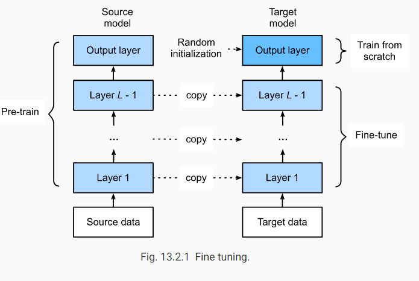

在复杂数据集上训练的模型会在简单的数据集上过拟合。为解决该问题

* 可以收集更多数据，这较为耗时耗力

* 运用迁移学习。例如，虽然ImageNet中的图像大多与椅子无关，但在此数据集上训练的模型可以提取更一般的图像特征，这些特征有助于识别边缘、纹理、形状和对象组成。这些相似的特征对于识别椅子可能同样有效。

* 最常见的迁移学习方法：微调（fine tuning），包括以下步骤：

  * 预训练一个网络，即在源数据上训练源模型

  * 建立新的神经网络模型，即目标模型。这将复制源模型的涉及及参数，**除了输出层的。**我们假设这些模型参数包含了从源数据学习到的知识，**这些知识同样适用于目标模型。**同时，我们假设**源模型的输出层与源模型的标签有关**，因此不将输出层用于目标模型

  * 向目标模型添加一个**输出大小为目标数据集类别数**的输出层，并随机初始化该图层的模型参数。

  * 在目标集上训练模型。我们将从头开始训练输出层，而所有剩余层的参数将根据源模型的参数进行微调。

    

## 1.获取数据集

通过ImageFolder加载数据

```
train_imgs = torchvision.datasets.ImageFolder(os.path.join(data_dir, 'train'))
test_imgs = torchvision.datasets.ImageFolder(os.path.join(data_dir, 'test'))
```

增广

```python
# We specify the mean and variance of the three RGB channels to normalize the
# image channel
normalize = torchvision.transforms.Normalize(
    [0.485, 0.456, 0.406], [0.229, 0.224, 0.225])

train_augs = torchvision.transforms.Compose([
    torchvision.transforms.RandomResizedCrop(224),
    torchvision.transforms.RandomHorizontalFlip(),
    torchvision.transforms.ToTensor(),
    normalize])

test_augs = torchvision.transforms.Compose([
    torchvision.transforms.Resize(256),
    torchvision.transforms.CenterCrop(224),
    torchvision.transforms.ToTensor(),
    normalize])
```


## 2.预先训练模型

```
pretrained_net = torchvision.models.resnet18(pretrained=True)
```

微调

```
finetune_net = torchvision.models.resnet18(pretrained=True)
finetune_net.fc = nn.Linear(finetune_net.fc.in_features, 2)
nn.init.xavier_uniform_(finetune_net.fc.weight);
# If `param_group=True`, the model parameters in fc layer will be updated
# using a learning rate ten times greater, defined in the trainer.
```

预训练模型包括包括两个成员变量：

* features：除了输出层外的所有层
* output：输出层

新的网络设计与原网络相同，但是输出层输出数等于目标数据集的类别数。因此，除了初始层外的其他层参数初始化为预训练参数，并设置较小的学习率进行微调。与之相比，输出层的参数随机初始化，并需要**较大学习率从头开始训练**。