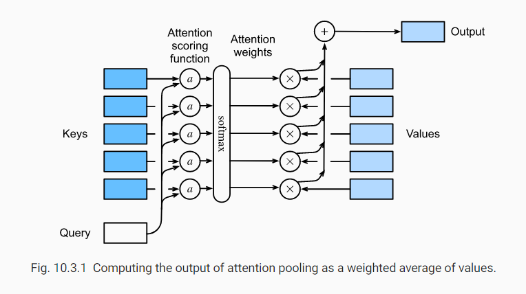

上一节，用高斯核函数对query和key之间的相互作用进行建模。用高斯核作为attention scoring function（注意力打分函数），函数结果被输入softmax运算。结果，得到键值对的概率分布。最后，attention pooling的输出仅是values（值）基于attention weights的加权和。

将attention scoring function（注意力打分函数）记为$a$，下图展示如何将attention pooling的输出计算为values的加权和。由于attention weights为概率分布，所以加权和本质上是加权平均。



数学上，假设一个query $\pmb{q}\in{\mathbb{R}^q}$，以及$m$对键值对：$(\pmb{k}_1,\pmb{v}_1),...,(\pmb{k}_m,\pmb{v}_m)$，其中$\pmb{k}_i\in{\mathbb{R}^k}$，$\pmb{v}_i\in{\mathbb{R}^v}$。attention pooling函数$f$是values的加权和：
$$
f(\pmb{q},(\pmb{k}_1,\pmb{v}_1),...,(\pmb{k}_m,\pmb{v}_m))=\sum_{i=1}^{m}\alpha(\pmb{q},\pmb{k}_i)\pmb{v}_i\in\mathbb{R}^v\tag{1}
$$
其中，对于query $\pmb{q}$和key $\pmb{k}_i$的权值是由一个对attention scoring function $a$的softmax 函数计算，该函数将**两个向量**映射为**一个标量**
$$
\alpha(\pmb{q},\pmb{k}_i)=softmax(a(\pmb{q},\pmb{k_i}))=\frac{exp(a(\pmb{q},\pmb{k}_i))}{\sum_{j=1}^{m}exp(a(\pmb{q},\pmb{k}_j))}\tag{2}
$$
正如所见，不同的attention scoring function $a$的选择会使得attention pooling有不同表现。后续为两种流行的attention scoring function

## 3.1 Masked Softmax Operation

softmax运算用来产生作为**概率分布**的attention weights。在一些情况下，不是所有的值都应该被输入attention pooling。例如，在**机器翻译**中，一些文本序列被一些没有含义的token填充。为只对有意义的作为value的token进行attention pooling，我们可以指定一个有效的序列长度以便在计算softmax时过滤掉超出该范围的token。因此定义如下masked_softmax函数，实现这种屏蔽操作。所有超出**有效长度**的值都被屏蔽为0

* 输入X：(batch_count, batch_size, value_dim)

```python
def sequence_mask(X,valid_len,value=0):
    """Mask irrelevant entries in sequences"""
    maxlen=X.size(1)
    mask=torch.arange((maxlen),dtype=torch.float32,
                     device=X.device)[None,:]<valid_len[:, None]
    X[~mask]=value
    return X

def masked_softmax(X,valid_lens):
    """Perform softmax operation by masking elements on the last axis"""
    # 'X': 3D tensor, 'valid_lens': 1D or 2D tensor
    if valid_lens is None:
        return nn.functional.softmax(X,dim=-1)
    else:
        shape=X.shape
        if valid_lens.dim()==1:
            valid_lens=torch.repeat_interleave(valid_lens,shape[1])
        else:
            valid_lens=valid_lens.view(-1)
        # On the last axis, replace masked elements with a very large negative
        # Value, whose exponentiation outputs 0
        X=d2l.sequence_mask(X.view(-1,shape[-1]),valid_lens,value=-1e6)
        return nn.functional.softmax(X.view(shape),dim=-1)
```

## 3.2 加性模型（Additive Attention）

总的来说，当queries和keys向量**长度不同时**，我们用加性模型作为打分函数。给定query $q\in{\mathbb{R}^q}$，和一个key $\pmb{k}\in{R}^k$，加性模型打分函数：
$$
a(\pmb{q},\pmb{k})=\pmb{w}^T_{v}tanh(\pmb{W}_q\pmb{q}+\pmb{W}_k\pmb{k})\in{\mathbb{R}}\tag{3}
$$
其中，可学习参数$\pmb{W}_q\in\mathbb{R}^{h \times q}$，$\pmb{W}_k\in\mathbb{R}^{h \times k}$，且$\pmb{w}_v\in\mathbb{R}^h$。如（3），query和key相互连接并输入单隐藏层的多层感知机，隐藏单元$h$。使用$tanh$作为激活函数，**并且不适用偏置项**

* $q$：(batch size, number of steps or sequence length in tokens, feature size) 

* attention pooling： (batch size, number of steps for queries, feature size for values)

## 3.3 缩放点积模型（Scaled Dot-Product Attention0

另一个在计算上更加高效的打分函数是点积运算。然而，该运算要求**query**和**key**有同样的向量长度，即$d$，假设query和key的所有元素是独立的随机变量，均值为0，单位方差，则**点积运算的均值为0，方差为$d$**。为保证点积方差不论向量长度如何，始终保持为1，缩放点积模型如下：
$$
a(\pmb{q},\pmb{k})=\pmb{q}^T\pmb{k}/\sqrt{d}\tag{4}
$$
为提高效率，经常考虑小批量，如为$n$个query和$m$个键值对计算注意力，其中queries和keys长度为$d$，values长度为$v$。对queries $\pmb{Q}\in{\mathbb{R}^{n \times d}}$，keys $\pmb K\in\mathbb{R}^{m \times d}$，value $\pmb{V}\in\mathbb{R}^{m \times v}$为
$$
softmax(\frac{\pmb{Q}\pmb{K}^T}{\sqrt{d}})\pmb{V}\in{\mathbb{R}^{n \times v}}
$$


