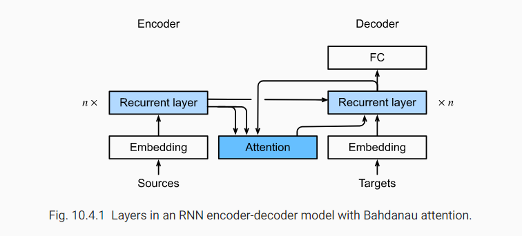
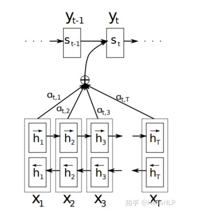

encoder-decoder回顾：RNN编码器将可变长度序列转换成固定形状的context variable，然后RNN解码器基于生成的token和context variable逐个token地生成输出（目标）序列。

Bahdannau注意力：可微分（differentiable）的注意力模型（之前高斯核函数不可微分），且没有严格地单向对齐限制（severe unidirectional alignment limitation)。当预测一个token时，如果不是所有输入token都是相关的，模型**仅针对（或注意）一部分和当前预测相关的输入序列**。**这通过将context variable**视为attention pooling的输出来实现。

##  4.1 模型

新的基于注意力的模型与encoder-decoder不同之处在于在时间步$t'$用context variable $\pmb{c}_t'$ 代替context variable $\pmb{c}$，假设输入序列有${T}$个token，在decoding时间步$t'$的context variable是attention pooling的输出：
$$
\pmb{c}_t'=\sum_{t=1}^{T}\alpha(s_{t'-1},\pmb{h}_t)\pmb{h}_t\tag{1}
$$
其中，decoder在$t'-1$的隐藏状态$s_{t'-1}$是一个query，encoder的隐藏状态$\pmb{h}_t$既是keys也是values，而attention weight $\alpha$ 通过下式计算：
$$
\alpha(\pmb{q},\pmb{k}_i)=softmax(a(\pmb{q},\pmb{k_i}))=\frac{exp(a(\pmb{q},\pmb{k}_i))}{\sum_{j=1}^{m}exp(a(\pmb{q},\pmb{k}_j))}\in\mathbb{R}\tag{2}
$$
与经典RNN Encoder-Decoder结构有些许不同，Bahdanau注意力示意图如下：

## 4.2 定义注意力Decoder

decoder的state由以下初始化

* encoder在所有时间步的最后一层的隐藏状态（作为keys和values）
* encoder在最后一个时间步的所有层隐藏状态（初始化decoder的隐藏状态）
* encoder的有效长度（在attention pooling时去掉padding tokens）
* 在每一个解码时间步，前一个时间步的解码器最终层隐藏状态被用作attention的query。

最终，attention pooling和输入的embedding都被连接作为RNN解码器的输入。

