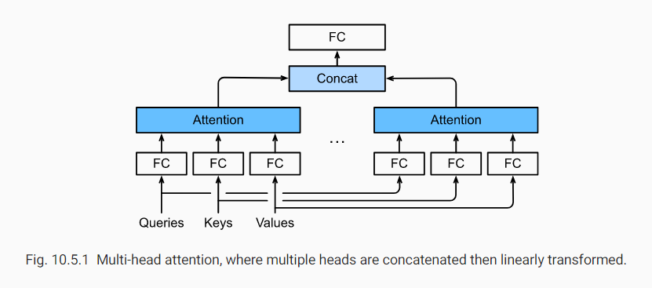

在实践中，给定相同的一组queries、keys和values，我们可能希望我们的模型结合来自相同注意机制的不同行为的知识，例如捕获序列内不同范围的依赖性(例如，较短范围对较长范围)。因此，允许我们的注意力机制**联合使用查询、键和值的不同表示子空间**可能是有益的。

为此，可以用$h$个独立学习的线性投影来转换queries、keys、values，而不是执行单一的attention pooling。如此，这$h$个投影后的queries、keys和values同时输入attention pooling。最后，$h$个attention pooling的输出被串联起来，用一个FC层转换得到最终输出。这种设计称为**multi-head attention**，$h$个attention pooling中的每一个的输出称为一个**head**。

## 5.1 模型

给定query $\pmb{q}\in{\mathbb{R}^{d_q}}$，key $\pmb{k}\in{\mathbb{R}^{d_k}}$和一个value $\pmb{v}\in{\mathbb{R}^{d_v}}$，每个attention head $\pmb{h}_i(i=1,...,h)$按下式计算：
$$
\mathbb{h}_i=f(\pmb{W}_i^{(q)}\pmb{q},\pmb{W}_i^{(k)}\pmb{k},\pmb{W}_i^{(q)}\pmb{v})\in{\pmb{R}^{pv}}\tag{1}
$$
其中学习参数为$\pmb{W}_i^{(q)}\in{\mathbb{R}^{p_q\times{d_q}}}$,$\pmb{W}^{(k)}_i\in{\mathbb{R}^{p_k\times{d_k}}}$，$\pmb{W}^{(v)}_i\in{\mathbb{R}^{p_v\times{d_v}}}$,$f$为attention pooling，比如加性模型或缩放点积模型。$\pmb{W}_o\in{\mathbb{R}^{p_o\times{d_o}}}$为输出层权重。
$$
\pmb{W}_o\left[ \begin{matrix} \pmb{h}_1\\ \vdots \\ \pmb{h}_h \end{matrix} \right]\in\mathbb{R}^{p_o}

$$

基于这种设计，一个head会注意输入的不同部分，可以表达比简单的加权平均更复杂的函数
