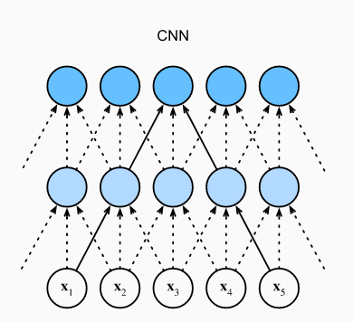
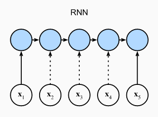
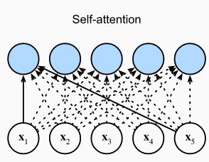
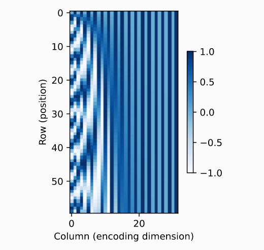

深度学习中，我们经常用CNNs或RNNs来编码一个序列。现在有了注意力机制。想象一下，我们将一系列token输入到attention pooling，这样相同的tokens就可以充当queries、keys和values。具体来说，每个query关注所有key-value对，并生成一个注意力输出。由于queries、keys和values来自同一个地方，因此这执行自注意力机制（self-attention），这也称为内部注意（intra-attention)。在本节中，我们将讨论使用自注意力机制的序列编码，包括使用序列顺序的附加信息。

## 6.1 自注意力（Self-attention)

给定一个输入tokens序列$\pmb{x}_1,...,\pmb{x}_n$，其中$\pmb{x}_i\in{\mathbb{R}^d}(1\le{i}\le{n})$，自注意力输出同样长度的序列：$\pmb{y}_1,...,\pmb{y}_n$，其中
$$
\pmb{y}_i=f(\pmb{x}_i,(\pmb{x}_1,\pmb{x}_1),...,(\pmb{x}_n,\pmb{x}_n))\in{\mathbb{R}^d}
$$
$f$为打分函数。使用multi-head attention，以下代码片段计算shape为(batch_size, num_steps, $d$)的张量的自注意力，输出同样形状的张量

```python
num_hiddens, num_heads = 100, 5
attention = d2l.MultiHeadAttention(num_hiddens, num_hiddens, num_hiddens,
                                   num_hiddens, num_heads, 0.5)
attention.eval()
```

## 6.2 CNNs，RNNs和自注意力的比较

比较用不同结构将长度为$n$的token序列映射为另一个长度相同的序列，其中每个输入或输出token表示为$d$维向量。具体来说，考虑CNNs，RNNs和自注意力。我们从计算复杂性、顺序操作、最大路径长度进行比较。注意顺序操作不利于并行计算，而序列位置的任何组合之间的较短路径使得更容易学习序列内的长程相关性。







考虑卷积核$k$的卷积层：我们将在后面的章节中提供更多关于使用CNNs进行序列处理的细节。现在我们只需要知道，由于序列长度为$n$，输入输出通道数都为$d$，卷积层的计算复杂度为$O(knd^2)$。如图所示，CNNs是分层的，因此有$O(1)$个顺序操作，最大路径长度为$O(n/k)$。例如，x1和x5在图中核大小为3的两层CNN的感受野内。

当更新RNNs的隐藏状态时，$d×d$权重矩阵与$d$维隐藏状态的相乘具有$O(d^2)$的计算复杂度。由于序列长度为$n$，RNN层的计算复杂度为$O(nd^2)$。根据图，有$O(n)$个不能并行化的顺序操作，最大路径长度也是$O(n)$。

在自注意力机制中，queries、keys和values都是$n \times d$矩阵，考虑缩放点积注意力，当$n \times d$矩阵与$d \times n$矩阵相乘时，输出的$ n \times n$矩阵，又与$n \times d$矩阵相乘，结果是，自注意力机制复杂度为$O(n^2d)$。每个token都通过自我关注直接连接到任何其他token，因此可以以$O(1)$顺序操作进行并行计算，最大路径长度$O(1)$

总之，CNNs和自注意力都享受并行计算，自我注意具有最短的最大路径长度。然而，相对于序列长度的二次计算复杂性使得自我关注对于非常长的序列来说非常慢。

## 6.3 位置编码（Positional Encoding)

不同于RNNs一个接着一个处理序列的token，自注意力抛弃了顺序操作而支持并行计算。同时，为了应用序列的位置信息，我们可以通过位置编码向输入序列注入绝对位置信息或相对位置信息。**位置编码可以学习，也可以设定**。以下介绍如何基于**sine**和**cosine** **设定**位置编码。

假设输入表示$\pmb{X}\in\mathbb{R}^{n \times d}$（**应该是通过嵌入层编码后的**)包含了$n$个tokens的序列的$d$维嵌入信息，位置编码输出$\pmb{X}+\pmb{P}$中使用位置嵌入矩阵（**positional embedding matrix**)$\pmb{P}\in{\mathbb{R}^{n \times d}}$，其第$i$行以及第$(2j)$列或$(2j+1)$列编码为：
$$
p_{i,2j}=sin(\frac{i}{10000^{2j/d}})\\
p_{i,2j+1}=cos(\frac{i}{10000^{2j/d}})
$$
在位置编码矩阵$\pmb{P}$中，**行对应一个序列中的位置**，**列代表位置编码各个维度**，在这种编码情况下，第6列和第7列相比第8列和第9列有更高的频率。

### 6.3.1 绝对位置信息

为了解沿着编码维度单调递减的频率与绝对位置的关系，我们大于处0，1，...，7的二进制表示。最低位，次低位，以及第三低位是每个数字、每两个数字、每四个数字变换一次。二进制表示中，高位的频率比低位小。同样的，如下列heat map所示，位置编码通过使用三角函数沿编码维度降低频率。由于输出是浮点数，这种连续表示比二进制表示更节省空间。



### 6.3.2 相对位置编码

除了捕获绝对位置信息外，以上位置编码同样允许模型学习通过相对位置进行关注。这是因为在固定的位置偏移（positional offset）$\delta$，在位置$i+\delta$的位置的位置编码可以用线性投影表示为在位置$i$的编码。

记$\omega_j=1/10000^{2j/d}$，$(p_{i,2j},p_{i,2j+1})$可以线性投影至$(p_{i+\delta,2j},p_{i+\delta,2j+1})$：
$$
\left[ \begin{matrix} cos(\delta{\omega_j}) & sin(\delta{\omega_j}) \\ -sin(\delta{\omega_j}) & cos(\delta{\omega_j}) \end{matrix} \right]\left[ \begin{matrix} p_{i,2j} \\ p_{i,2j+1}\end{matrix} \right]\\
=\left[ \begin{matrix} cos(\delta{\omega_j})sin(i{\omega_j})+ sin(\delta{\omega_j})cos(i{\omega_j})\\ -sin(\delta{\omega_j})sin(i{\omega_j})+cos(\delta{\omega_j})cos(i{\omega_j})\end{matrix} \right]\\
=\left[ \begin{matrix} sin((i+\delta)\omega_j) \\ cos((i+\delta)\omega_j)\end{matrix} \right]\\
=\left[ \begin{matrix} p_{i+\delta,2j} \\ p_{i+\delta,2j+1}\end{matrix} \right]
$$
其中$2 \times 2$的投影矩阵不依赖位置索引$i$