# R-CNN：Region with CNN feature

**Rich feature hierarchies for accurate object detection and semantic segmentation**

### 1.1 一张图像生成1k—2k候选区域（使用Selective Search方法）

利用Selective Search算法通过图像分割的方法得到一些原始区域，然后使用一些合并策略将这些区域合并，得到一个层次化的区域结构，而这些结构就包含可能需要的物体。

### 1.2 对每个候选区域，使用深度网络提取特征

将2000候选区域缩放到$227 \times 227$，接着将候选区输入事先训练好的AlexNet CNN网络获取4096维的特征得到$2000\times 4096$维矩阵。其中，AlexNet不包括之后的全连接层

### 1.3 特征送入每一类的SVM分类器，判别是否属于该类

将$2000\times 4096$维特征与20个SVM组成的权值矩阵$4096\times 20$相乘，获得$2000\times 20$维矩阵表示每个建议框是某个类别的得分。分别对上述$2000\times 20$维矩阵中每一列即每一类进行非极大值抑制剔除重叠建议框，得到该列即该类中得分高的一些建议框。

**难分样本挖掘解决正样本和负样本之间的不平衡性**：

* 正样本：生成的proposal和某个标注数据的ground truth重叠区域（IOU）大于某个阈值，分为正样本
* 一张图像所有的proposal中，正样本比负样本少得多。而造成proposals【IoU<0.5】数量多，**主要是proposals【IoU<0.1】这个子集**，因为大部分的proposals并不与我们要预测的特定类别区域重叠，这样构成的数据集，正样本的数量会远远少于负样本。
* 负样本过多，正样本大概率被预测为正样本，因此采用随机采样，抽取25%正样本，75%的负样本。

#### 1.3.1 非极大值抑制剔除重叠建议框

* 对每个类别（列）寻找得分最高的目标（每一行）
* 计算该目标和该类其他目标的iou值
* 删除所有iou值大于给定阈值的目标

### 1.5 使用回归器精细修正候选框位置

对NMS处理后剩余的建议框进一步筛选。保留与真实边界框有相交且IOU大于一定阈值的候选框。接着分别用20个回归器对上述20个类别中剩余的建议框进行回归操作，最终得到每个类别的修正后的得分最高的bounding box

如图，黄色框口P表示建议框region proposal，绿色窗口G表示实际框ground truth，红色窗口表示region proposal进行回归后的预测窗口，可以用最小二乘法解决线性回归问题

### 1.6 存在问题

* 测试速度慢

  测试一张图像约53s（CPU），用Selective Search算法提取候选框用时约2秒，一张图像内候选框之间存在大量重叠，提取特征操作冗余

* 训练速度慢

  过程及其繁琐

* 训练所需空间大

  对于SVM和bbox回归训练，需要从每个图像中的每个目标候选框提取特征，写入磁盘。

# FAST R-CNN

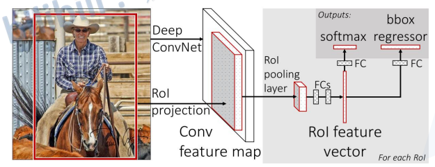

### 2.1 一张图生成1k~2k个候选区域（使用Selective Search方法）

### 2.2 将图像输入网络得到相应的特征图，将SS算法生成的候选框投影到特征图上获得相应的特征矩阵

一次性计算整张图像特征：

* R-CNN依次将候选框区域输入卷积神经网络得到特征
* Fast-RCNN将整张图像输入网络，紧接着从特征图像上提取相应的候选区域。这些候选区域的特征**不需要重复计算**，**不限制图像尺寸**

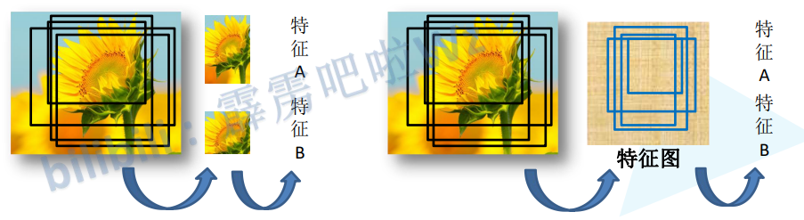

训练数据的采样（正样本，负样本）：

* 并非使用SS算法得到的所有区域，而是只用一小部分，并且分为正样本和负样本
* 正样本：包含检测目标，实际操作时与正确边界框IOU大于0.5
* 负样本：背景
* 所采集的候选区域正负样本以一定比例划分，保证样本平衡性

### 2.3 将每个特征矩阵通过ROI pooling层缩放到$7 \times 7$大小的特征图，接着将特征图展开通过一系列全连接层得到预测结果

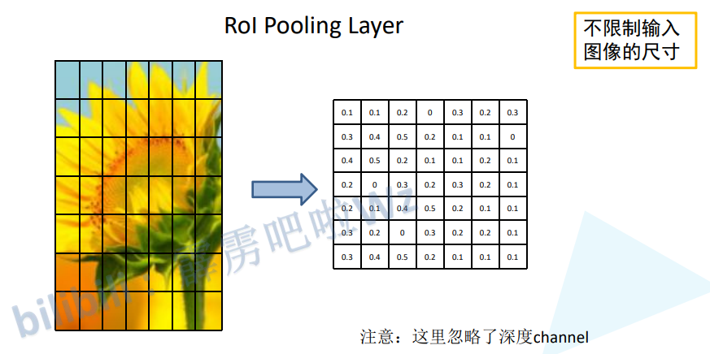

* 将特征图划分为$7 \times 7$的方块，每个方块进行最大池化下采样
* 每个通道都如此操作

### 2.4 分类器

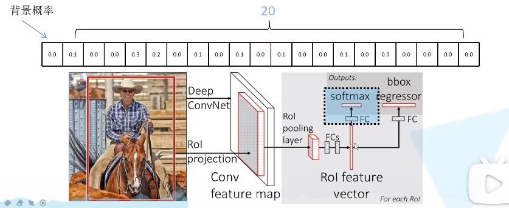

输出N+1个类别的概率（包含背景类），共N+1个节点，展平后，通过两个全连接层，并并联两个全连接层，分别用于分类和目标框回归。

* 分类：softmax输出N+1

* 边界框回归器：输出对应N+1个类别的候选边界框回归参数$(d_x,d_y,d_w,d_h)$共$(N+1)*4$个节点

  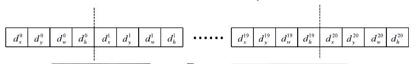
  $$
  \hat{G}_x=P_wd_x(P)+P_x\\
  \hat{G}_y=P_hd_y(P)+P_y\\
  \hat{G}_w=P_wexp(d_w(P))\\
  \hat{G}_h=P_hexp(d_h(P))
  $$
  其中，$P_x,P_y,P_w,P_h$分别为候选框的中心x，y坐标，以及宽和高；$\hat{G}_x,\hat{G}_y,\hat{G}_w,\hat{G}_h$分别为最终预测的边界框中心x，y坐标，以及宽高。

  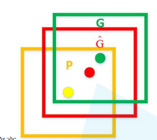

### 2.5 损失

**Multi-task loss**

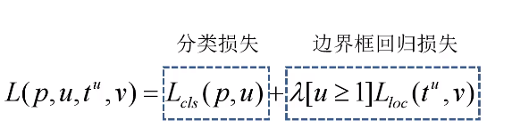

* $p$是分类器预测的softmax概率分布$p=(p_0,...,p_k)$
* $u$对应目标真实类别标签
* $L_{cls}(p,u)=-logp_u$
* $t_u$对应边界框回归器预测的**对应类别$u$的回归参数$(t_x^u,t_y^u,t_w^u,t_h^u)$**
* $v$对应真实目标边界框回归参数$(v_x,v_y,v_w,v_h)$
* $L_{loc}(t^u,v)=\sum_{i\in\{x,y,w,h\}}smoothh_{L_1}(t_i^u-v_i)$
* $smooth_{L1}(x)=\begin{cases} -0.5x^2,\quad |x|\leq 0\\ |x|-0.5, \quad otherwise \end{cases}$

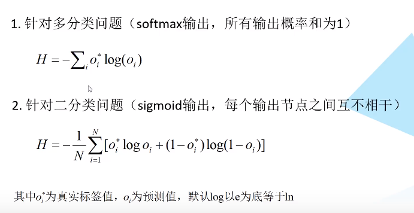

**==速度瓶颈在于SS==**

# Faster R-CNN

RPN+Fast R-CNN

### 3.1 将图像输入网络得到相应的特征图

### 3.2 使用RPN结构生成候选框，将RPN生成的候选框投影到特征图上得到相应的特征矩阵

* 对于特征图上的每个$3\times 3$的滑动窗口，计算出滑动窗口中心点对应原始图像上的中心点，并计算出k个anchor boxes（注意和proposal的差异），具体如下：
  * 每滑过一个位置，就计算一个一维向量，并通过两个全连接层输出目标概率（背景的概率和前景的概率），共$2k$个和边界框回归参数，共$4k$个，其中$k$为anchor boxes数目
  * 256指的是用ZF网络得到的特征图的深度（即通道），若用VGG16则得到512维输出
  * 每滑动至一个位置，计算该中心点在原图的位置，并以此点为中心计算$k$个anchor box
  * 具体实现时，在特征图上首先用$3\times 3$的卷积进行更深的特征提取，然后用$1\times 1$卷积分别实现分类网络和回归网络

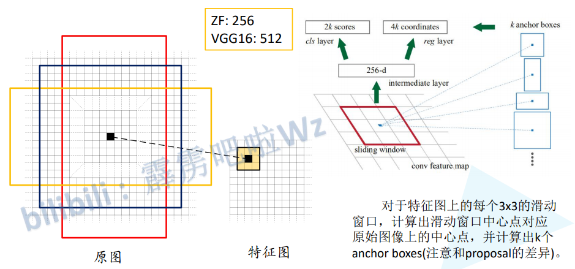

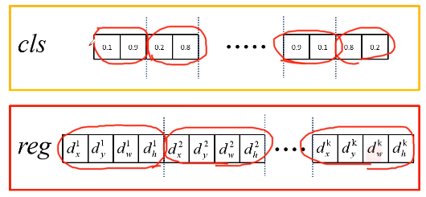

论文中所给的尺度和比例

* 尺度：{$128^2$,$256^2$,$512^2$}
* 三种比例：{1:1, 1:2, 2:1}
* 另外，$3\times 3$的VGG窗口感受野为228*228，却可以预测大于228的区域

对于一张$1000 \times 600 \times 3$的图像，大约有$60 \times 40 \times 9(20k)$个anchor，忽略跨越边界的anchor后，剩下约6k个anchor。对于RPN生成的候选框之间存在大量重叠区域，基于候选框cls得分，采用非极大抑制，IOU设为0.7，这样每张图片只剩2k个候选框

正负样本采样：正样本和负样本各128，如果正样本不足，则负样本和正样本一样多。

* anchor和准确边界框IOU超过0.7，为正样本；或为与某个准确边界框IOU最大的anchor
* 与所有准确边界框的IOU都小于0.3，为负样本

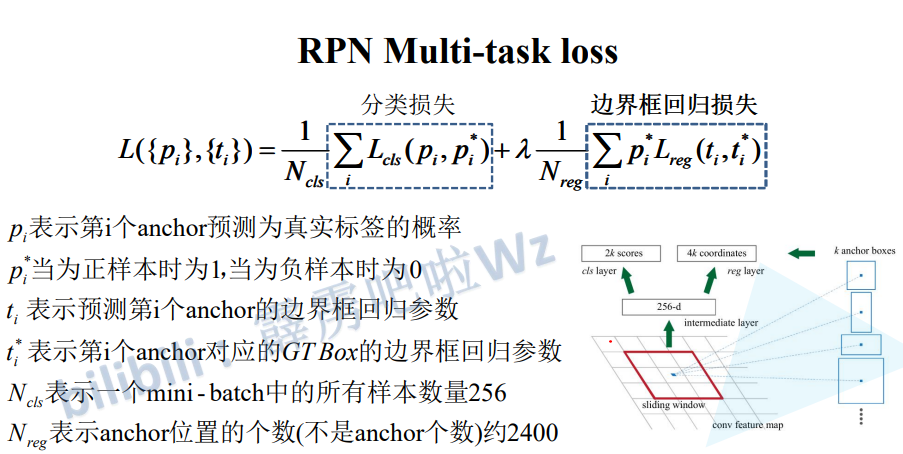

上式可以进一步化简：$\lambda\frac{1}{N_{reg}}=\frac{1}{N_{cls}}$

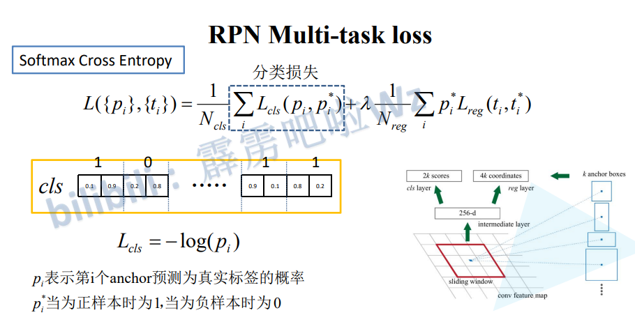

对于分类损失，如果使用二分类交叉熵则分类输入应该为$k$，如果使用多分类交叉熵则输出为$2k$

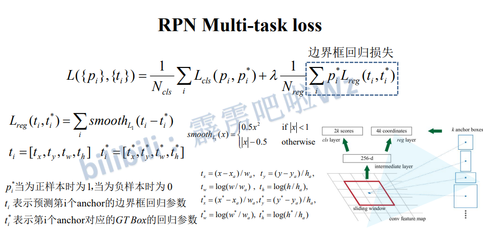

### 3.3 将每个特征矩阵通过ROI pooling层缩放到$7 \times 7$大小的特征图，接着将特征图展平通过一系列全连接层得到预测结果

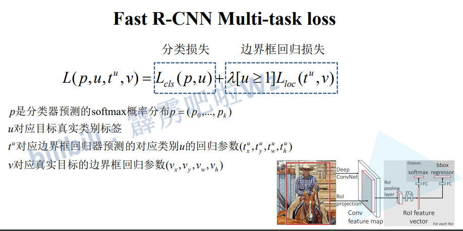

### 3.5 训练方法

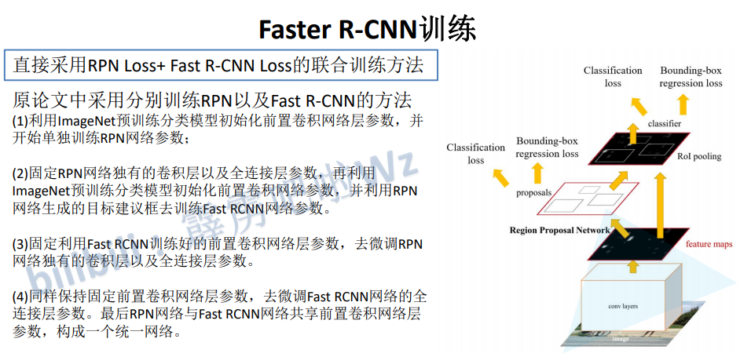

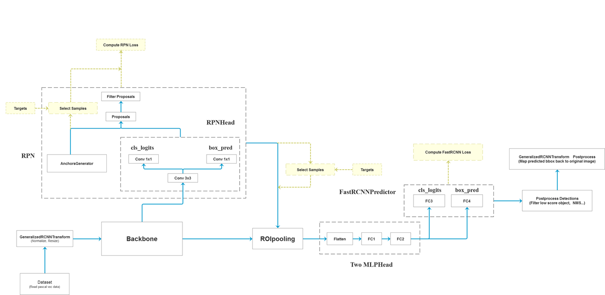

* 测试推理时间时，第一次推理比较慢，应该在进行一次正向传播后，从第二次开始进行统计
* 黄色框是在训练过程中才有的，在预测过程中没有
* ROI_HEAD：ROIpooling到Postprocess
* GeneralizedRCNNTransform：normalize和resize（限定输入图像最小边长，最大边长）