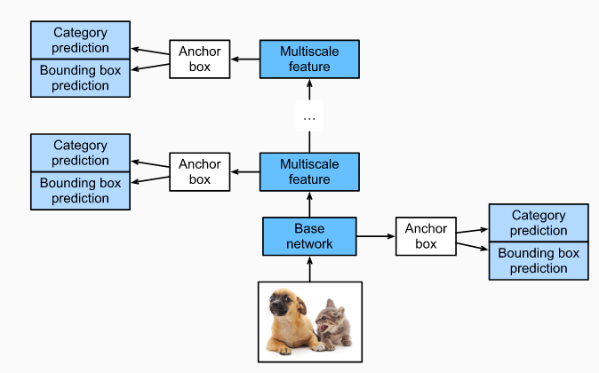
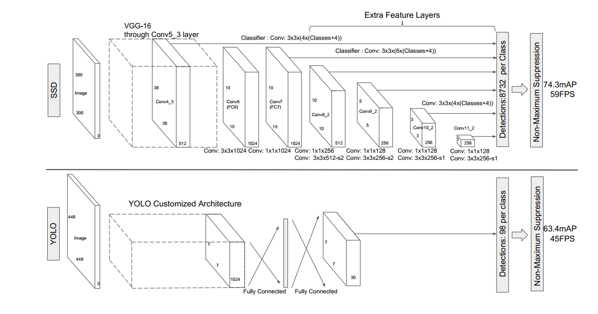
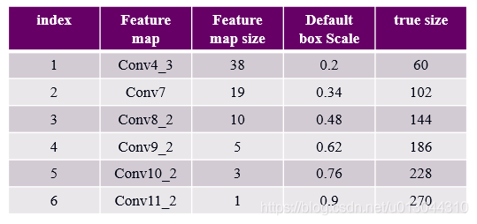

# 1.目标检测分类

### 基于候选区域选择的目标检测算法（two-stage)

分两个步骤：

* 生成可能存在目标的区域
* 将每个区域都输入分类器中进行分类，去掉置信度较低的候选区域，并修正置信度较高的目标区域的位置。

优点：

* 准确率相对较高

缺点：

* 需要运行两次卷积神经网络，运行速度慢

例子：Faster-RCNN

### 基于回归方法的目标检测算法（one-stage）

基本步骤：

* 给定一张图像，通过设定合理的输出向量，使用回归的方式输出这个目标的边框和类别，一步到位。

优点：

* 速度快，但对于密集的小样本来说检测较难

例子：YOLO、SSD

# 2.SSD思想

各层特征信息主要有如下区别：

* 低层卷积可以捕捉到更多的细节信息，高层卷积可以捕捉到更多的抽象信息。
* 低层特性更关心“在哪里”，但分类准确度不高，而高层特性更关心“是什么”，但丢失了物体的位置信息。

**SSD正是利用不同尺度检测图片中不同大小和类别的目标物体**

# 3.网络结构

前端使用VGG16网络，然后再VGG16的基础上新增了5个卷积层来获得更多的特征图用于检测





所用到的特征图以及其大小：

| feature map | 大小  |
| :---------: | :---: |
|   Conv4_3   | 38*38 |
|    Conv7    | 19*19 |
|   Conv8_2   | 10*10 |
|   Conv9_2   |  5*5  |
|  Conv10_2   |  3*3  |
|  Conv11_2   |  1*1  |

对于每个特征图，SSD引入初始框的概念，也就是说**在每个特征图的单元格的中心设置一系列尺度和大小不同的初始框**，这些初始框都会反向映射到原图的某一个位置，**如果某个初始框的位置正好和真实目标框的位置重叠度很高，那么就通过损失函数预测这个初始框的类别，同时对这些初始框的形状进行微调**，以使其符合我们标记的真实目标框。

# 4.初始框的设置

初始框的两个主要参数

设计原则：随着网络层数加深（特征图变小），初始框的尺度线性增加。最小的初始框尺度为0.2，最大的初始框尺度为0.9
$$
s_k=s_{min}=\frac{s_{max}-s_{min}}{m-1}(k-1),k\in[1,m]
$$
每个特征图上的初始框尺度如下：



* 注：这是论文中的描述方法，实际给出的官方源码中，SSD貌似将**第一个特征图的初始框单独设置为0.1的尺度**，剩下的采用以下公式，而且每个特征图上的尺度稍微有微调，网上也有各种解释版本，感兴趣的话可以看源码。

对于长宽比，作者直接采用了$a=1,2,3,1/2,1/3$五种比例，这样，每个特征图上的初始框长、宽可以用以下公式得出：
$$
w_k^a=s_k\sqrt{a_r},h_k^a=s_k/\sqrt{a_r}
$$
对于比例为1的初始框，又多增加了一个正方形的初始框：
$$
s_k^{'}=\sqrt{s_ks_{k+1}}
$$

# 5.训练过程

### （1）生成初始框

按照上述初始框生成规则在每个特征图的单元格中心生成初始框即可，这个步骤无需利用输入训练图像数据。

### （2）先验框匹配

在训练过程中，首先要确定训练图片中的目标真实框与哪个先验框来进行匹配，与之匹配的先验框所对应的边界框将负责预测它。若某个真实框和初始框的IOU大于某个阈值（一般是0.5），那么该初始框就与这个真实框进行匹配。能够与真实目标框匹配的初始框就是正样本，其他的都是负样本。

### （3）计算损失值

根据真实目标框的类别以及初始框相对于目标框的偏移，计算损失值。
损失函数如下,$\alpha$为两个损失函数的连接权重：
$$
L(x,c,l,g)=\frac{1}{N}(L_{conf}(x,c)+\alpha L_{loc}(x,l,g))
$$
其中，
$$
L_{conf{(x,c)}}
$$
为类别损失，公式如下：
$$
L_{conf}(x,c)=-\sum_{i\in{Pos}}^N x_{ij}^plog(\hat{c}_i^p)-\sum_{i\in{Neq}}log(\hat{c}_i^0)\\
\hat{c}_i^p=\frac{exp(c_i^p)}{\sum_p exp{c_i^p}}
$$
可以看到本质上就是个softmax损失函数，只是需要注意的是，如果要预测N个类别，那么**需要有N+1个输出**，多出的那个类别是背景类别。
$$
L_{loc}(x,l,g)
$$
为位置损失，公式如下：
$$
L_{loc}(x,l,g)=-\sum_{i\in{Pos}}^N \sum_{m\in\{cx,cy,w,h\}} x_{ij}^ksmooth_{L1}(l_i^m-\hat{g}_j^m)
$$
其中，$x_{ij}^p$是一个枚举变量，如果某个初始框可以和真是目标框进行匹配，那么这个值为1，否则为0.

# VOC数据集

数据集下载后解压得到一个名为VOCdevkit的文件夹，该文件夹结构如下：

```
└── VOCdevkit     #根目录
    └── VOC2012   #不同年份的数据集，这里只下载了2012的，还有2007等其它年份的
        ├── Annotations        #存放xml文件，与JPEGImages中的图片一一对应，解释图片的内容等等
        ├── ImageSets          #该目录下存放的都是txt文件，txt文件中每一行包含一个图片的名称，末尾会加上±1表示正负样本
        │   ├── Action
        │   ├── Layout
        │   ├── Main
        │   └── Segmentation
        ├── JPEGImages         #存放源图片
        ├── SegmentationClass  #存放的是图片，语义分割相关
        └── SegmentationObject #存放的是图片，实例分割相关

```

其中，

* Annotation文件夹存放的是xml文件，该文件是对图片的解释，每张图片都对于一个同名的xml文件。

* ImageSets文件夹存放的是txt文件，这些txt将数据集的图片分成了各种集合。如Main下的train.txt中记录的是用于训练的图片集合
* JPEGImages文件夹存放的是数据集的原图片
* SegmentationClass以及SegmentationObject文件夹存放的都是图片，且都是图像分割结果图