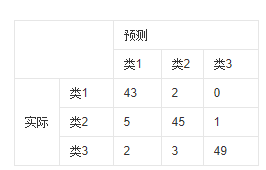
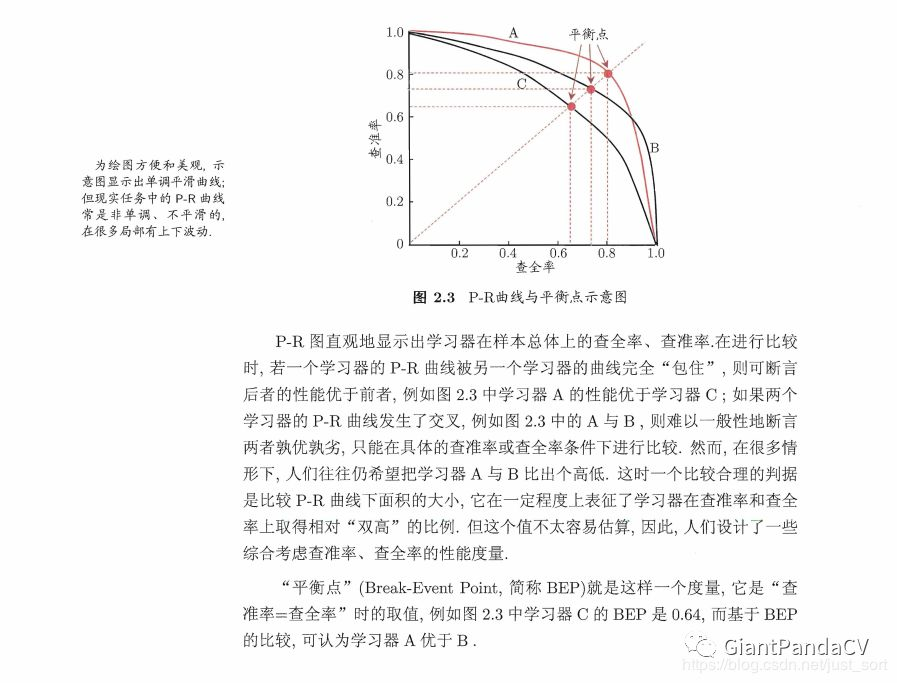
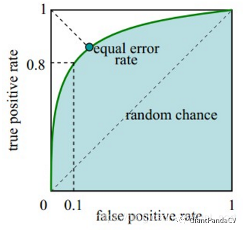
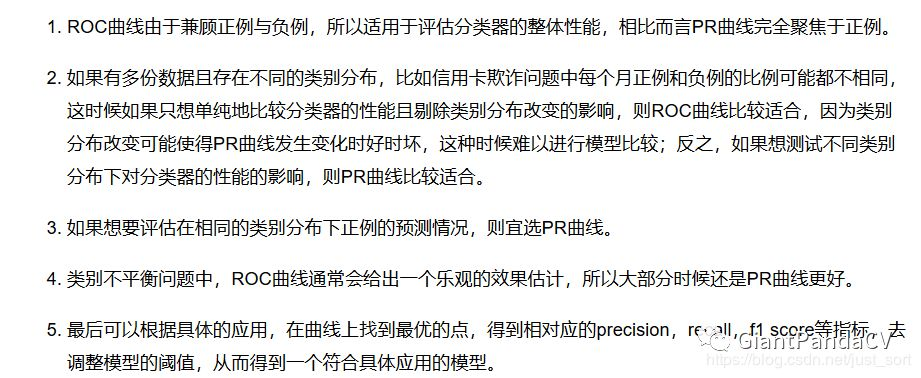

# 评价指标

* ==**准确率（Accuracy）**==

  检测时分对的样本数除以所有的样本数。准确率一般被用来评估检测模型的**全局准确程度**，**包含的信息有限**，**不能完全评价一个模型性能**。

* **==混淆矩阵（Confusion Matrix）==**

  混淆矩阵是以模型**预测的类别数量统计信息**为横轴，**真实标签的数量统计信息**为纵轴画出的矩阵。对角线代表了模型预测和数据标签一致的数目，所以准确率也可以用**混淆矩阵对角线之和除以测试集图片数量**来计算。对角线上的数字越大越好，在混淆矩阵可视化结果中颜色越深，代表模型在该类的预测结果更好。其他地方自然是预测错误的地方，自然值越小，颜色越浅说明模型预测的更好。

  

* ==**精确率（Precision）和召回率（Recall）和PR曲线**==

  * **准确率**：在所有识别出的图片中，True Positives所占的比率。$Precision=\frac{TP}{TP+FP}=\frac{TP}{N}$，$N$代表测试集样本数（做出预测的数量）

  * **召回率**：所有正样本样例中，被正确识别为正样本的比例。$Recall=\frac{TP}{TP+FN}$

  * **PR曲线**对应一个阈值。通过选择合适的阈值，如50%，**对样本进行划分，概率大于50%的就认为是正例，小于50%的就是负例,从而计算相应的精准率和召回率**。阈值的变化同时会导致Precision与Recall值发生变化，从而得到曲线。曲线图大概如下，这里有3条PR曲线，周志华机器学习的解释如下：

    

* **==平均精度（Average-Precision，AP）和mAP==**

  **AP**就是Precision-recall曲线下面的面积，通常来说一个越好的分类器，AP越高。**mAP是多个类别AP的平均值**。这个mean的意思是对每个类的AP再求平均，得到的就是mAP的值，mAP的大小一定在[0,1]区间，越大越好。该指标是目标检测算法中最重要的一个。

  * mAP对应多分类

* **==ROC曲线==**

  ROC的横轴是**假正率**(False positive rate， FPR)，$FPR = FP / [ FP + TN] $，代表所有**负样本中错误预测为正样本的概率**，**==假警报率==**。ROC的纵轴是**真正率**(True positive rate， TPR)，$TPR  = TP / [ TP + FN] $，代表所有**正样本中预测正确的概率**，**==命中率==**。ROC曲线的对角线坐标对应于**随即猜测**，而坐标点(0,1)也即是左上角坐标对应理想模型。曲线越接近左上角代表检测模型的效果越好。

  

  * 如何绘制？
    * 根据每个测试样本属于正样本的概率值从大到小排序。
    * 从高到低，依次将“Score”值作为阈值threshold，当测试样本属于正样本的概率大于或等于这个threshold时，我们认为它为正样本，否则为负样本。
    * **每次选取一个不同的threshold，我们就可以得到一组FPR和TPR，即ROC曲线上的一点**。当我们将threshold设置为1和0时，分别可以得到ROC曲线上的(0,0)和(1,1)两个点。将这些(FPR,TPR)对连接起来，就得到了ROC曲线。当threshold取值越多，ROC曲线越平滑。

* **==AUC(Area Uner Curve)==**

  即ROC曲线下的面积。AUC越接近于1，分类器性能越好。AUC值是一个概率值，当你随机挑选一个正样本以及一个负样本，当前的分类算法根据计算得到的Score值将这个正样本排在负样本前面的概率就是AUC值。当然，AUC值越大，当前的分类算法越有可能将正样本排在负样本前面，即能够更好的分类。(**若随机抽取一个阳性样本和一个阴性样本，分类器正确判断阳性样本的值高于阴性样本的概率 = AUC **)AUC的计算公式如下：
  $$
  AUC=\frac{1}{2}\sum_{i=1}^{m-1}(x_{i+1}-x_i)(y_i+y_{i+1})
  $$

# PR曲线和ROC曲线选用时机

目标检测中使用最多的是MAP值，但在不同的数据集中，PR曲线和ROC曲线有不同适用场景。

### PR曲线

从PR的计算公式可以看出，**PR曲线聚焦于正例**。类别不平衡问题中由于主要关心正例，所以在此情况下PR曲线被广泛认为优于ROC曲线。

### ROC曲线

**当测试集中的正负样本的分布发生变化时，ROC曲线可以保持不变**。因为TPR聚焦于正例，FPR聚焦于与负例，使其成为一个**比较均衡**的评估方法。但是在**关心正例的预测准确性的场景，ROC曲线就不能更好的反应模型的性能**了，因为ROC曲线的**横轴采用FPR**，根据FPR公式 ，**当负例N的数量远超正例P时，FP的大幅增长只能换来FPR的微小改变**。结果是**虽然大量负例被错判成正例，在ROC曲线上却无法直观地看出来**。

因此，PR曲线和ROC曲线的选用时机可以总结如下：

